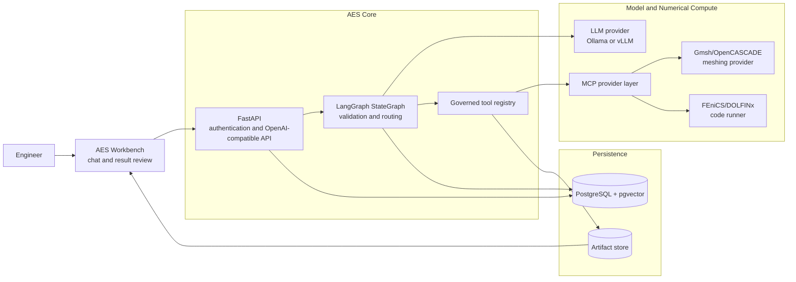
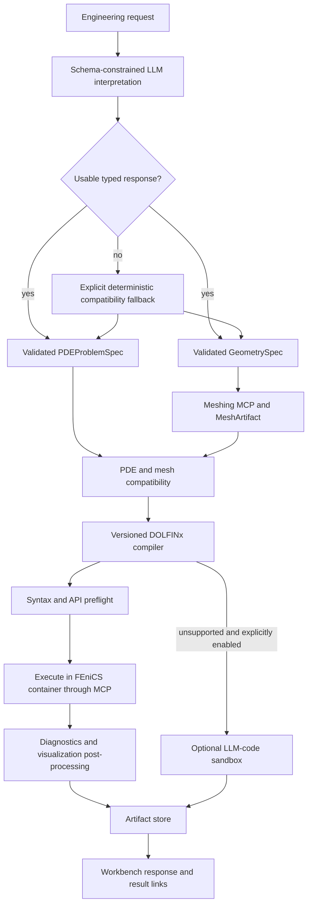

# AES - Agentic Engineering System

AES is a research prototype for turning natural-language engineering problems
into governed numerical workflows. Its first end-to-end use case is solving
partial differential equations with DOLFINx/FEniCS: AES interprets PDE and
geometry semantics into typed contracts, validates them, generates or imports
a governed mesh, compiles supported problems into DOLFINx code, executes them
in an isolated provider, and presents diagnostics and artifacts in a browser
workbench.

The project combines explicit LangGraph orchestration with local or
cluster-hosted language models, Model Context Protocol (MCP) tools, numerical
solver containers, persistent authentication, and scientific result
visualization.

> **Project status:** active research and development. AES is suitable for
> controlled experiments and demonstrations, but generated numerical models
> and results still require engineering review before real-world use.

## What AES Does

- Detects whether a request is an applicable engineering/PDE task.
- Extracts the domain, equation, coefficients, source terms, boundary and
  initial conditions, and time parameters.
- Produces independently validated `PDEProblemSpec` and `GeometrySpec`
  contracts and checks their boundary-region compatibility.
- Generates Gmsh/OpenCASCADE meshes for primitives and CSG, imports
  STEP/BREP/IGES CAD, and validates or converts MSH/XDMF meshes.
- Declares STL/OBJ/PLY surface reconstruction as an explicit capability
  placeholder; AES does not guess a volume mesh from scan data.
- Asks for missing information or the desired output when the request is
  ambiguous.
- Produces formulation summaries, generated DOLFINx code, or executed solves.
- Applies static safety checks and a bounded code-repair loop before execution.
- Executes generated code inside a dedicated FEniCS provider container through
  MCP rather than inside the orchestration service.
- Collects source code, logs, diagnostics, solution files, previews, and
  manifests in an AES-owned artifact store.
- Presents authenticated chat, workflow progress, diagnostics, artifacts, and
  numerical result previews in the AES Workbench.
- Supports Ollama for local development and an OpenAI-compatible vLLM service
  as the Kubernetes production target.

## Architecture



The browser never communicates directly with the database, model runtime, or
solver containers. FastAPI is the authenticated application boundary;
LangGraph owns workflow state and routing; MCP providers own external tool
execution; the artifact store owns result publication.

### Typical Solve Flow



See [the central architecture document](docs/architecture.md) for component
contracts, runtime sequences, persistence boundaries, and links to each
component's detailed architecture.

## Repository Layout

```text
AES/
  langgraph/   LangGraph workflow, FastAPI boundary, tools, and tests
  web-ui/      Authenticated AES Workbench and scientific result viewer
  mcp/         MCP provider registry, contracts, and provider containers
  database/    PostgreSQL/pgvector service, schemas, and migrations
  ollama/      Local model runtime and model-pull automation
  vllm/        Kubernetes-native production model serving
  deploy/      Development and production Docker Compose entrypoints
  artifacts/   Local AES run artifacts (runtime data)
  docs/        Cross-component architecture and operational documentation
```

## Technology Stack

| Area | Technologies |
| --- | --- |
| Orchestration and API | Python, LangGraph, LangChain integrations, FastAPI, Pydantic |
| Models | Ollama for local development, vLLM/OpenAI-compatible API for Kubernetes |
| Engineering tools | MCP, Gmsh, OpenCASCADE, meshio, DOLFINx/FEniCS, PETSc, UFL |
| Web application | React, TypeScript, Vite, Nginx, VTK.js |
| Persistence | PostgreSQL 16, pgvector, versioned SQL migrations, filesystem artifact store |
| Deployment | Docker Compose, Docker, Kubernetes, Kustomize, NVIDIA GPUs |

## Quick Start

### Prerequisites

- Git
- Docker Engine or Docker Desktop with Docker Compose
- Enough RAM for the selected Ollama model
- An NVIDIA GPU is optional for the basic development stack

The default development model is `qwen3:4b`. Full FEniCS execution and
Kubernetes vLLM deployment have additional prerequisites documented below.

### 1. Configure AES

From the repository root:

```bash
cp deploy/.env.example deploy/.env
```

Replace both PostgreSQL password placeholders in `deploy/.env` with different
random values. This file is ignored by Git and must never be committed.

Create the shared Docker network once:

```bash
docker network inspect ai-stack-net >/dev/null 2>&1 \
  || docker network create ai-stack-net
```

### 2. Start the Development Stack

```bash
AES_OLLAMA_MODEL=qwen3:4b \
AES_OLLAMA_PULL_GROUP=minimal \
docker compose -f deploy/compose.dev.yaml \
  --profile models up -d --build
```

The `models` profile starts a one-shot model puller in addition to PostgreSQL,
Ollama, LangGraph, and the Workbench. Follow startup with:

```bash
docker compose -f deploy/compose.dev.yaml \
  --profile models logs -f --timestamps
```

### 3. Create the First User

AES intentionally has no default username or password. Create an account after
the containers are running:

```bash
docker compose -f deploy/compose.dev.yaml exec langgraph \
  python -m aes_agent.create_user \
  --username engineer \
  --display-name "AES Engineer"
```

The command requests the password interactively so it does not appear in shell
history.

### 4. Open the Workbench

Open [http://127.0.0.1:3000](http://127.0.0.1:3000), sign in with the account
you created, and submit an engineering problem.

The local service endpoints are:

| Service | Address |
| --- | --- |
| AES Workbench | `http://127.0.0.1:3000` |
| LangGraph API | `http://127.0.0.1:8002` |
| Ollama | `http://127.0.0.1:11435` |
| Meshing MCP | `http://127.0.0.1:8007` with the `fenics` profile |

## Optional FEniCS Execution

The basic stack can classify and plan without starting the FEniCS profile.
Live numerical execution starts the meshing MCP, external `dolfinx-mcp:latest`
image, and AES FEniCS code runner together through the `fenics` profile.

After preparing the provider image, start the full development stack with:

```bash
docker compose -f deploy/compose.dev.yaml \
  --profile models --profile fenics up -d --build
```

Provider setup, smoke tests, execution flags, and troubleshooting are described
in [the MCP guide](mcp/README.md) and
[the FEniCS architecture](mcp/providers/fenics/architecture.md).

## Model Serving Modes

- **Development:** Ollama runs as part of the Docker Compose stack and defaults
  to a small local model.
- **Compose production:** Ollama remains the default unless
  `AES_LLM_PROVIDER=vllm` and a reachable OpenAI-compatible endpoint are
  configured.
- **Kubernetes production target:** vLLM runs separately from Docker Compose,
  currently using the served alias `aes-engineering-model` with a quantized
  Gemma 4 31B checkpoint on one A100-class GPU.

See [the vLLM deployment guide](vllm/README.md) for Kubernetes manifests,
secrets, resource requirements, port forwarding, and optional VPN-restricted
Ingress.

## Current Boundaries

- Users and server sessions are stored in PostgreSQL.
- Workbench conversation history is currently browser-local and scoped by
  username; database-backed chat persistence is planned.
- Existing artifact directories do not yet provide complete per-user
  multi-tenant authorization.
- Retrieval and filesystem MCP providers are architectural scaffolds, not
  production-ready integrations.
- Generated code passes bounded checks and sandboxed execution, but numerical
  correctness still requires domain-expert review.

## Documentation

- [System architecture](docs/architecture.md)
- [LangGraph architecture](langgraph/architecture.md)
- [Workbench documentation](web-ui/README.md)
- [MCP provider layer](mcp/README.md)
- [Database architecture](database/architecture.md)
- [Artifact-store design](docs/artifact_store.md)
- [Logging and observability](docs/logging.md)
- [Docker Compose architecture](deploy/architecture.md)
- [Kubernetes vLLM deployment](vllm/README.md)

## Security Notes

- Never commit `deploy/.env`, Kubernetes Secret manifests, API keys, model
  tokens, passwords, private hostnames, or cluster-specific configuration.
- Keep `AES_AUTH_COOKIE_SECURE=false` only for localhost or SSH-tunnel HTTP
  testing. Enable it when HTTPS terminates in front of the Workbench.
- Disable content logging in privacy-sensitive deployments with
  `AES_LOG_CONTENT=false` and `FENICS_RUNNER_LOG_CONTENT=false`.
- Treat generated solver code and numerical output as untrusted until reviewed.

## Development and Tests

Create a Python environment with the repository-wide requirements aggregator:

```bash
python -m venv .venv
source .venv/bin/activate
python -m pip install --upgrade pip
python -m pip install -r aes_requirements.txt
```

Run the LangGraph test suite:

```bash
cd langgraph
PYTHONPATH=. python -m unittest discover -s tests -v
```

Component-specific setup and operational details are maintained in the linked
architecture and deployment guides above.
