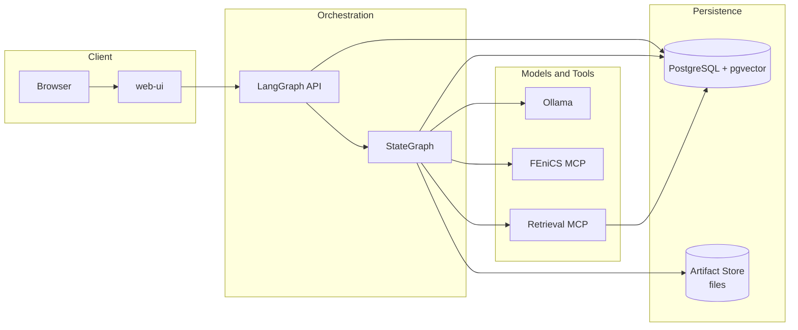
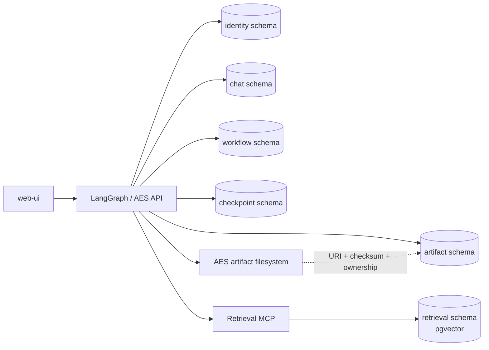
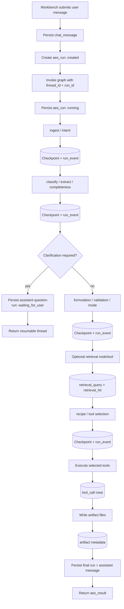
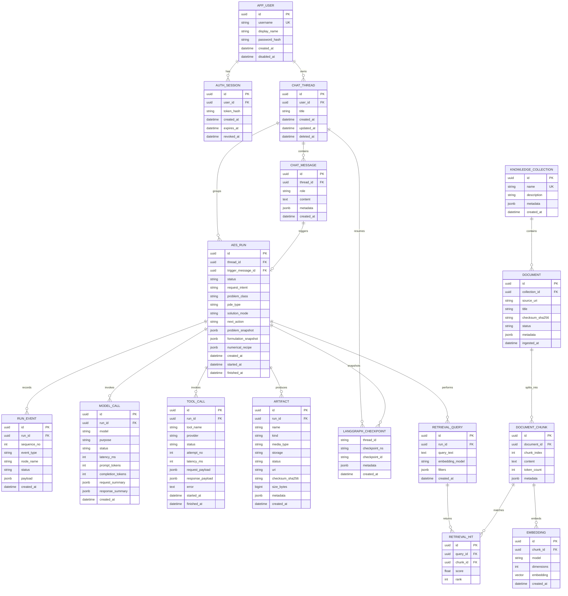
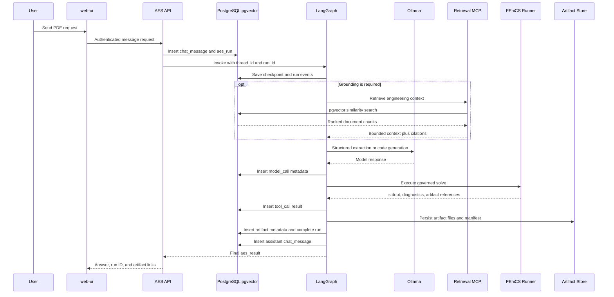
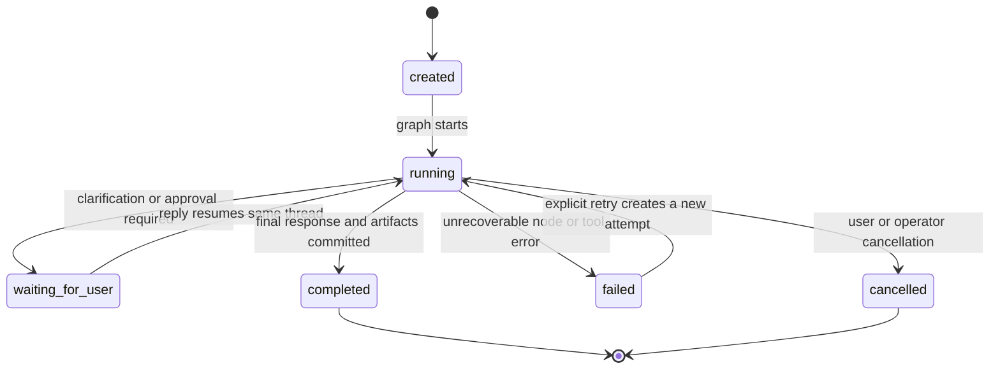
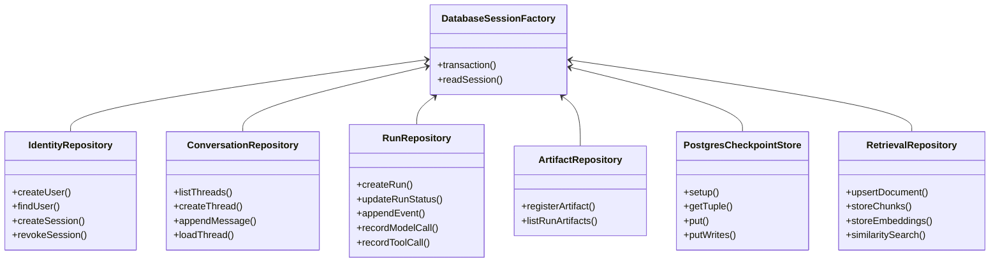
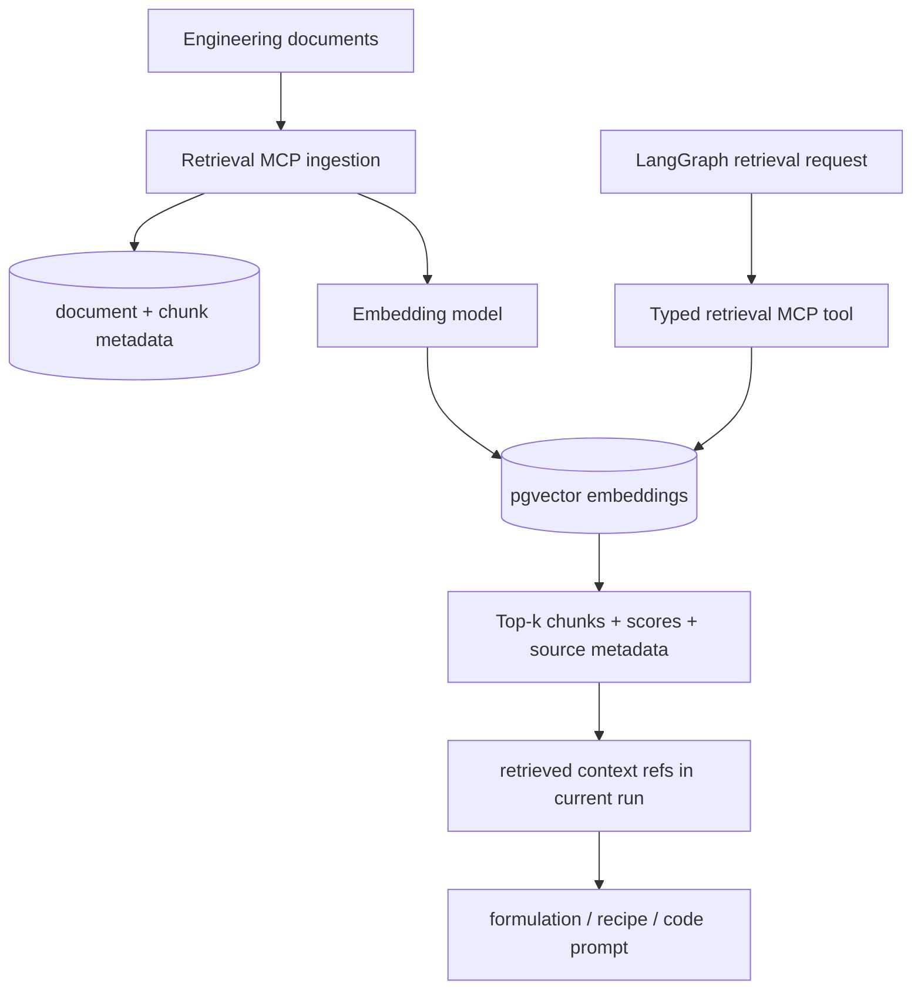

# AES Database Architecture

The `database/` component owns AES PostgreSQL deployment, schema migrations,
and durable application data. The first implemented slice provides pgvector,
server-side users, and opaque login sessions. Conversations, workflow records,
LangGraph checkpoints, artifact metadata, and retrieval indexes remain the
target described by this document.

## Decision

The first implementation should use one PostgreSQL container with the
`pgvector` extension.

- PostgreSQL provides users, sessions, conversations, messages, AES runs,
  workflow events, tool/model calls, LangGraph checkpoints, and artifact
  metadata.
- `pgvector` makes the same PostgreSQL service the first AES vector database
  for document chunks and embeddings.
- Large files remain in the AES artifact store. PostgreSQL stores their
  metadata, ownership, status, checksum, and URI, not the file bytes.
- A dedicated vector engine such as Qdrant or Weaviate is deferred until
  retrieval scale or operational requirements justify another service.

This is one physical database service, but it is not one unstructured schema.
Separate PostgreSQL schemas and roles preserve ownership boundaries.

## System Placement



The browser does not connect to PostgreSQL. The Workbench uses authenticated
HTTP APIs, and server-side services enforce authorization and ownership.

## Storage Boundaries



| PostgreSQL schema | Owner | Purpose |
| --- | --- | --- |
| `identity` | AES API | Users, password hashes, login sessions, authorization data |
| `chat` | AES API | Conversation threads and user/assistant messages |
| `workflow` | LangGraph/AES | Runs, node/route events, model calls, tool calls, final status |
| `checkpoint` | LangGraph checkpointer | Durable graph snapshots and pending writes for resume/recovery |
| `artifact` | Artifact-store integration | Metadata for files stored outside PostgreSQL |
| `retrieval` | Retrieval MCP | Collections, documents, chunks, embeddings, queries, and hits |

The target uses separate database roles:

- the configured PostgreSQL administrator currently applies bootstrap
  migrations and is not used by runtime services,
- `aes_app`: read/write access to `identity`, `chat`, `workflow`, and
  `artifact`,
- `aes_checkpoint`: access only to LangGraph checkpoint tables,
- `aes_retrieval`: access only to `retrieval`, including vector indexes,
- `aes_readonly`: optional diagnostics/reporting access.

The first migration creates `aes_app`, `aes_checkpoint`, and `aes_retrieval`.
Only `aes_app` is used by application code in the identity slice. A dedicated
non-administrator migration role and the optional read-only role are later
hardening steps.

## Current Persistence Inventory

The database introduction replaces or complements these current stores.

| Current data | Current location | Target |
| --- | --- | --- |
| User identity and login sessions | `identity.app_user` and `identity.auth_session` | Implemented; keep server-side |
| Conversations and turns | Browser `localStorage` | `chat.chat_thread` and `chat.chat_message` |
| Active conversation selection | Browser `localStorage` | Remains a UI preference; may be cached locally |
| `AgentState` | Process memory during `graph.invoke` | PostgreSQL LangGraph checkpointer |
| Run status and next action | Returned only in `aes_result` and artifact manifest | `workflow.aes_run` |
| Node and route progress | Logs plus simulated Workbench progress | `workflow.run_event` |
| Ollama calls | Component logs | `workflow.model_call` metadata and bounded content |
| Tool calls and results | `AgentState.tool_results` and logs | `workflow.tool_call` plus checkpoint snapshot |
| Artifact metadata | `manifest.json` in each run directory | `artifact.artifact` plus existing manifest |
| Artifact file bytes | Host-mounted `artifacts/` and provider workspaces | Remain outside PostgreSQL |
| Retrieval documents/index | Planned only | `retrieval.*` with `pgvector` |

Browser storage is no longer authoritative for identity. It remains the
temporary source of truth for conversations and active UI selection until the
chat schema and API slice is implemented. PostgreSQL is already authoritative
for users and sessions and will become authoritative for chats, progress, and
results in later slices.

## AgentState Persistence Map

`AgentState` remains the current-run contract. It should not grow into a user,
chat, or document database. The checkpointer stores complete state snapshots;
selected fields are also projected into queryable tables.

| `AgentState` group | Fields | Durable projection |
| --- | --- | --- |
| Request | `raw_user_input` | Triggering `chat_message.content`; optional immutable copy in `aes_run.input_text` |
| Intent | `request_intent`, `intent_reason` | `aes_run.request_intent`, `aes_run.intent_reason` |
| Problem extraction | `problem_class`, `domain_info`, `pde_info`, `coefficient_info`, `source_info`, `bc_info`, `initial_condition_info`, `time_info` | `aes_run.problem_snapshot` JSONB plus indexed `problem_class` and `pde_type` columns |
| Completeness | `missing_information`, `clarification_questions` | Checkpoint JSON; clarification assistant message; run status `waiting_for_user` |
| Formulation | `selected_formulation`, `validation_status`, `validation_errors` | `aes_run.formulation_snapshot` JSONB and validation status |
| Mode and recipe | `solution_mode`, `numerical_recipe_status`, `numerical_recipe`, `numerical_recipe_errors` | `aes_run.solution_mode`, recipe/status JSONB |
| Tool selection | `selected_tools`, `tool_execution_status` | `aes_run.selected_tools` JSONB and aggregate execution status |
| Tool execution | `tool_results`, `tool_errors` | One `tool_call` row per invocation; complete values also remain in checkpoints |
| Final response | `generated_artifact`, `agent_status`, `next_action` | Assistant `chat_message`, final `aes_run` status, response text, and next action |

Transport and ownership identifiers should be passed through the LangGraph
runtime configuration, not mixed into the mathematical state:

- `user_id`,
- `conversation_id`,
- `message_id`,
- `run_id`,
- LangGraph `thread_id` and `checkpoint_ns`,
- request/correlation ID.

The conversation ID should normally be the LangGraph `thread_id`. A separate
`run_id` identifies one user-message execution inside that thread.

## Graph Persistence Points



Each node completion should create a small structured `run_event`. Complete
state recovery belongs to the checkpointer; `run_event` is the user-visible and
queryable timeline. This avoids storing a full state copy in every event row.

## Entity Model



`LANGGRAPH_CHECKPOINT` is conceptual in this ER model. The implementation
should use the official PostgreSQL checkpointer's own tables and migrations
rather than reimplementing its storage format.

## Runtime Sequence



## Run Lifecycle



The database should enforce valid statuses, but lifecycle transitions remain an
application responsibility. A retry should preserve the failed run and create
a new run or explicit attempt record rather than rewriting history.

## Implementation-Level Design



These are responsibility boundaries, not a requirement for one large facade.
The LangGraph API should depend on small repositories and the official
checkpointer. Retrieval storage remains behind the Retrieval MCP provider.

## Retrieval Design

The retrieval MCP provider owns ingestion, chunking, embedding generation, and
similarity search. LangGraph decides when retrieval is useful and consumes only
bounded, cited results.



Embedding records must include their model and dimension. A change of embedding
model creates a new embedding set; it must not silently mix incompatible
vectors in one index.

## Artifact Consistency

Artifact files and PostgreSQL cannot share one atomic transaction. Use this
order:

1. Create artifact metadata with status `materializing`.
2. Write the file to a temporary name in the artifact store.
3. Calculate size and SHA-256 checksum.
4. Atomically rename the file into its final run directory.
5. Mark metadata `stored` and commit the final URI.

Failed or interrupted writes remain queryable as `failed` or `missing` and can
be reconciled by a maintenance job. Provider-owned `mcp://` references remain
`referenced` until AES materializes them.

## Security And Privacy

- Store password hashes only, using a modern password-hashing algorithm; never
  store plaintext passwords or session tokens.
- Keep PostgreSQL on `ai-stack-net`. Do not publish its port in production.
- Use Docker secrets or an ignored environment file for credentials.
- Authorize every conversation, run, and artifact through `user_id` ownership.
- Redact secrets before persisting model/tool payloads.
- Store bounded model/tool content only when explicitly enabled. Metadata,
  hashes, timings, and statuses remain available without full prompt retention.
- Define retention periods for sessions, run events, checkpoints, model/tool
  payloads, and deleted chats.
- Raw container logs are not application database records. A future log system
  such as Loki or OpenTelemetry should store them separately.

## Target Project Layout

```text
database/
  architecture.md
  README.md
  compose.database.yaml
  migrations/
    apply.sh
    roles.sql
    versions/
      001_identity.sql
```

`deploy/compose.dev.yaml` and `deploy/compose.prod.yaml` include
`database/compose.database.yaml`, following the existing component-owned
Compose pattern. The one-shot `aes-database-migrate` service applies versioned
SQL before LangGraph starts.

## Implementation Phases

1. **Completed:** add the PostgreSQL/pgvector container, persistent volume,
   health check, secret configuration, migration job, schemas, and initial
   runtime roles.
2. **In progress:** server-side users and opaque sessions are implemented.
   Add conversations, messages, and run records, then migrate Workbench chat
   history from authoritative `localStorage` to API persistence.
3. Add the PostgreSQL LangGraph checkpointer and resume clarification using the
   existing conversation ID as `thread_id`.
4. Persist real graph node/route progress and stream it to the Workbench instead
   of simulating progress timers.
5. Add tool/model call records and artifact metadata registration.
6. Implement the Retrieval MCP ingestion/query path with pgvector and cited
   results.
7. Add backup, restore, retention, reconciliation, and database integration
   tests before treating the service as production-ready.

## Non-Goals For The First Database Step

- Storing XDMF, HDF5, VTK, PNG, SVG, MP4, generated Python, or raw logs as
  PostgreSQL large objects.
- Giving the browser direct SQL access.
- Replacing MCP with database calls from the LLM.
- Introducing Qdrant, Weaviate, Elasticsearch, or a second relational database
  before pgvector is measured under real AES retrieval workloads.
- Reimplementing the official LangGraph PostgreSQL checkpoint schema.
