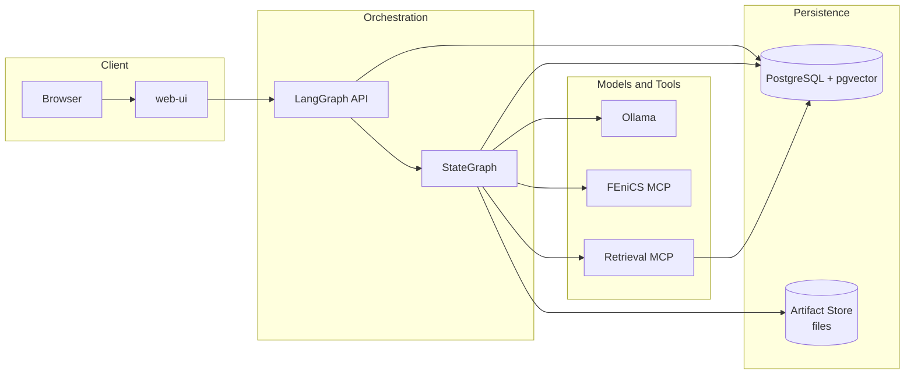
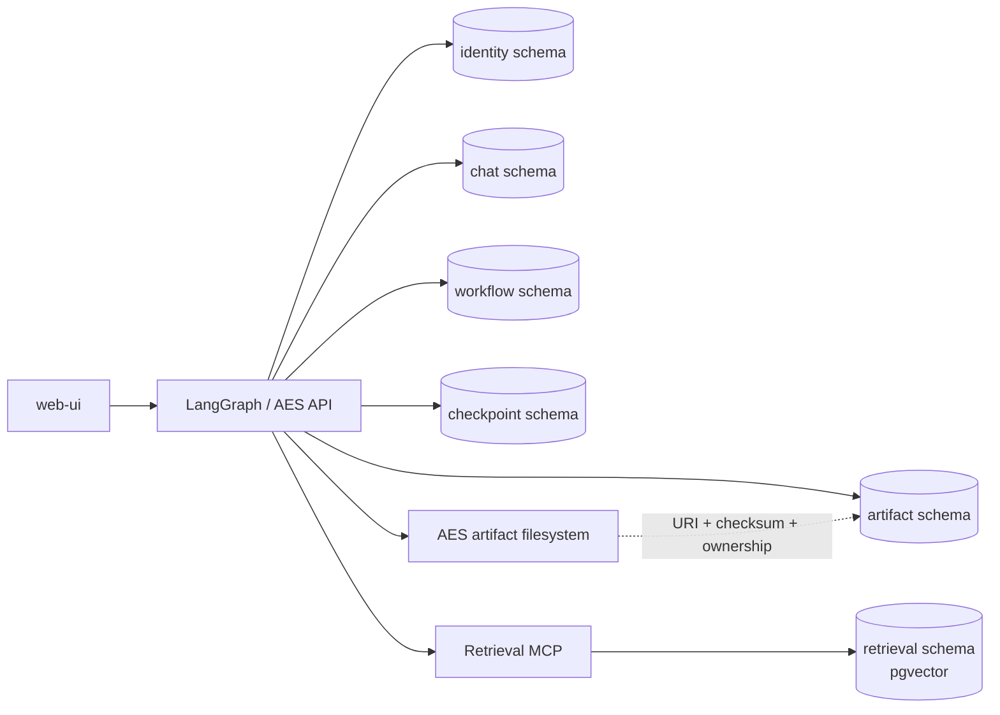
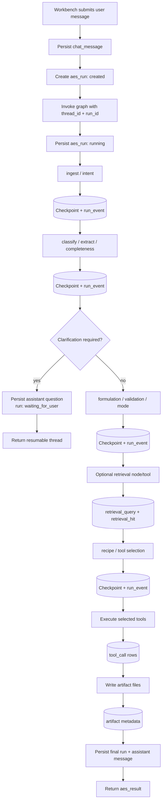
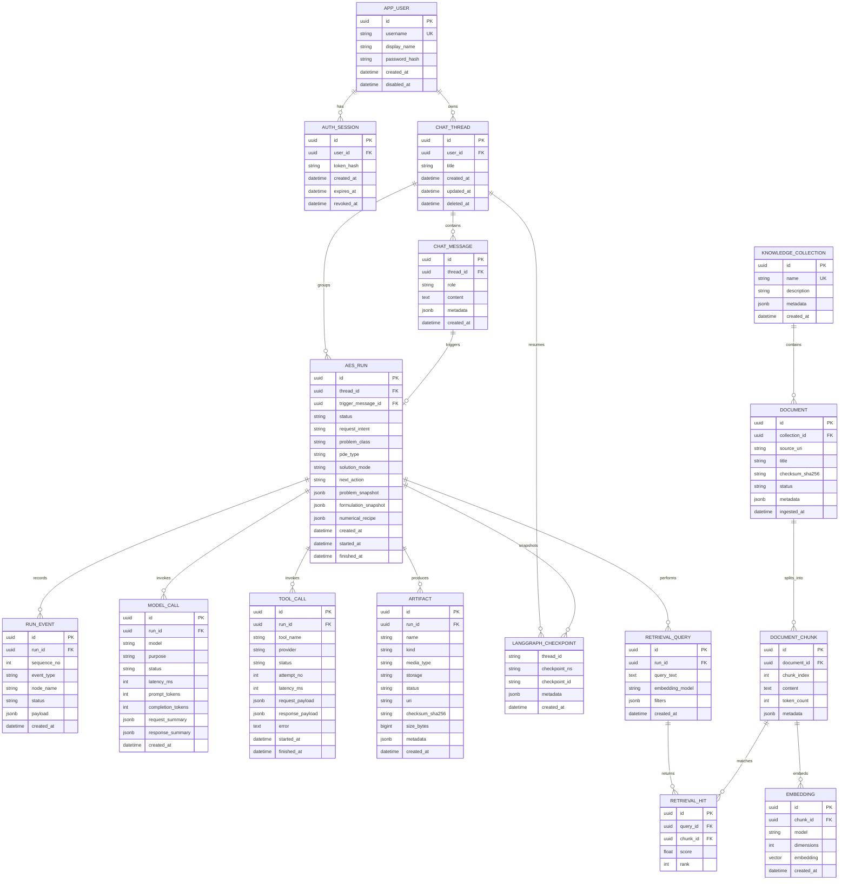
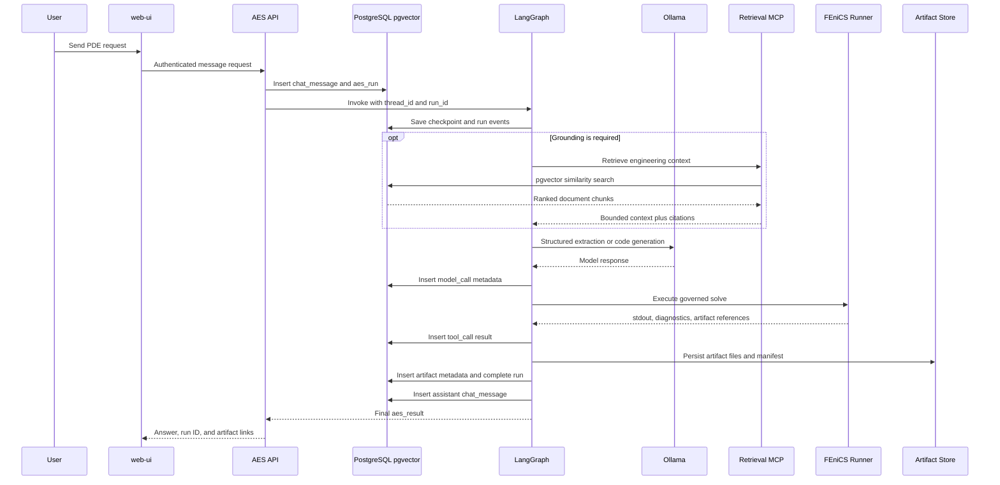
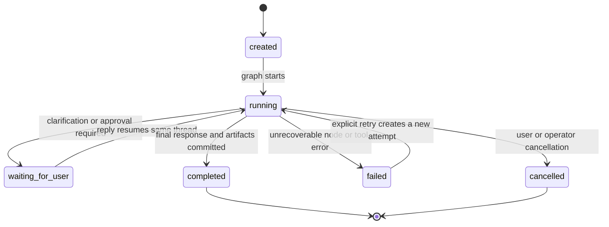
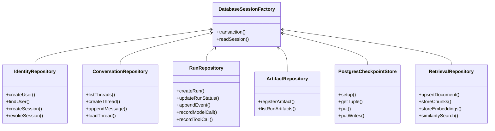
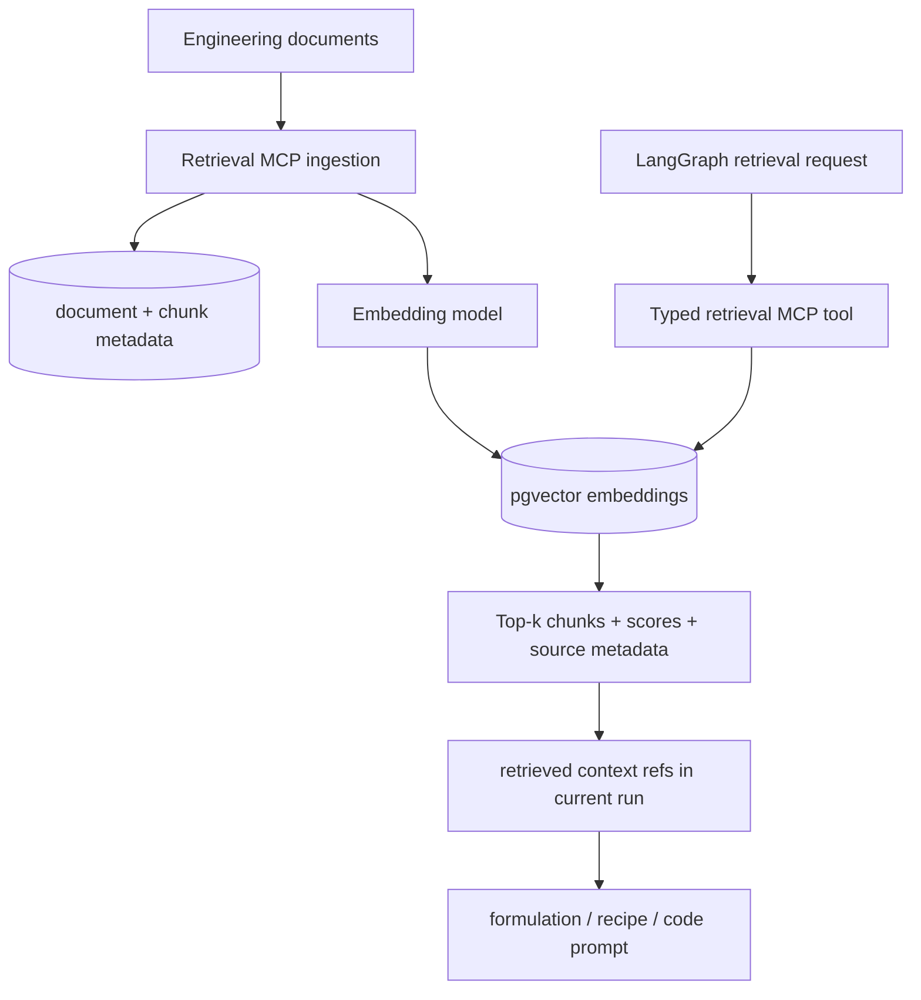

# AES Database Architecture

The `database/` component owns AES PostgreSQL deployment, schema migrations,
and durable application data. The first implemented slice provides pgvector,
server-side users, and opaque login sessions. Conversations, workflow records,
LangGraph checkpoints, artifact metadata, and retrieval indexes remain the
target described by this document.

## Decision

The first implementation should use one PostgreSQL container with the
`pgvector` extension.

- PostgreSQL provides users, sessions, conversations, messages, AES runs,
  workflow events, tool/model calls, LangGraph checkpoints, and artifact
  metadata.
- `pgvector` makes the same PostgreSQL service the first AES vector database
  for document chunks and embeddings.
- Large files remain in the AES artifact store. PostgreSQL stores their
  metadata, ownership, status, checksum, and URI, not the file bytes.
- A dedicated vector engine such as Qdrant or Weaviate is deferred until
  retrieval scale or operational requirements justify another service.

This is one physical database service, but it is not one unstructured schema.
Separate PostgreSQL schemas and roles preserve ownership boundaries.

## System Placement


```mermaid
flowchart LR
    subgraph CLIENTS["Client"]
        direction TB
        browser["Browser"] --> web["web-ui"]
    end

    subgraph ORCHESTRATION["Orchestration"]
        direction TB
        api["LangGraph API"] --> orchestrator["StateGraph"]
    end

    subgraph COMPUTE["Models and Tools"]
        direction TB
        ollama["Ollama"]
        fenics["FEniCS MCP"]
        retrieval["Retrieval MCP"]
    end

    subgraph PERSISTENCE["Persistence"]
        direction TB
        postgres[("PostgreSQL + pgvector")]
        artifacts[("Artifact Store<br/>files")]
    end

    web --> api
    orchestrator --> ollama
    orchestrator --> fenics
    orchestrator --> retrieval
    api --> postgres
    orchestrator --> postgres
    retrieval --> postgres
    orchestrator --> artifacts
```

The browser does not connect to PostgreSQL. The Workbench uses authenticated
HTTP APIs, and server-side services enforce authorization and ownership.

## Storage Boundaries


```mermaid
flowchart LR
    UI["web-ui"] --> API["LangGraph / AES API"]
    API --> ID[("identity schema")]
    API --> CHAT[("chat schema")]
    API --> WF[("workflow schema")]
    API --> CP[("checkpoint schema")]

    API --> FILES["AES artifact filesystem"]
    API --> META[("artifact schema")]

    API --> RET["Retrieval MCP"]
    RET --> VEC[("retrieval schema<br/>pgvector")]

    FILES -. "URI + checksum + ownership" .-> META
```

| PostgreSQL schema | Owner | Purpose |
| --- | --- | --- |
| `identity` | AES API | Users, password hashes, login sessions, authorization data |
| `chat` | AES API | Conversation threads and user/assistant messages |
| `workflow` | LangGraph/AES | Runs, node/route events, model calls, tool calls, final status |
| `checkpoint` | LangGraph checkpointer | Durable graph snapshots and pending writes for resume/recovery |
| `artifact` | Artifact-store integration | Metadata for files stored outside PostgreSQL |
| `retrieval` | Retrieval MCP | Collections, documents, chunks, embeddings, queries, and hits |

The target uses separate database roles:

- the configured PostgreSQL administrator currently applies bootstrap
  migrations and is not used by runtime services,
- `aes_app`: read/write access to `identity`, `chat`, `workflow`, and
  `artifact`,
- `aes_checkpoint`: access only to LangGraph checkpoint tables,
- `aes_retrieval`: access only to `retrieval`, including vector indexes,
- `aes_readonly`: optional diagnostics/reporting access.

The first migration creates `aes_app`, `aes_checkpoint`, and `aes_retrieval`.
Only `aes_app` is used by application code in the identity slice. A dedicated
non-administrator migration role and the optional read-only role are later
hardening steps.

## Current Persistence Inventory

The database introduction replaces or complements these current stores.

| Current data | Current location | Target |
| --- | --- | --- |
| User identity and login sessions | `identity.app_user` and `identity.auth_session` | Implemented; keep server-side |
| Conversations and turns | Browser `localStorage` | `chat.chat_thread` and `chat.chat_message` |
| Active conversation selection | Browser `localStorage` | Remains a UI preference; may be cached locally |
| `AgentState` | Process memory during `graph.invoke` | PostgreSQL LangGraph checkpointer |
| Run status and next action | Returned only in `aes_result` and artifact manifest | `workflow.aes_run` |
| Node and route progress | Logs plus simulated Workbench progress | `workflow.run_event` |
| Ollama calls | Component logs | `workflow.model_call` metadata and bounded content |
| Tool calls and results | `AgentState.tool_results` and logs | `workflow.tool_call` plus checkpoint snapshot |
| Artifact metadata | `manifest.json` in each run directory | `artifact.artifact` plus existing manifest |
| Artifact file bytes | Host-mounted `artifacts/` and provider workspaces | Remain outside PostgreSQL |
| Retrieval documents/index | Planned only | `retrieval.*` with `pgvector` |

Browser storage is no longer authoritative for identity. It remains the
temporary source of truth for conversations and active UI selection until the
chat schema and API slice is implemented. PostgreSQL is already authoritative
for users and sessions and will become authoritative for chats, progress, and
results in later slices.

## AgentState Persistence Map

`AgentState` remains the current-run contract. It should not grow into a user,
chat, or document database. The checkpointer stores complete state snapshots;
selected fields are also projected into queryable tables.

| `AgentState` group | Fields | Durable projection |
| --- | --- | --- |
| Request | `raw_user_input` | Triggering `chat_message.content`; optional immutable copy in `aes_run.input_text` |
| Intent | `request_intent`, `intent_reason` | `aes_run.request_intent`, `aes_run.intent_reason` |
| Problem extraction | `problem_class`, `domain_info`, `pde_info`, `coefficient_info`, `source_info`, `bc_info`, `initial_condition_info`, `time_info` | `aes_run.problem_snapshot` JSONB plus indexed `problem_class` and `pde_type` columns |
| Completeness | `missing_information`, `clarification_questions` | Checkpoint JSON; clarification assistant message; run status `waiting_for_user` |
| Formulation | `selected_formulation`, `validation_status`, `validation_errors` | `aes_run.formulation_snapshot` JSONB and validation status |
| Mode and recipe | `solution_mode`, `numerical_recipe_status`, `numerical_recipe`, `numerical_recipe_errors` | `aes_run.solution_mode`, recipe/status JSONB |
| Tool selection | `selected_tools`, `tool_execution_status` | `aes_run.selected_tools` JSONB and aggregate execution status |
| Tool execution | `tool_results`, `tool_errors` | One `tool_call` row per invocation; complete values also remain in checkpoints |
| Final response | `generated_artifact`, `agent_status`, `next_action` | Assistant `chat_message`, final `aes_run` status, response text, and next action |

Transport and ownership identifiers should be passed through the LangGraph
runtime configuration, not mixed into the mathematical state:

- `user_id`,
- `conversation_id`,
- `message_id`,
- `run_id`,
- LangGraph `thread_id` and `checkpoint_ns`,
- request/correlation ID.

The conversation ID should normally be the LangGraph `thread_id`. A separate
`run_id` identifies one user-message execution inside that thread.

## Graph Persistence Points


```mermaid
flowchart TD
    A["Workbench submits user message"] --> B["Persist chat_message"]
    B --> C["Create aes_run: created"]
    C --> D["Invoke graph with thread_id + run_id"]
    D --> E["Persist aes_run: running"]

    E --> N1["ingest / intent"]
    N1 --> CP1[("Checkpoint + run_event")]
    CP1 --> N2["classify / extract / completeness"]
    N2 --> CP2[("Checkpoint + run_event")]

    CP2 --> Q{"Clarification required?"}
    Q -->|yes| WAIT["Persist assistant question<br/>run: waiting_for_user"]
    WAIT --> END1["Return resumable thread"]

    Q -->|no| N3["formulation / validation / mode"]
    N3 --> CP3[("Checkpoint + run_event")]
    CP3 --> RET["Optional retrieval node/tool"]
    RET --> RH[("retrieval_query + retrieval_hit")]
    RH --> N4["recipe / tool selection"]
    N4 --> CP4[("Checkpoint + run_event")]

    CP4 --> TOOL["Execute selected tools"]
    TOOL --> TC[("tool_call rows")]
    TC --> STORE["Write artifact files"]
    STORE --> AM[("artifact metadata")]
    AM --> FINAL["Persist final run + assistant message"]
    FINAL --> END2["Return aes_result"]
```

Each node completion should create a small structured `run_event`. Complete
state recovery belongs to the checkpointer; `run_event` is the user-visible and
queryable timeline. This avoids storing a full state copy in every event row.

## Entity Model


```mermaid
erDiagram
    APP_USER ||--o{ AUTH_SESSION : has
    APP_USER ||--o{ CHAT_THREAD : owns
    CHAT_THREAD ||--o{ CHAT_MESSAGE : contains
    CHAT_THREAD ||--o{ AES_RUN : groups
    CHAT_MESSAGE ||--o| AES_RUN : triggers
    AES_RUN ||--o{ RUN_EVENT : records
    AES_RUN ||--o{ MODEL_CALL : invokes
    AES_RUN ||--o{ TOOL_CALL : invokes
    AES_RUN ||--o{ ARTIFACT : produces
    CHAT_THREAD ||--o{ LANGGRAPH_CHECKPOINT : resumes
    AES_RUN ||--o{ LANGGRAPH_CHECKPOINT : snapshots

    KNOWLEDGE_COLLECTION ||--o{ DOCUMENT : contains
    DOCUMENT ||--o{ DOCUMENT_CHUNK : splits_into
    DOCUMENT_CHUNK ||--o{ EMBEDDING : embeds
    AES_RUN ||--o{ RETRIEVAL_QUERY : performs
    RETRIEVAL_QUERY ||--o{ RETRIEVAL_HIT : returns
    DOCUMENT_CHUNK ||--o{ RETRIEVAL_HIT : matches

    APP_USER {
        uuid id PK
        string username UK
        string display_name
        string password_hash
        datetime created_at
        datetime disabled_at
    }

    AUTH_SESSION {
        uuid id PK
        uuid user_id FK
        string token_hash
        datetime created_at
        datetime expires_at
        datetime revoked_at
    }

    CHAT_THREAD {
        uuid id PK
        uuid user_id FK
        string title
        datetime created_at
        datetime updated_at
        datetime deleted_at
    }

    CHAT_MESSAGE {
        uuid id PK
        uuid thread_id FK
        string role
        text content
        jsonb metadata
        datetime created_at
    }

    AES_RUN {
        uuid id PK
        uuid thread_id FK
        uuid trigger_message_id FK
        string status
        string request_intent
        string problem_class
        string pde_type
        string solution_mode
        string next_action
        jsonb problem_snapshot
        jsonb formulation_snapshot
        jsonb numerical_recipe
        datetime created_at
        datetime started_at
        datetime finished_at
    }

    RUN_EVENT {
        uuid id PK
        uuid run_id FK
        int sequence_no
        string event_type
        string node_name
        string status
        jsonb payload
        datetime created_at
    }

    MODEL_CALL {
        uuid id PK
        uuid run_id FK
        string model
        string purpose
        string status
        int latency_ms
        int prompt_tokens
        int completion_tokens
        jsonb request_summary
        jsonb response_summary
        datetime created_at
    }

    TOOL_CALL {
        uuid id PK
        uuid run_id FK
        string tool_name
        string provider
        string status
        int attempt_no
        int latency_ms
        jsonb request_payload
        jsonb response_payload
        text error
        datetime started_at
        datetime finished_at
    }

    ARTIFACT {
        uuid id PK
        uuid run_id FK
        string name
        string kind
        string media_type
        string storage
        string status
        string uri
        string checksum_sha256
        bigint size_bytes
        jsonb metadata
        datetime created_at
    }

    LANGGRAPH_CHECKPOINT {
        string thread_id
        string checkpoint_ns
        string checkpoint_id
        jsonb metadata
        datetime created_at
    }

    KNOWLEDGE_COLLECTION {
        uuid id PK
        string name UK
        string description
        jsonb metadata
        datetime created_at
    }

    DOCUMENT {
        uuid id PK
        uuid collection_id FK
        string source_uri
        string title
        string checksum_sha256
        string status
        jsonb metadata
        datetime ingested_at
    }

    DOCUMENT_CHUNK {
        uuid id PK
        uuid document_id FK
        int chunk_index
        text content
        int token_count
        jsonb metadata
    }

    EMBEDDING {
        uuid id PK
        uuid chunk_id FK
        string model
        int dimensions
        vector embedding
        datetime created_at
    }

    RETRIEVAL_QUERY {
        uuid id PK
        uuid run_id FK
        text query_text
        string embedding_model
        jsonb filters
        datetime created_at
    }

    RETRIEVAL_HIT {
        uuid id PK
        uuid query_id FK
        uuid chunk_id FK
        float score
        int rank
    }
```

`LANGGRAPH_CHECKPOINT` is conceptual in this ER model. The implementation
should use the official PostgreSQL checkpointer's own tables and migrations
rather than reimplementing its storage format.

## Runtime Sequence


```mermaid
sequenceDiagram
    participant U as User
    participant W as web-ui
    participant A as AES API
    participant DB as PostgreSQL pgvector
    participant G as LangGraph
    participant L as Ollama
    participant R as Retrieval MCP
    participant F as FEniCS Runner
    participant S as Artifact Store

    U->>W: Send PDE request
    W->>A: Authenticated message request
    A->>DB: Insert chat_message and aes_run
    A->>G: Invoke with thread_id and run_id
    G->>DB: Save checkpoint and run events
    opt Grounding is required
        G->>R: Retrieve engineering context
        R->>DB: pgvector similarity search
        DB-->>R: Ranked document chunks
        R-->>G: Bounded context plus citations
    end
    G->>L: Structured extraction or code generation
    L-->>G: Model response
    G->>DB: Insert model_call metadata
    G->>F: Execute governed solve
    F-->>G: stdout, diagnostics, artifact references
    G->>DB: Insert tool_call result
    G->>S: Persist artifact files and manifest
    G->>DB: Insert artifact metadata and complete run
    G->>DB: Insert assistant chat_message
    G-->>A: Final aes_result
    A-->>W: Answer, run ID, and artifact links
```

## Run Lifecycle


```mermaid
stateDiagram-v2
    [*] --> created
    created --> running: graph starts
    running --> waiting_for_user: clarification or approval required
    waiting_for_user --> running: reply resumes same thread
    running --> completed: final response and artifacts committed
    running --> failed: unrecoverable node or tool error
    running --> cancelled: user or operator cancellation
    failed --> running: explicit retry creates a new attempt
    completed --> [*]
    cancelled --> [*]
```

The database should enforce valid statuses, but lifecycle transitions remain an
application responsibility. A retry should preserve the failed run and create
a new run or explicit attempt record rather than rewriting history.

## Implementation-Level Design


```mermaid
classDiagram
    class DatabaseSessionFactory {
        +transaction()
        +readSession()
    }

    class IdentityRepository {
        +createUser()
        +findUser()
        +createSession()
        +revokeSession()
    }

    class ConversationRepository {
        +listThreads()
        +createThread()
        +appendMessage()
        +loadThread()
    }

    class RunRepository {
        +createRun()
        +updateRunStatus()
        +appendEvent()
        +recordModelCall()
        +recordToolCall()
    }

    class ArtifactRepository {
        +registerArtifact()
        +listRunArtifacts()
    }

    class PostgresCheckpointStore {
        +setup()
        +getTuple()
        +put()
        +putWrites()
    }

    class RetrievalRepository {
        +upsertDocument()
        +storeChunks()
        +storeEmbeddings()
        +similaritySearch()
    }

    DatabaseSessionFactory <-- IdentityRepository
    DatabaseSessionFactory <-- ConversationRepository
    DatabaseSessionFactory <-- RunRepository
    DatabaseSessionFactory <-- ArtifactRepository
    DatabaseSessionFactory <-- PostgresCheckpointStore
    DatabaseSessionFactory <-- RetrievalRepository
```

These are responsibility boundaries, not a requirement for one large facade.
The LangGraph API should depend on small repositories and the official
checkpointer. Retrieval storage remains behind the Retrieval MCP provider.

## Retrieval Design

The retrieval MCP provider owns ingestion, chunking, embedding generation, and
similarity search. LangGraph decides when retrieval is useful and consumes only
bounded, cited results.


```mermaid
flowchart TD
    SRC["Engineering documents"] --> ING["Retrieval MCP ingestion"]
    ING --> DOC[("document + chunk metadata")]
    ING --> EMB["Embedding model"]
    EMB --> VEC[("pgvector embeddings")]

    Q["LangGraph retrieval request"] --> R["Typed retrieval MCP tool"]
    R --> VEC
    VEC --> HIT["Top-k chunks + scores + source metadata"]
    HIT --> CTX["retrieved context refs in current run"]
    CTX --> FORM["formulation / recipe / code prompt"]
```

Embedding records must include their model and dimension. A change of embedding
model creates a new embedding set; it must not silently mix incompatible
vectors in one index.

## Artifact Consistency

Artifact files and PostgreSQL cannot share one atomic transaction. Use this
order:

1. Create artifact metadata with status `materializing`.
2. Write the file to a temporary name in the artifact store.
3. Calculate size and SHA-256 checksum.
4. Atomically rename the file into its final run directory.
5. Mark metadata `stored` and commit the final URI.

Failed or interrupted writes remain queryable as `failed` or `missing` and can
be reconciled by a maintenance job. Provider-owned `mcp://` references remain
`referenced` until AES materializes them.

## Security And Privacy

- Store password hashes only, using a modern password-hashing algorithm; never
  store plaintext passwords or session tokens.
- Keep PostgreSQL on `ai-stack-net`. Do not publish its port in production.
- Use Docker secrets or an ignored environment file for credentials.
- Authorize every conversation, run, and artifact through `user_id` ownership.
- Redact secrets before persisting model/tool payloads.
- Store bounded model/tool content only when explicitly enabled. Metadata,
  hashes, timings, and statuses remain available without full prompt retention.
- Define retention periods for sessions, run events, checkpoints, model/tool
  payloads, and deleted chats.
- Raw container logs are not application database records. A future log system
  such as Loki or OpenTelemetry should store them separately.

## Target Project Layout

```text
database/
  architecture.md
  README.md
  compose.database.yaml
  migrations/
    apply.sh
    roles.sql
    versions/
      001_identity.sql
```

`deploy/compose.dev.yaml` and `deploy/compose.prod.yaml` include
`database/compose.database.yaml`, following the existing component-owned
Compose pattern. The one-shot `aes-database-migrate` service applies versioned
SQL before LangGraph starts.

## Implementation Phases

1. **Completed:** add the PostgreSQL/pgvector container, persistent volume,
   health check, secret configuration, migration job, schemas, and initial
   runtime roles.
2. **In progress:** server-side users and opaque sessions are implemented.
   Add conversations, messages, and run records, then migrate Workbench chat
   history from authoritative `localStorage` to API persistence.
3. Add the PostgreSQL LangGraph checkpointer and resume clarification using the
   existing conversation ID as `thread_id`.
4. Persist real graph node/route progress and stream it to the Workbench instead
   of simulating progress timers.
5. Add tool/model call records and artifact metadata registration.
6. Implement the Retrieval MCP ingestion/query path with pgvector and cited
   results.
7. Add backup, restore, retention, reconciliation, and database integration
   tests before treating the service as production-ready.

## Non-Goals For The First Database Step

- Storing XDMF, HDF5, VTK, PNG, SVG, MP4, generated Python, or raw logs as
  PostgreSQL large objects.
- Giving the browser direct SQL access.
- Replacing MCP with database calls from the LLM.
- Introducing Qdrant, Weaviate, Elasticsearch, or a second relational database
  before pgvector is measured under real AES retrieval workloads.
- Reimplementing the official LangGraph PostgreSQL checkpoint schema.


```mermaid
flowchart LR

%% ============================================================
%% 1. ENGINEERING PROBLEM
%% ============================================================

    Problem["Engineering / Scientific Problem"]

    Problem --> objective

    subgraph objectives["PROBLEM OBJECTIVE"]
        direction TB

        objective{"What should be determined?"}

        objective --> forward["Forward Simulation"]
        objective --> inverse["Inverse Problem"]
        objective --> optimization["Design Optimization"]
        objective --> uncertainty["Uncertainty Quantification"]
        objective --> control["Prediction and Control"]

        forward --> forward_desc["Known model and parameters<br/>→ compute system response"]

        inverse --> inverse_desc["Measured response<br/>→ infer parameters, sources,<br/>geometry or initial conditions"]

        optimization --> optimization_desc["Change design variables<br/>→ minimize or maximize an objective"]

        uncertainty --> uncertainty_desc["Propagate uncertain parameters<br/>→ probability distributions<br/>and confidence intervals"]

        control --> control_desc["Use simulation repeatedly<br/>→ estimate and control<br/>a dynamic system"]
    end

%% ============================================================
%% 2. PHYSICAL DOMAINS
%% ============================================================

    forward --> physics
    inverse --> physics
    optimization --> physics
    uncertainty --> physics
    control --> physics

    subgraph numerics["PHYSICAL DOMAINS OF NUMERICAL SIMULATION"]
        direction TB

        physics["Selection of Physical Model"]

        physics --> solid["Solid Mechanics"]
        physics --> fluid["Fluid Mechanics / CFD"]
        physics --> heat["Heat Transfer"]
        physics --> electromagnetic["Electromagnetics"]
        physics --> acoustics["Acoustics and Wave Propagation"]
        physics --> species["Mass and Species Transport"]
        physics --> reactions["Chemical Reactions and Combustion"]
        physics --> geomechanics["Geomechanics and Porous Media"]
        physics --> phasefield["Phase-Field and Microstructure Models"]
        physics --> particles["Particle and Molecular Systems"]
        physics --> radiation["Radiation and Particle Transport"]
        physics --> biological["Biological and Biomedical Systems"]
        physics --> quantum["Quantum and Electronic Structure"]
        physics --> plasma["Plasma Physics"]
    end

%% ============================================================
%% 3. SOLID MECHANICS
%% ============================================================

    subgraph solid_models["SOLID MECHANICS"]
        direction TB

        solid --> solid_types{"Model type"}

        solid_types --> elasticity["Linear Elasticity"]
        solid_types --> nonlinear_solid["Nonlinear Solid Mechanics"]
        solid_types --> plasticity["Plasticity"]
        solid_types --> fracture["Fracture and Damage"]
        solid_types --> structural_dynamics["Structural Dynamics"]
        solid_types --> contact["Contact Mechanics"]
        solid_types --> viscoelasticity["Viscoelasticity"]
        solid_types --> composites["Composite Materials"]

        elasticity --> solid_eq["Balance of momentum:<br/>ρ ü = ∇·σ + f"]

        solid_eq --> constitutive["Constitutive relation:<br/>σ = C : ε"]

        constitutive --> strain["Small-strain tensor:<br/>ε = ½(∇u + ∇uᵀ)"]

        nonlinear_solid --> finite_deformation["Finite deformation:<br/>deformation gradient F<br/>and nonlinear stress measures"]

        plasticity --> plastic_model["Elastic-plastic decomposition<br/>yield criterion<br/>flow rule<br/>hardening law"]

        fracture --> fracture_models["LEFM<br/>cohesive-zone models<br/>phase-field fracture"]

        structural_dynamics --> dynamics_eq["M ü + C u̇ + K u = f(t)"]

        contact --> contact_conditions["Non-penetration<br/>normal pressure<br/>friction law"]

        solid --> solid_outputs["Typical outputs:<br/>displacement, strain, stress,<br/>eigenfrequencies, damage,<br/>buckling loads and fatigue"]
    end

%% ============================================================
%% 4. FLUID MECHANICS
%% ============================================================

    subgraph fluid_models["FLUID MECHANICS / CFD"]
        direction TB

        fluid --> fluid_classification{"Flow classification"}

        fluid_classification --> incompressible["Incompressible Flow"]
        fluid_classification --> compressible["Compressible Flow"]
        fluid_classification --> laminar["Laminar Flow"]
        fluid_classification --> turbulent["Turbulent Flow"]
        fluid_classification --> multiphase["Multiphase Flow"]
        fluid_classification --> nonnewtonian["Non-Newtonian Flow"]
        fluid_classification --> rotating["Rotating and Turbomachinery Flow"]
        fluid_classification --> free_surface["Free-Surface Flow"]

        incompressible --> continuity["Mass conservation:<br/>∇·u = 0"]

        incompressible --> momentum["Momentum conservation:<br/>ρ(∂u/∂t + u·∇u)<br/>= −∇p + μ∇²u + ρf"]

        compressible --> compressible_eq["Compressible conservation laws:<br/>mass + momentum + energy<br/>with variable density"]

        turbulent --> turbulence_models["RANS<br/>LES<br/>DNS<br/>hybrid RANS-LES"]

        multiphase --> multiphase_models["Volume of Fluid<br/>Euler-Euler<br/>Euler-Lagrange<br/>level-set methods"]

        nonnewtonian --> rheology["Constitutive laws:<br/>viscosity depends on<br/>shear rate or deformation history"]

        fluid --> fluid_outputs["Typical outputs:<br/>velocity, pressure, vorticity,<br/>drag, lift, mass flow,<br/>turbulence and wall shear"]
    end

%% ============================================================
%% 5. HEAT TRANSFER
%% ============================================================

    subgraph heat_models["HEAT TRANSFER"]
        direction TB

        heat --> heat_types{"Heat-transfer mechanism"}

        heat_types --> conduction["Heat Conduction"]
        heat_types --> convection["Convective Heat Transfer"]
        heat_types --> thermal_radiation["Thermal Radiation"]
        heat_types --> phase_change["Phase Change"]
        heat_types --> conjugate_heat["Conjugate Heat Transfer"]

        conduction --> heat_eq["Heat equation:<br/>ρcₚ ∂T/∂t<br/>= ∇·(k∇T) + Q"]

        convection --> advection_heat["Energy transport in fluid:<br/>ρcₚ(∂T/∂t + u·∇T)<br/>= ∇·(k∇T) + Q"]

        thermal_radiation --> radiation_models["Surface-to-surface radiation<br/>radiative transfer equation<br/>view-factor methods"]

        phase_change --> phase_change_models["Latent heat<br/>enthalpy method<br/>Stefan problem"]

        conjugate_heat --> conjugate_desc["Coupled conduction in solids<br/>and convection in fluids"]

        heat --> heat_outputs["Typical outputs:<br/>temperature, heat flux,<br/>thermal resistance,<br/>cooling rate and hot spots"]
    end

%% ============================================================
%% 6. ELECTROMAGNETICS
%% ============================================================

    subgraph electromagnetic_models["ELECTROMAGNETICS"]
        direction TB

        electromagnetic --> em_types{"Frequency and regime"}

        em_types --> electrostatic["Electrostatics"]
        em_types --> magnetostatic["Magnetostatics"]
        em_types --> low_frequency["Low-Frequency Electromagnetics"]
        em_types --> wave_em["Electromagnetic Waves"]
        em_types --> circuits["Circuit and Field Coupling"]

        electrostatic --> poisson_em["Poisson equation:<br/>−∇·(ε∇φ) = ρₑ"]

        magnetostatic --> magnetic_eq["Magnetic vector potential:<br/>∇×(μ⁻¹∇×A) = J"]

        wave_em --> maxwell["Maxwell equations:<br/>∇×E = −∂B/∂t<br/>∇×H = J + ∂D/∂t"]

        electromagnetic --> em_outputs["Typical outputs:<br/>electric and magnetic fields,<br/>current density, impedance,<br/>forces, losses and radiation"]
    end

%% ============================================================
%% 7. ACOUSTICS AND WAVES
%% ============================================================

    subgraph acoustic_models["ACOUSTICS AND WAVE PROPAGATION"]
        direction TB

        acoustics --> acoustic_types{"Wave model"}

        acoustic_types --> pressure_acoustics["Pressure Acoustics"]
        acoustic_types --> elastic_waves["Elastic Waves"]
        acoustic_types --> ultrasound["Ultrasound"]
        acoustic_types --> aeroacoustics["Aeroacoustics"]
        acoustic_types --> seismic["Seismic Waves"]

        pressure_acoustics --> wave_eq["Wave equation:<br/>∂²p/∂t² = c²∇²p"]

        pressure_acoustics --> helmholtz["Frequency-domain form:<br/>∇²p + k²p = 0"]

        elastic_waves --> elastodynamics["Elastodynamic equation:<br/>ρü = ∇·σ + f"]

        aeroacoustics --> aero_desc["Coupling between unsteady flow<br/>and sound generation"]

        acoustics --> acoustic_outputs["Typical outputs:<br/>sound pressure, frequency response,<br/>wave arrival times, modes,<br/>attenuation and scattering"]
    end

%% ============================================================
%% 8. MASS TRANSPORT AND REACTIONS
%% ============================================================

    subgraph transport_models["MASS, SPECIES AND REACTION TRANSPORT"]
        direction TB

        species --> transport_types{"Transport mechanism"}

        transport_types --> diffusion["Diffusion"]
        transport_types --> advection_diffusion["Advection-Diffusion"]
        transport_types --> porous_transport["Transport in Porous Media"]
        transport_types --> particle_transport["Particle Transport"]

        diffusion --> diffusion_eq["Diffusion equation:<br/>∂c/∂t = ∇·(D∇c) + S"]

        advection_diffusion --> transport_eq["Advection-diffusion:<br/>∂c/∂t + u·∇c<br/>= ∇·(D∇c) + S"]

        reactions --> reaction_types{"Reaction model"}

        reaction_types --> reaction_kinetics["Chemical Kinetics"]
        reaction_types --> combustion["Combustion"]
        reaction_types --> electrochemistry["Electrochemistry"]
        reaction_types --> catalysis["Catalytic Reactions"]

        reaction_kinetics --> reaction_eq["Reaction-transport equation:<br/>∂cᵢ/∂t + u·∇cᵢ<br/>= ∇·(Dᵢ∇cᵢ) + Rᵢ(c,T)"]

        combustion --> combustion_coupling["Flow + heat + species<br/>+ chemical reaction kinetics"]

        electrochemistry --> electrochemistry_eq["Charge transport<br/>species transport<br/>electrode kinetics"]

        species --> transport_outputs["Typical outputs:<br/>concentration, residence time,<br/>mixing, pollutant dispersion<br/>and reaction conversion"]
    end

%% ============================================================
%% 9. GEOMECHANICS AND POROUS MEDIA
%% ============================================================

    subgraph geo_models["GEOMECHANICS AND POROUS MEDIA"]
        direction TB

        geomechanics --> geo_types{"Model type"}

        geo_types --> soil_mechanics["Soil and Rock Mechanics"]
        geo_types --> groundwater["Groundwater Flow"]
        geo_types --> reservoir["Reservoir Simulation"]
        geo_types --> poroelasticity["Poroelasticity"]
        geo_types --> subsurface_fracture["Hydraulic Fracture"]

        groundwater --> darcy["Darcy law:<br/>u = −K/μ · (∇p − ρg)"]

        groundwater --> groundwater_eq["Mass balance:<br/>S ∂p/∂t − ∇·(K∇p) = q"]

        poroelasticity --> biot["Biot poroelasticity:<br/>solid deformation<br/>coupled with pore pressure"]

        subsurface_fracture --> fracture_flow["Fracture mechanics<br/>+ porous flow<br/>+ fluid pressure"]

        geomechanics --> geo_outputs["Typical outputs:<br/>settlement, pore pressure,<br/>stress, permeability,<br/>subsidence and fracture growth"]
    end

%% ============================================================
%% 10. PHASE FIELD AND MATERIAL SCIENCE
%% ============================================================

    subgraph material_models["MATERIAL SCIENCE AND MICROSTRUCTURE"]
        direction TB

        phasefield --> phase_types{"Microstructure process"}

        phase_types --> solidification["Solidification"]
        phase_types --> grain_growth["Grain Growth"]
        phase_types --> phase_separation["Phase Separation"]
        phase_types --> phase_fracture["Diffuse Fracture"]
        phase_types --> corrosion["Corrosion"]
        phase_types --> topology["Topology Evolution"]

        phase_separation --> cahn_hilliard["Cahn-Hilliard equation:<br/>∂φ/∂t = ∇·(M∇μ)"]

        solidification --> allen_cahn["Allen-Cahn-type evolution:<br/>∂φ/∂t = −M δF/δφ"]

        phase_fracture --> fracture_phase["Displacement field u<br/>+ damage phase field d"]

        particles --> particle_types{"Particle scale"}

        particle_types --> molecular_dynamics["Molecular Dynamics"]
        particle_types --> discrete_elements["Discrete Element Method"]
        particle_types --> smoothed_particles["Smoothed Particle Hydrodynamics"]

        molecular_dynamics --> newton_particles["Particle dynamics:<br/>mᵢẍᵢ = Fᵢ"]

        discrete_elements --> dem_desc["Contact forces between<br/>discrete particles or grains"]

        phasefield --> material_outputs["Typical outputs:<br/>microstructure, grains,<br/>interfaces, cracks,<br/>phase fractions and defects"]
    end

%% ============================================================
%% 11. RADIATION, QUANTUM, BIOLOGY AND PLASMA
%% ============================================================

    subgraph advanced_models["ADDITIONAL COMPUTATIONAL PHYSICS DOMAINS"]
        direction TB

        radiation --> radiation_transport["Radiative / particle transport:<br/>Boltzmann transport equation"]

        radiation_transport --> radiation_methods["Discrete ordinates<br/>Monte Carlo<br/>moment methods"]

        biological --> bio_models["Biomechanics<br/>blood flow<br/>tissue growth<br/>electrophysiology<br/>reaction-diffusion systems"]

        quantum --> quantum_models["Schrödinger equation<br/>density functional theory<br/>electronic structure"]

        quantum_models --> schrodinger["Time-independent Schrödinger equation:<br/>Ĥψ = Eψ"]

        plasma --> plasma_models["Magnetohydrodynamics<br/>kinetic plasma models<br/>particle-in-cell methods"]

        plasma_models --> mhd["MHD coupling:<br/>fluid mechanics<br/>+ electromagnetics"]
    end

%% ============================================================
%% 12. MATHEMATICAL FORMULATION
%% ============================================================

    solid_outputs --> formulation
    fluid_outputs --> formulation
    heat_outputs --> formulation
    em_outputs --> formulation
    acoustic_outputs --> formulation
    transport_outputs --> formulation
    geo_outputs --> formulation
    material_outputs --> formulation
    radiation_methods --> formulation
    bio_models --> formulation
    schrodinger --> formulation
    mhd --> formulation

    subgraph mathematical_formulation["MATHEMATICAL FORMULATION"]
        direction TB

        formulation["Governing Mathematical Model"]

        formulation --> algebraic["Algebraic Equations"]
        formulation --> ode["Ordinary Differential Equations"]
        formulation --> pde["Partial Differential Equations"]
        formulation --> integral["Integral Equations"]
        formulation --> stochastic["Stochastic Differential Equations"]
        formulation --> dae["Differential-Algebraic Equations"]
        formulation --> variational["Variational and Weak Formulations"]

        pde --> pde_types{"PDE classification"}

        pde_types --> elliptic["Elliptic<br/>equilibrium and steady fields"]
        pde_types --> parabolic["Parabolic<br/>diffusion and dissipation"]
        pde_types --> hyperbolic["Hyperbolic<br/>waves and conservation laws"]
        pde_types --> mixed["Mixed and coupled systems"]

        integral --> integral_examples["Boundary integral equations<br/>radiative transfer<br/>potential problems"]

        stochastic --> stochastic_examples["Random forcing<br/>Brownian motion<br/>uncertain systems"]

        variational --> weak_form["Multiply by test function<br/>integrate over domain<br/>apply integration by parts"]
    end

%% ============================================================
%% 13. INITIAL AND BOUNDARY CONDITIONS
%% ============================================================

    formulation --> conditions

    subgraph model_conditions["MODEL COMPLETION"]
        direction TB

        conditions["Initial, Boundary and Interface Conditions"]

        conditions --> dirichlet["Dirichlet condition:<br/>prescribed solution value"]

        conditions --> neumann["Neumann condition:<br/>prescribed flux or traction"]

        conditions --> robin["Robin condition:<br/>mixed value and flux"]

        conditions --> initial["Initial condition:<br/>state at t = 0"]

        conditions --> interface["Interface conditions:<br/>continuity, jump or contact laws"]

        conditions --> periodic["Periodic conditions"]

        conditions --> farfield["Open, radiation or far-field conditions"]

        conditions --> material_parameters["Material and model parameters:<br/>density, viscosity, conductivity,<br/>elasticity, diffusivity and reaction rates"]
    end

%% ============================================================
%% 14. DISCRETIZATION METHODS
%% ============================================================

    material_parameters --> discretization

    subgraph numerical_methods["NUMERICAL DISCRETIZATION METHODS"]
        direction TB

        discretization["Discretize Space, Time and State Variables"]

        discretization --> fem["Finite Element Method<br/>FEM"]

        discretization --> fvm["Finite Volume Method<br/>FVM"]

        discretization --> fdm["Finite Difference Method<br/>FDM"]

        discretization --> bem["Boundary Element Method<br/>BEM"]

        discretization --> spectral["Spectral and Pseudospectral Methods"]

        discretization --> dg["Discontinuous Galerkin<br/>DG"]

        discretization --> meshfree["Mesh-Free Methods"]

        discretization --> lbm["Lattice Boltzmann Method<br/>LBM"]

        discretization --> montecarlo["Monte Carlo Methods"]

        discretization --> particle_methods["Particle Methods<br/>SPH, DEM, PIC"]

        fem --> fem_use["Common for:<br/>solid mechanics, heat,<br/>electromagnetics and multiphysics"]

        fvm --> fvm_use["Common for:<br/>CFD, heat transfer<br/>and conservation laws"]

        fdm --> fdm_use["Common for:<br/>structured grids,<br/>waves and diffusion"]

        bem --> bem_use["Common for:<br/>exterior domains,<br/>acoustics and potential problems"]

        spectral --> spectral_use["High-order accuracy<br/>for smooth solutions"]

        montecarlo --> montecarlo_use["Radiation, uncertainty,<br/>particle transport and statistics"]
    end

%% ============================================================
%% 15. MESHING
%% ============================================================

    discretization --> mesh

    subgraph meshing["GEOMETRY AND MESH GENERATION"]
        direction TB

        mesh["Computational Domain"]

        mesh --> geometry["CAD / BIM / IFC / Imaging / Point Cloud"]

        geometry --> cleanup["Geometry repair:<br/>watertightness, intersections,<br/>gaps and topology"]

        cleanup --> spatial_mesh{"Spatial representation"}

        spatial_mesh --> structured["Structured mesh"]
        spatial_mesh --> unstructured["Unstructured mesh"]
        spatial_mesh --> adaptive["Adaptive mesh"]
        spatial_mesh --> immersed["Immersed or embedded geometry"]
        spatial_mesh --> particles_mesh["Particles or point clouds"]

        structured --> structured_cells["Quadrilateral / hexahedral cells"]

        unstructured --> unstructured_cells["Triangles / tetrahedra<br/>polyhedra / prisms"]

        adaptive --> amr["Adaptive mesh refinement<br/>based on error indicators"]

        mesh --> mesh_quality["Mesh-quality checks:<br/>skewness, aspect ratio,<br/>non-orthogonality and resolution"]
    end

%% ============================================================
%% 16. ALGEBRAIC SOLVERS
%% ============================================================

    mesh_quality --> solver

    subgraph solvers["NUMERICAL SOLUTION"]
        direction TB

        solver["Discrete Algebraic System"]

        solver --> linear_system["Linear system:<br/>A x = b"]

        solver --> nonlinear_system["Nonlinear system:<br/>F(x) = 0"]

        solver --> eigenproblem["Eigenvalue problem:<br/>A x = λ B x"]

        solver --> timedependent["Time-dependent system:<br/>M ẋ = F(x,t)"]

        linear_system --> direct_solver["Direct solvers:<br/>LU, Cholesky and sparse factorization"]

        linear_system --> iterative_solver["Iterative solvers:<br/>CG, GMRES, BiCGSTAB"]

        iterative_solver --> preconditioner["Preconditioning:<br/>Jacobi, ILU, AMG,<br/>domain decomposition"]

        nonlinear_system --> nonlinear_solver["Newton method<br/>Picard iteration<br/>fixed-point iteration"]

        timedependent --> time_integrator["Time integration:<br/>explicit, implicit,<br/>Runge-Kutta and BDF"]

        eigenproblem --> eigen_solver["Arnoldi, Lanczos<br/>and subspace iteration"]

        solver --> parallel["Parallel and HPC execution:<br/>MPI, OpenMP, GPU<br/>and distributed computing"]
    end

%% ============================================================
%% 17. VERIFICATION AND VALIDATION
%% ============================================================

    parallel --> results

    subgraph verification["RESULT ANALYSIS AND TRUST"]
        direction TB

        results["Numerical Results"]

        results --> verification_step["Verification:<br/>Did we solve the equations correctly?"]

        verification_step --> convergence["Residual convergence"]

        verification_step --> mesh_independence["Mesh-independence study"]

        verification_step --> timestep_independence["Time-step independence"]

        verification_step --> code_verification["Benchmark and manufactured solutions"]

        results --> validation_step["Validation:<br/>Do the equations represent reality?"]

        validation_step --> experiments["Comparison with measurements"]

        validation_step --> reference["Comparison with analytical<br/>or reference solutions"]

        validation_step --> calibration["Parameter calibration"]

        results --> postprocessing["Post-processing:<br/>fields, plots, streamlines,<br/>stress maps and animations"]
    end

%% ============================================================
%% 18. INVERSE PROBLEMS
%% ============================================================

    inverse_desc --> inverse_workflow

    subgraph inverse_problems["INVERSE PROBLEMS AND DATA ASSIMILATION"]
        direction TB

        inverse_workflow["Observed Data y"]

        inverse_workflow --> forward_operator["Forward model:<br/>y = F(m) + noise"]

        forward_operator --> unknowns["Unknown quantities m:<br/>material parameters, sources,<br/>loads, boundary conditions,<br/>geometry or initial state"]

        unknowns --> inverse_methods{"Inverse method"}

        inverse_methods --> deterministic_inverse["Deterministic optimization"]

        inverse_methods --> bayesian_inverse["Bayesian inversion"]

        inverse_methods --> data_assimilation["Data assimilation"]

        inverse_methods --> tomography["Tomographic reconstruction"]

        inverse_methods --> sciml_inverse["Scientific Machine Learning"]

        deterministic_inverse --> least_squares["Minimize:<br/>‖F(m) − y‖² + regularization"]

        bayesian_inverse --> posterior["Posterior distribution:<br/>p(m|y) ∝ p(y|m)p(m)"]

        data_assimilation --> assimilation_methods["Kalman filters<br/>ensemble methods<br/>variational assimilation"]

        tomography --> transforms["Integral transforms:<br/>Radon transform<br/>Fourier transform<br/>inverse scattering"]

        sciml_inverse --> pinns["PINNs<br/>neural operators<br/>surrogate models"]

        least_squares --> inverse_result["Estimated parameters<br/>and reconstructed state"]

        posterior --> inverse_result
        assimilation_methods --> inverse_result
        transforms --> inverse_result
        pinns --> inverse_result
    end

%% ============================================================
%% 19. OPTIMIZATION AND DESIGN
%% ============================================================

    optimization_desc --> design_loop

    subgraph design_optimization["SIMULATION-BASED DESIGN OPTIMIZATION"]
        direction TB

        design_loop["Design Variables"]

        design_loop --> simulation_model["Numerical Simulation"]

        simulation_model --> objective_function["Objective function:<br/>mass, drag, stress,<br/>temperature, cost or efficiency"]

        objective_function --> constraints["Constraints:<br/>physics, geometry,<br/>manufacturing and safety"]

        constraints --> gradients{"Optimization strategy"}

        gradients --> gradient_based["Gradient-based methods"]

        gradients --> gradient_free["Gradient-free methods"]

        gradients --> topology_opt["Topology optimization"]

        gradients --> multiobjective["Multi-objective optimization"]

        gradient_based --> adjoint["Adjoint methods<br/>for efficient sensitivities"]

        gradient_free --> evolutionary["Evolutionary algorithms<br/>particle swarm<br/>Bayesian optimization"]

        topology_opt --> material_design["Optimal material distribution"]

        multiobjective --> pareto["Pareto-optimal designs"]

        adjoint --> updated_design["Updated Design"]
        evolutionary --> updated_design
        material_design --> updated_design
        pareto --> updated_design

        updated_design --> simulation_model
    end

%% ============================================================
%% 20. UNCERTAINTY QUANTIFICATION
%% ============================================================

    uncertainty_desc --> uq

    subgraph uncertainty_models["UNCERTAINTY QUANTIFICATION"]
        direction TB

        uq["Uncertain Inputs"]

        uq --> aleatory["Aleatory uncertainty:<br/>natural variability"]

        uq --> epistemic["Epistemic uncertainty:<br/>limited knowledge"]

        aleatory --> random_variables["Probability distributions<br/>and random fields"]

        epistemic --> uncertain_parameters["Intervals, priors<br/>and model discrepancy"]

        random_variables --> uq_methods{"Propagation method"}
        uncertain_parameters --> uq_methods

        uq_methods --> sampling["Monte Carlo sampling"]

        uq_methods --> polynomial_chaos["Polynomial chaos"]

        uq_methods --> stochastic_collocation["Stochastic collocation"]

        uq_methods --> surrogate_uq["Surrogate-assisted UQ"]

        sampling --> uq_outputs["Output distributions<br/>failure probabilities<br/>sensitivity indices<br/>and confidence intervals"]

        polynomial_chaos --> uq_outputs
        stochastic_collocation --> uq_outputs
        surrogate_uq --> uq_outputs
    end

%% ============================================================
%% 21. MULTIPHYSICS
%% ============================================================

    solid --> multiphysics_center
    fluid --> multiphysics_center
    heat --> multiphysics_center
    electromagnetic --> multiphysics_center
    acoustics --> multiphysics_center
    species --> multiphysics_center
    reactions --> multiphysics_center
    geomechanics --> multiphysics_center
    phasefield --> multiphysics_center

    subgraph multiphysics["MULTIPHYSICS COUPLING"]
        direction TB

        multiphysics_center["Coupled Physical Processes"]

        multiphysics_center --> fsi["Fluid-Structure Interaction<br/>CFD + solid mechanics"]

        multiphysics_center --> thermo_mechanical["Thermo-Mechanical Coupling<br/>heat + deformation"]

        multiphysics_center --> conjugate["Conjugate Heat Transfer<br/>fluid + solid heat transfer"]

        multiphysics_center --> electro_thermal["Electro-Thermal Coupling<br/>electric current + heat"]

        multiphysics_center --> magneto_mechanical["Magneto-Mechanical Coupling<br/>electromagnetics + deformation"]

        multiphysics_center --> poromechanics["Poromechanics<br/>porous flow + deformation"]

        multiphysics_center --> reactive_flow["Reactive Flow<br/>CFD + heat + species + chemistry"]

        multiphysics_center --> aeroacoustic_coupling["Aeroacoustics<br/>fluid flow + acoustic waves"]

        multiphysics_center --> electrochem_thermal["Battery Model<br/>electrochemistry + heat<br/>+ mechanics"]

        multiphysics_center --> additive["Additive Manufacturing<br/>fluid flow + phase change<br/>+ heat + mechanics"]

        multiphysics_center --> building_physics["Building Physics<br/>airflow + heat + moisture<br/>+ radiation"]

        multiphysics_center --> biomedical_coupling["Biomedical Multiphysics<br/>blood flow + tissue mechanics<br/>+ transport"]

        multiphysics_center --> coupling_methods{"Coupling strategy"}

        coupling_methods --> monolithic["Monolithic coupling:<br/>solve all fields together"]

        coupling_methods --> partitioned["Partitioned coupling:<br/>separate solvers exchange data"]

        coupling_methods --> one_way["One-way coupling"]

        coupling_methods --> two_way["Two-way coupling"]
    end

%% ============================================================
%% 22. DIGITAL TWINS AND AES
%% ============================================================

    postprocessing --> digital_twin
    inverse_result --> digital_twin
    uq_outputs --> digital_twin
    updated_design --> digital_twin
    multiphysics_center --> digital_twin

    subgraph modern_systems["MODERN COMPUTATIONAL ENGINEERING SYSTEMS"]
        direction TB

        digital_twin["Integrated Computational System"]

        digital_twin --> digital_twin_model["Digital Twin"]

        digital_twin --> simulation_platform["Multiphysics Simulation Platform"]

        digital_twin --> sciml["Scientific Machine Learning"]

        digital_twin --> rom["Reduced-Order Models"]

        digital_twin --> surrogate["Surrogate Models"]

        digital_twin --> aes["Agentic Engineering System"]

        digital_twin_model --> twin_loop["Measurements → state estimation<br/>→ simulation → prediction<br/>→ decision"]

        rom --> rom_desc["Approximate high-dimensional models<br/>with reduced computational cost"]

        surrogate --> surrogate_desc["Learn input-output relation<br/>from simulation or measurement data"]

        sciml --> sciml_desc["Physics-informed learning<br/>neural operators<br/>hybrid data-physics models"]

        aes --> aes_tasks["Natural-language specification<br/>model selection<br/>solver orchestration<br/>HPC execution<br/>validation and reporting"]
    end
```