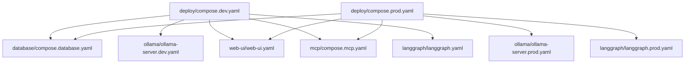
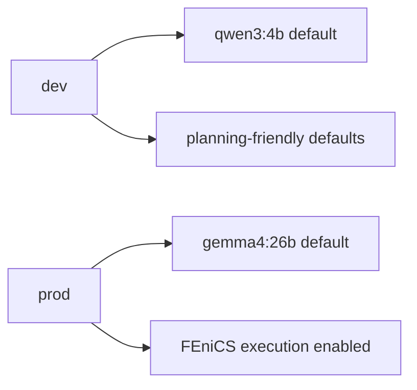
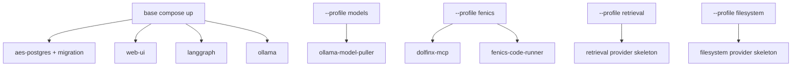
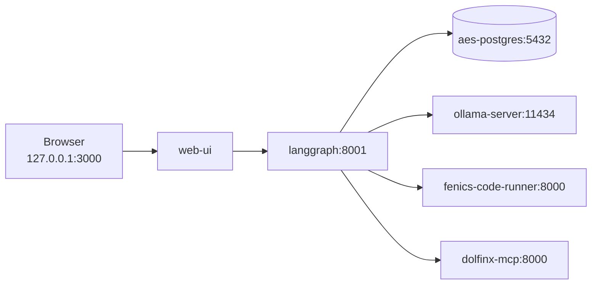

# Deployment Architecture

The `deploy/` component owns the top-level Docker Compose entrypoints. It does
not define every service directly; it includes component-owned Compose files.



## Ownership

`deploy/` owns:

- dev/prod entrypoint composition,
- profile activation strategy,
- cross-component startup commands.

It does not own:

- individual service definitions,
- provider implementation,
- model recommendation manifests,
- application code.

## Dev Versus Prod

The intentional dev/prod difference is concentrated in Ollama and LangGraph
runtime defaults.



Both stacks include:

- `aes-postgres` and the one-shot `aes-database-migrate`,
- `web-ui`,
- `langgraph`,
- `ollama`,
- `mcp/compose.mcp.yaml`.

## Profiles



Use `--profile fenics` whenever live FEniCS execution or FEniCS logs are
expected.

## Network

All services communicate through the external Docker network:

```text
ai-stack-net
```

The browser enters through `web-ui` on host port `3000`. `web-ui` proxies to
LangGraph by Docker service name.



## Common Startup

Copy `database/.env.example` to the repository-root `.env` file and replace
both password placeholders before the first startup. Compose refuses to start
without the database administrator and application-role passwords.

Production full stack:

```bash
AES_OLLAMA_MODEL=gemma4:26b docker compose -f deploy/compose.prod.yaml --profile models --profile fenics up -d --build
```

Development stack:

```bash
AES_OLLAMA_MODEL=qwen3:4b docker compose -f deploy/compose.dev.yaml --profile models up -d --build
```

## Recreate After Layout Changes

When service names/profiles/includes changed, remove orphans once:

```bash
docker compose -f deploy/compose.prod.yaml --profile models --profile fenics down --remove-orphans
docker compose -f deploy/compose.prod.yaml --profile models --profile fenics up -d --build --force-recreate
```

## Deployment Rule

Component-owned Compose files stay with their component. `deploy/` wires them
together; it should not become another monolithic service-definition directory.
