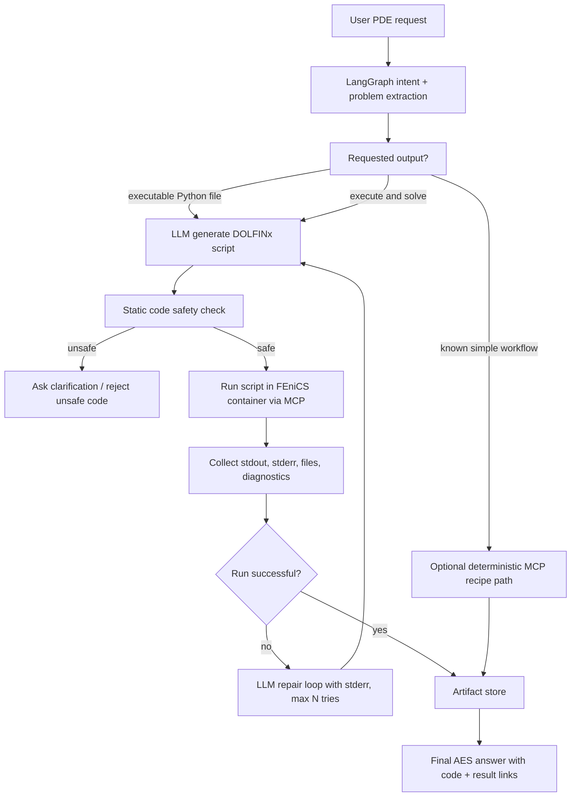
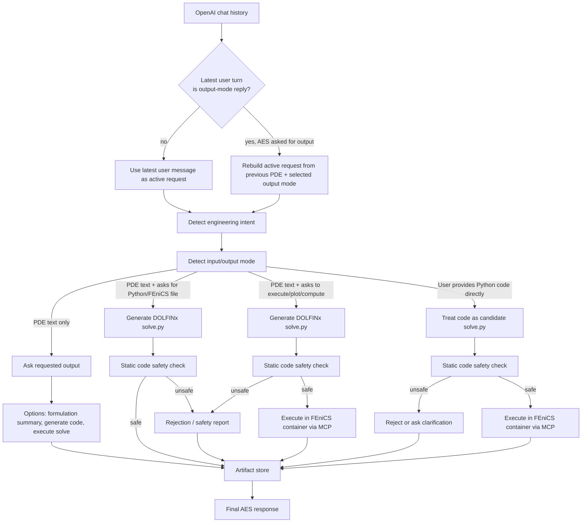

# AES Architecture

AES is split into orchestration, model runtime, user interface, MCP providers,
deployment composition, and documentation.

```text
Open WebUI
  -> AES FastAPI / OpenAI-compatible endpoint
  -> LangGraph StateGraph
  -> AES tool registry
  -> MCP provider adapter
  -> provider-specific MCP servers
  -> AES artifact store
```

## Source Layout

```text
AES/
  langgraph/     # AES orchestration service
  mcp/           # MCP provider infrastructure
  ollama/        # model runtime compose file and data
  open-webui/    # user interface compose file and data
  deploy/        # dev/prod deployment entrypoints
  docs/          # architecture and operation docs
```

## Design Principles

- Keep LangGraph as the workflow and routing spine.
- Keep the LLM behind explicit nodes and schemas.
- Expose high-level AES wrapper tools to the model, not every low-level MCP tool.
- Keep heavy execution backends in separate provider containers.
- Keep final artifact policy in AES, not inside provider containers.
- Use planning mode by default for expensive numerical tools.
- Add live execution only after schema and smoke-test validation.

## Flexible FEniCS Code Path

The first FEniCS integration used a deterministic `numerical_recipe` that AES
translated into a fixed sequence of low-level DOLFINx MCP calls. That path is
useful for narrow smoke tests, but it is too rigid for general PDE work because
each new equation family requires new hand-written recipe and provider-call
logic.

The preferred architecture is now a hybrid path: LangGraph still owns
orchestration, validation, and artifact policy, while the LLM generates a full
DOLFINx Python script for flexible numerical workflows. AES performs static
safety checks before execution, runs the script only inside the FEniCS provider
boundary, and stores final outputs through the AES artifact store.



Implementation rule: high-level AES tools stay exposed to LangGraph and the LLM;
low-level provider tools remain hidden behind wrapper code. The current
`fenics_code_solve` path can already generate and persist a checked `solve.py`.
Live execution requires a FEniCS MCP script-runner contract, for example
`run_python_script`, because the existing `dolfinx-mcp` allowlist intentionally
blocks arbitrary `run_custom_code`.

If the selected mode requests execution but generated-code execution is disabled
or no provider script-runner is configured, AES should report a blocked tool
result. Production sets `DOLFINX_CODE_EXECUTE=true` and
`DOLFINX_CODE_MCP_URL=http://fenics-code-runner:8000/mcp` by default so AES
attempts the provider execution path through the separate code-runner service,
while dev keeps execution overrideable and disabled by default. The checked
`solve.py` may still be stored as an artifact, but the run must not be reported
as a completed numerical execution.

### Requested Output And Input Modes

AES should not assume that every PDE description is a request for generated
FEniCS code or immediate execution. A user may provide only a mathematical
problem statement, an explicit request for a Python file, a request to execute a
solve, or an already-written Python script. LangGraph should classify this
intent before selecting tools.



The OpenAI-compatible adapter deliberately does not merge arbitrary chat
history into every AES request. This prevents a new operational message, such
as a Docker command, from inheriting an older PDE and accidentally triggering a
solver workflow. The controlled exception is AES's own requested-output
clarification: if AES asked what output the user wants and the next user turn is
a short reply such as `execution with stored result artifacts`, the adapter
rebuilds the active request as:

```text
previous PDE problem

Requested AES output: execute the generated DOLFINx/FEniCS solve and store result artifacts
```

This is a temporary lightweight resume rule until checkpoint-backed
conversation state is introduced.

Planned solution modes:

- `formulation_summary`: explain or derive the mathematical/FEM formulation
  without generating code.
- `needs_output_intent`: ask the user whether they want formulation, generated
  code, or execution.
- `generate_fenics_code`: generate and store a checked `solve.py`.
- `execute_generated_fenics_code`: generate, check, execute, and store results.
- `execute_user_fenics_code`: check user-provided Python code, execute it in the
  FEniCS container, and store results.
- `deterministic_mcp_recipe`: use the older constrained MCP recipe path for
  known simple workflows and smoke tests.

Direct user-provided Python code must use the same safety and artifact policy as
LLM-generated code. AES should never execute raw code directly in the LangGraph
container; execution belongs inside a sandboxed FEniCS provider boundary.

Artifact storage is a common terminal step for every path. A stored AES run may
contain a clarification question, formulation summary, generated `solve.py`,
execution diagnostics, solver files, an error report, or a rejected unsafe-code
report. In other words, artifact storage means traceability of the AES workflow,
not only successful numerical solver output.

## Artifact Store

Providers return structured results and artifact references. AES owns the final
artifact manifest and storage policy through the local `artifact_store` tool.

The first implementation writes:

- `manifest.json`,
- `summary.md`.

Both files are written below `AES_ARTIFACT_ROOT`, mounted as `/artifacts` in the
LangGraph containers. Provider workspaces, such as the FEniCS `/workspace`, are
treated as scratch or provider-owned storage, not as final AES output locations.

## MCP Provider Layer

`mcp/` is a provider-management layer for multiple MCP servers. The central
`mcp/compose.mcp.yaml` file follows the same pattern as the top-level deployment
entrypoints: it includes provider-owned Compose files instead of defining every
service directly.

```text
mcp/compose.mcp.yaml
  -> mcp/providers/fenics/compose.yaml
  -> mcp/providers/retrieval/compose.yaml
  -> mcp/providers/filesystem/compose.yaml
```

The central `mcp/providers.yaml` file is also only an index. Provider-specific
AES/governance metadata is stored locally:

```text
mcp/providers.yaml
  -> mcp/providers/fenics/provider.yaml
  -> mcp/providers/retrieval/provider.yaml
  -> mcp/providers/filesystem/provider.yaml
```

Each provider should own:

- compose configuration,
- provider manifest,
- allowlist,
- schema snapshot,
- workspace,
- smoke tests,
- README with operational notes.

For now, providers are optional long-running services selected by Docker Compose
profiles. On-demand provider startup can be added later with a controller or
Kubernetes-style job lifecycle, but it is deliberately not part of the first
Compose-based version.

## Deployment Entry Points

The deployment layer has only two top-level entrypoints:

```text
deploy/compose.dev.yaml
deploy/compose.prod.yaml
```

Both files include the component-owned service definitions. The dev/prod
difference is intentionally concentrated in the Ollama component:

```text
ollama/ollama-server.dev.yaml
ollama/ollama-server.prod.yaml
```
