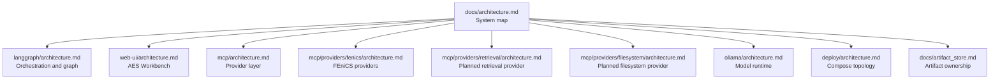
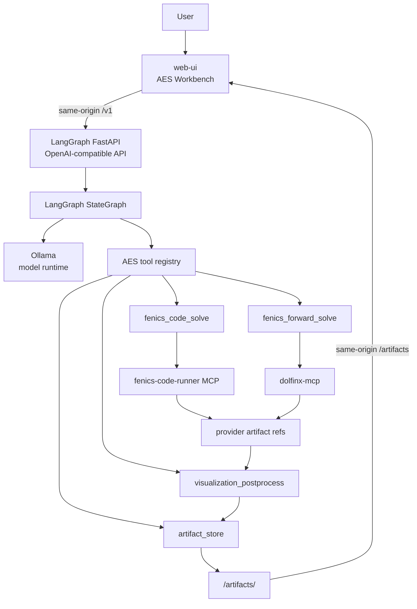
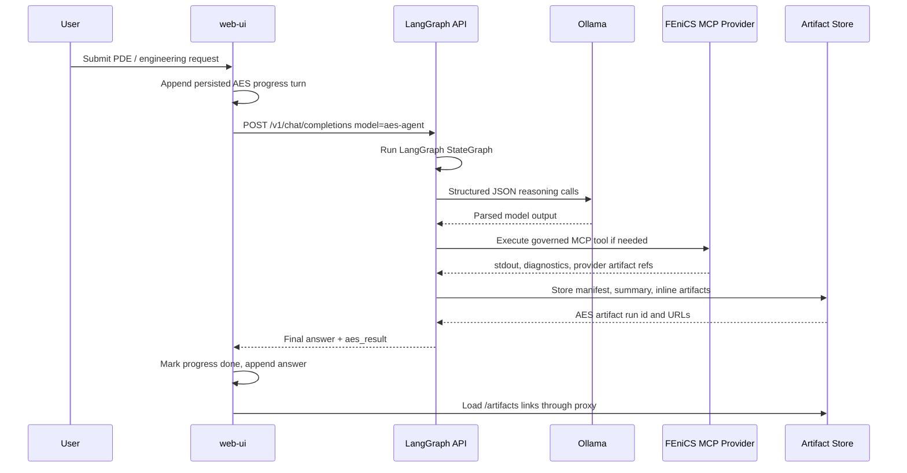
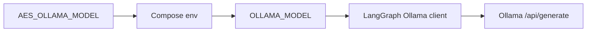
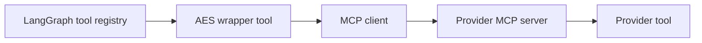
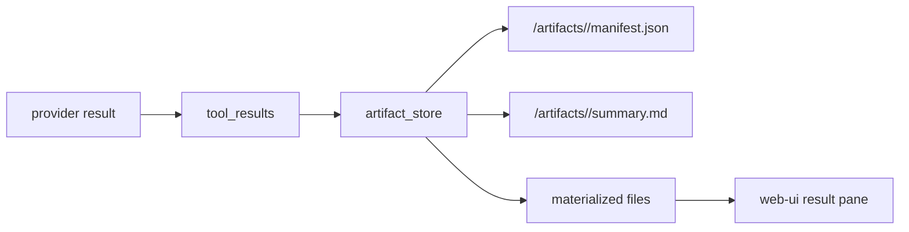
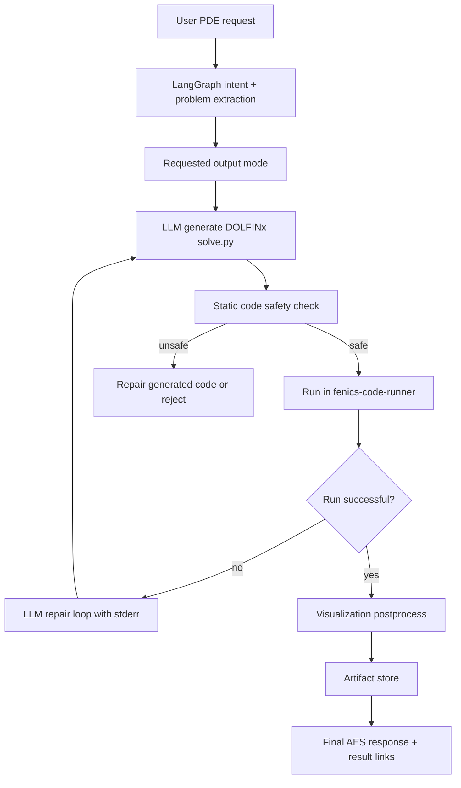
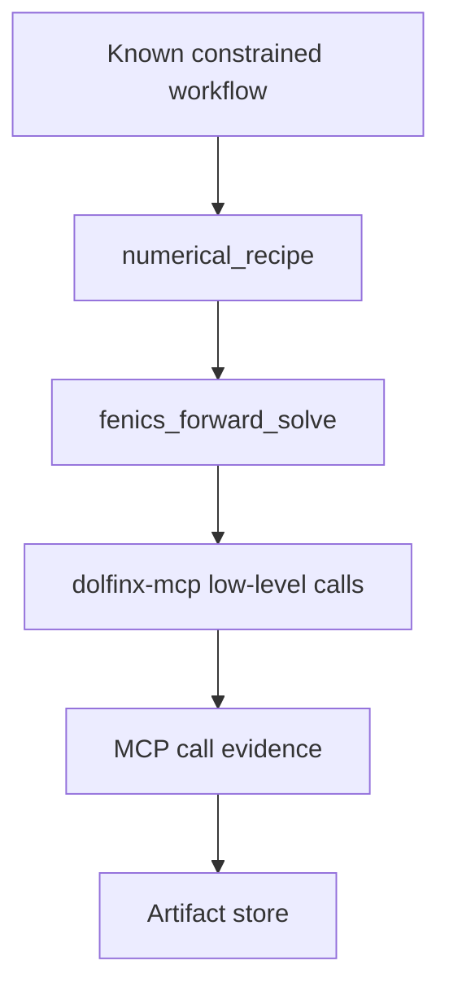
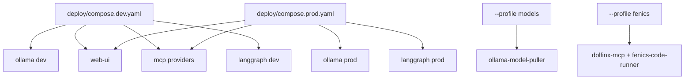

# AES System Architecture

This document is the central architecture map for AES. It shows how the main
components interact. Component-internal details live beside the code in each
component's own `architecture.md`.

## Component Docs



## System Overview

AES is an agentic engineering system for PDE/FEM workflows. The browser talks
to an AES-native Workbench. The Workbench calls the LangGraph service through an
OpenAI-compatible API. LangGraph orchestrates the engineering workflow, calls
Ollama for structured model reasoning, invokes governed tools, executes FEniCS
workloads through MCP providers, and stores final artifacts through the AES
artifact store.



## Source Layout

```text
AES/
  langgraph/     # orchestration service, graph, tools, API
  mcp/           # MCP provider layer and provider governance
  ollama/        # model runtime compose files and model manifests
  web-ui/        # AES Workbench browser application
  deploy/        # dev/prod Compose entrypoints
  docs/          # cross-component documentation
```

## Main Runtime Flow



## Component Responsibilities

| Component | Responsibility | Detailed Architecture |
| --- | --- | --- |
| `web-ui/` | Browser Workbench, chat, local sessions, progress turns, result workspace, VTK.js shell | [`web-ui/architecture.md`](../web-ui/architecture.md) |
| `langgraph/` | FastAPI API, LangGraph workflow, state, routing, Ollama calls, tool execution, final answer renderer | [`langgraph/architecture.md`](../langgraph/architecture.md) |
| `ollama/` | LLM runtime, dev/prod model manifests, pull automation, model warmup/runtime settings | [`ollama/architecture.md`](../ollama/architecture.md) |
| `mcp/` | Provider registry, provider manifests, allowlists, contracts, Compose provider includes | [`mcp/architecture.md`](../mcp/architecture.md) |
| `mcp/providers/fenics/` | DOLFINx/FEniCS execution boundary, code runner, deterministic MCP smoke path | [`mcp/providers/fenics/architecture.md`](../mcp/providers/fenics/architecture.md) |
| `deploy/` | Dev/prod Compose entrypoints and profile composition | [`deploy/architecture.md`](../deploy/architecture.md) |
| artifact store | AES-owned run manifests, summaries, materialized artifacts, public artifact URLs | [`docs/artifact_store.md`](artifact_store.md) |

## Integration Contracts

### Browser To LangGraph

The Workbench calls the LangGraph API through the same-origin Nginx proxy:

```text
Browser -> web-ui:3000
web-ui /v1/*         -> http://langgraph:8001/v1/*
web-ui /artifacts/*  -> http://langgraph:8001/artifacts/*
```

The public model is:

```text
aes-agent
```

This is an AES wrapper model, not the raw Ollama model.

### LangGraph To Ollama

LangGraph calls Ollama through the configured internal service URL.



### LangGraph To MCP Providers

LangGraph exposes only high-level AES wrapper tools to the workflow. Low-level
provider tools remain behind wrapper code and allowlists.



### Provider Outputs To AES Artifacts

Providers may return `mcp://...` references, inline artifacts, diagnostics, or
stdout/stderr. The AES artifact store owns the final user-facing run directory.



## Design Principles

- Keep LangGraph as the explicit workflow and routing spine.
- Keep model calls behind nodes and structured parsers.
- Expose high-level AES tools to the graph, not every low-level MCP tool.
- Keep heavy execution backends in provider containers.
- Keep final artifact policy in AES, not provider scratch workspaces.
- Treat artifact storage as workflow traceability, not only successful solver
  output.
- Use Mermaid diagrams as the default architecture communication format.
- Keep deployment composition thin: top-level Compose files include
  component-owned service definitions.

## Current Main Paths

### Flexible FEniCS Generated-Code Path



### Deterministic MCP Smoke Path



The generated-code path is the preferred flexible path. The deterministic MCP
path remains for controlled smoke workflows and provider contract validation.

## Deployment Topology



See [`deploy/architecture.md`](../deploy/architecture.md) and
[`docs/deployment.md`](deployment.md) for commands.

## Planned Extensions

- Materialize provider-owned raw solution files into AES-owned `/artifacts`.
- Add real VTK conversion for `.xdmf`/`.h5` solution outputs.
- Add retrieval provider implementation for project/domain RAG.
- Add persistent server-side Workbench sessions later, replacing localStorage.
- Add lifecycle controller for on-demand provider startup when Compose profiles
  are no longer enough.
