# AES System Architecture

This document is the central architecture map for AES. It shows how the main
components interact. Component-internal details live beside the code in each
component's own `architecture.md`.

## Component Docs


```mermaid
flowchart TD
    A["docs/architecture.md<br/>System map"] --> B["langgraph/architecture.md<br/>Orchestration and graph"]
    A --> C["web-ui/architecture.md<br/>AES Workbench"]
    A --> D["mcp/architecture.md<br/>Provider layer"]
    A --> E["mcp/providers/fenics/architecture.md<br/>FEniCS providers"]
    A --> ME["mcp/providers/meshing/architecture.md<br/>Geometry and meshing"]
    A --> F["mcp/providers/retrieval/architecture.md<br/>Planned retrieval provider"]
    A --> G["mcp/providers/filesystem/architecture.md<br/>Planned filesystem provider"]
    A --> H["ollama/architecture.md<br/>Model runtime"]
    A --> I["deploy/architecture.md<br/>Compose topology"]
    A --> J["docs/artifact_store.md<br/>Artifact ownership"]
    A --> K["database/architecture.md<br/>PostgreSQL + pgvector"]
    A --> L["vllm/architecture.md<br/>Cluster model serving"]
```

## System Overview

AES is an agentic engineering system for PDE/FEM workflows. The browser talks
to an AES-native Workbench. The Workbench calls the LangGraph service through an
OpenAI-compatible API. LangGraph orchestrates the engineering workflow, calls
the configured model provider for structured reasoning, invokes governed tools,
executes FEniCS workloads through MCP providers, and stores final artifacts
through the AES artifact store. Ollama serves local development; vLLM is the
cluster-native production target.

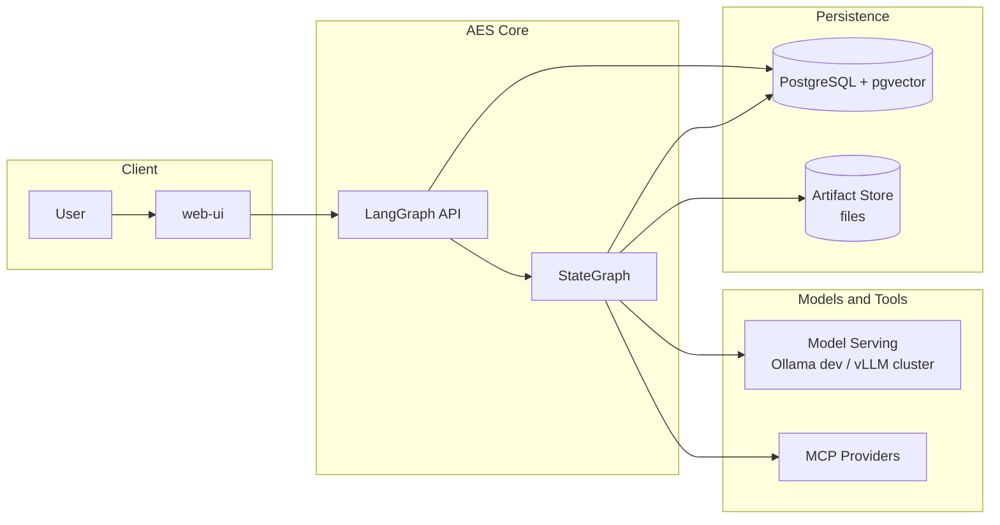
```mermaid
flowchart LR
    subgraph CLIENT["Client"]
        direction TB
        user["User"] --> web["web-ui"]
    end

    subgraph CORE["AES Core"]
        direction TB
        api["LangGraph API"] --> orchestrator["StateGraph"]
    end

    subgraph COMPUTE["Models and Tools"]
        direction TB
        models["Model Serving<br/>Ollama dev / vLLM cluster"]
        mcp["MCP Providers"]
    end

    subgraph PERSISTENCE["Persistence"]
        direction TB
        postgres[("PostgreSQL + pgvector")]
        artifacts[("Artifact Store<br/>files")]
    end

    web --> api
    orchestrator --> models
    orchestrator --> mcp
    api --> postgres
    orchestrator --> postgres
    orchestrator --> artifacts
```

The database component now deploys one PostgreSQL container with `pgvector`, a
versioned migration job, separate schemas, and restricted runtime roles. The
implemented identity slice stores users and opaque server sessions. Large
numerical files remain in the artifact store; chat, workflow, checkpoint,
artifact-metadata, and retrieval persistence follow in later slices.

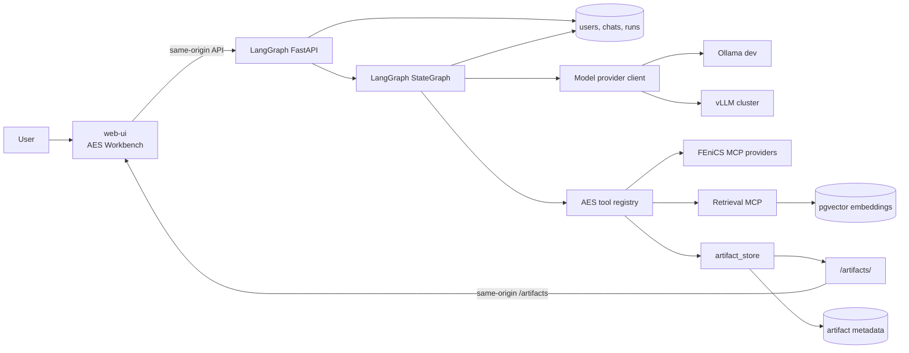
```mermaid
flowchart LR
    U["User"] --> W["web-ui<br/>AES Workbench"]
    W -->|"same-origin API"| API["LangGraph FastAPI"]
    API --> G["LangGraph StateGraph"]
    API --> DB[("users, chats, runs")]
    G --> DB
    G --> O["Model provider client"]
    O --> OD["Ollama dev"]
    O --> VP["vLLM cluster"]
    G --> T["AES tool registry"]
    T --> MCP["FEniCS MCP providers"]
    T --> RET["Retrieval MCP"]
    RET --> VEC[("pgvector embeddings")]
    T --> AS["artifact_store"]
    AS --> FILES["/artifacts/<run_id>"]
    AS --> META[("artifact metadata")]
    FILES -->|"same-origin /artifacts"| W
```

## Source Layout

```text
AES/
  langgraph/     # orchestration service, graph, tools, API
  mcp/           # MCP provider layer and provider governance
  ollama/        # model runtime compose files and model manifests
  vllm/          # Kubernetes-native production model serving
  web-ui/        # AES Workbench browser application
  database/      # PostgreSQL/pgvector persistence architecture and service
  deploy/        # dev/prod Compose entrypoints
  docs/          # cross-component documentation
```

## Main Runtime Flow

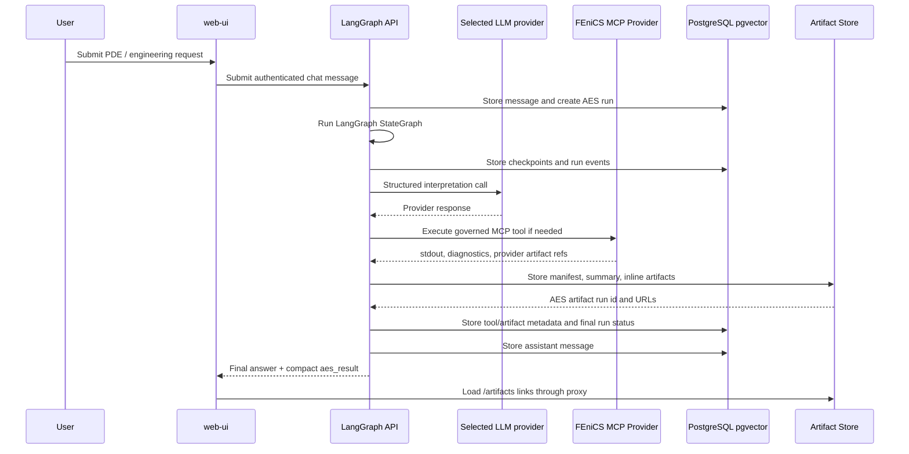
```mermaid
sequenceDiagram
    participant User
    participant UI as web-ui
    participant LG as LangGraph API
    participant Model as Selected LLM provider
    participant MCP as FEniCS MCP Provider
    participant DB as PostgreSQL pgvector
    participant Store as Artifact Store

    User->>UI: Submit PDE / engineering request
    UI->>LG: Submit authenticated chat message
    LG->>DB: Store message and create AES run
    LG->>LG: Run LangGraph StateGraph
    LG->>DB: Store checkpoints and run events
    LG->>Model: Structured interpretation call
    Model-->>LG: Provider response
    LG->>MCP: Execute governed MCP tool if needed
    MCP-->>LG: stdout, diagnostics, provider artifact refs
    LG->>Store: Store manifest, summary, inline artifacts
    Store-->>LG: AES artifact run id and URLs
    LG->>DB: Store tool/artifact metadata and final run status
    LG->>DB: Store assistant message
    LG-->>UI: Final answer + compact aes_result
    UI->>Store: Load /artifacts links through proxy
```

Identity/session operations in this sequence are implemented. Message, run,
checkpoint, tool, and artifact-metadata operations describe the next
persistence slices; the current Workbench still stores conversations in
browser `localStorage` and the graph invokes without a persistent checkpointer.

## Component Responsibilities

| Component | Responsibility | Detailed Architecture |
| --- | --- | --- |
| `web-ui/` | Browser Workbench, authenticated session UI, local chat cache, progress turns, result workspace, VTK.js shell | [`web-ui/architecture.md`](../web-ui/architecture.md) |
| `langgraph/` | FastAPI auth/API boundary, LangGraph workflow, state, routing, provider-neutral model calls, tool execution, final answer renderer | [`langgraph/architecture.md`](../langgraph/architecture.md) |
| `ollama/` | Local/dev LLM runtime, model manifests, pull automation, model warmup/runtime settings | [`ollama/architecture.md`](../ollama/architecture.md) |
| `vllm/` | Kubernetes-native production model serving, GPU resources, persistent cache, authenticated ClusterIP API | [`vllm/architecture.md`](../vllm/architecture.md) |
| `mcp/` | Provider registry, provider manifests, allowlists, contracts, Compose provider includes | [`mcp/architecture.md`](../mcp/architecture.md) |
| `mcp/providers/fenics/` | DOLFINx/FEniCS execution boundary, code runner, deterministic MCP smoke path | [`mcp/providers/fenics/architecture.md`](../mcp/providers/fenics/architecture.md) |
| `mcp/providers/meshing/` | Gmsh/OpenCASCADE CSG and CAD meshing, MSH/XDMF import, semantic tags, mesh-quality validation | [`mcp/providers/meshing/architecture.md`](../mcp/providers/meshing/architecture.md) |
| `database/` | PostgreSQL schemas, pgvector retrieval index, LangGraph checkpoints, migrations, backups, and database service roles | [`database/architecture.md`](../database/architecture.md) |
| `deploy/` | Dev/prod Compose entrypoints and profile composition | [`deploy/architecture.md`](../deploy/architecture.md) |
| artifact store | AES-owned run manifests, summaries, materialized artifacts, public artifact URLs | [`docs/artifact_store.md`](artifact_store.md) |
| observability | Component-prefixed logs, content preview controls, live Docker log workflow | [`docs/logging.md`](logging.md) |

## Integration Contracts

### Browser To LangGraph

The Workbench calls the LangGraph API through the same-origin Nginx proxy:

```text
Browser -> web-ui:3000
web-ui /api/*        -> http://langgraph:8001/api/*
web-ui /v1/*         -> http://langgraph:8001/v1/*
web-ui /artifacts/*  -> http://langgraph:8001/artifacts/*
```

The browser authenticates through `/api/auth/login`. LangGraph stores the
session server-side and returns an opaque `HttpOnly` cookie; protected chat,
invoke, and artifact requests carry that cookie through the same-origin proxy.

The public model is:

```text
aes-agent
```

This is an AES wrapper model, not the raw Ollama or vLLM model.

The browser receives a compact public `aes_result`, not the complete internal
`AgentState`. It contains result status and artifact manifest references.
Inline generated files, sampled field arrays, execution diagnostics, and raw
MCP payloads remain in the artifact store and are fetched only when the result
workspace needs them.

### LangGraph To Model Providers

LangGraph owns a provider-neutral model client. Local development uses Ollama's
native generation API. Cluster production uses vLLM's OpenAI-compatible Chat
Completions API.

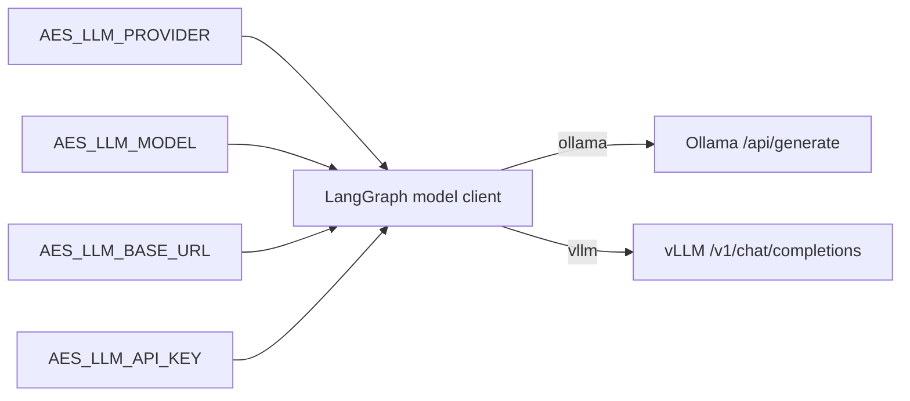
```mermaid
flowchart LR
    A["AES_LLM_PROVIDER"] --> B["LangGraph model client"]
    B -->|"ollama"| C["Ollama /api/generate"]
    B -->|"vllm"| D["vLLM /v1/chat/completions"]
    E["AES_LLM_MODEL"] --> B
    F["AES_LLM_BASE_URL"] --> B
    G["AES_LLM_API_KEY"] --> B
```

The public Workbench model remains `aes-agent`; raw provider models are never
exposed as the AES application contract.

### LangGraph To MCP Providers

LangGraph exposes only high-level AES wrapper tools to the workflow. Low-level
provider tools remain behind wrapper code and allowlists.

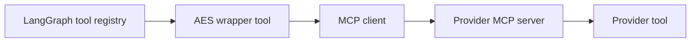
```mermaid
flowchart LR
    A["LangGraph tool registry"] --> B["AES wrapper tool"]
    B --> C["MCP client"]
    C --> D["Provider MCP server"]
    D --> E["Provider tool"]
```

### Provider Outputs To AES Artifacts

Providers may return `mcp://...` references, inline artifacts, diagnostics, or
stdout/stderr. The AES artifact store owns the final user-facing run directory.

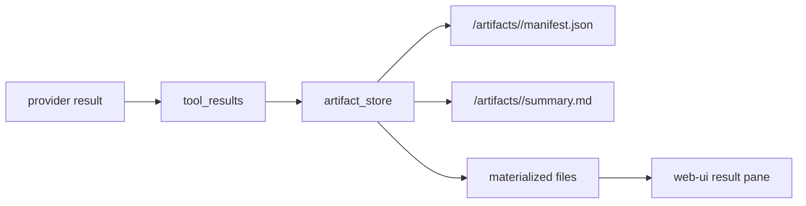
```mermaid
flowchart LR
    A["provider result"] --> B["tool_results"]
    B --> C["artifact_store"]
    C --> D["/artifacts/<run_id>/manifest.json"]
    C --> E["/artifacts/<run_id>/summary.md"]
    C --> F["materialized files"]
    F --> G["web-ui result pane"]
```

### Typed Problem And Geometry Presentation

The public response retains bounded `pde_spec` and `geometry_spec` contracts
needed to display what AES actually solved. The Workbench does not
reverse-engineer mathematics or geometry from assistant prose. KaTeX renders
the equation and conditions, while VTK.js owns geometry and solution
interaction in one scientific viewport.

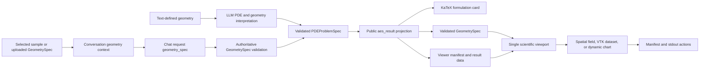
```mermaid
flowchart LR
    A["Text-defined geometry"] --> LLM["LLM PDE and geometry interpretation"]
    S["Selected sample or uploaded GeometrySpec"] --> CTX["Conversation geometry context"]
    CTX --> API["Chat request geometry_spec"]
    API --> VAL["Authoritative GeometrySpec validation"]
    LLM --> P["Validated PDEProblemSpec"]
    VAL --> P
    P --> B["Public aes_result projection"]
    B --> C["KaTeX formulation card"]
    B --> E["Validated GeometrySpec"]
    B --> F["Viewer manifest and result data"]
    E --> H["Single scientific viewport"]
    F --> H
    H --> I["Spatial field, VTK dataset, or dynamic chart"]
    I --> J["Manifest and stdout actions"]
```

The canonical geometry catalog is `examples/geometries/`. Its four YAML/JSON
fixtures are shared by contract tests, native Gmsh integration tests, and the
browser sample selector. Selecting a sample or uploading typed JSON attaches
the GeometrySpec to the current conversation and sends it through the
authenticated chat API. VTK XML PolyData (`.vtp`) uploads remain display-only,
because surface visualization data is not by itself a governed FEM domain.

## Design Principles

- Keep LangGraph as the explicit workflow and routing spine.
- Keep model calls behind nodes and structured parsers.
- Expose high-level AES tools to the graph, not every low-level MCP tool.
- Keep heavy execution backends in provider containers.
- Keep final artifact policy in AES, not provider scratch workspaces.
- Keep browser clients and LLMs away from direct database access; persistence
  is exposed through authenticated APIs and typed retrieval tools.
- Keep full `AgentState` snapshots in the LangGraph checkpointer while
  projecting queryable run, event, tool, and artifact metadata into dedicated
  tables.
- Project a bounded browser response from internal `AgentState`; never use an
  API/chat payload as bulk numerical artifact transport.
- Keep large numerical artifacts outside PostgreSQL and store only their
  ownership, status, checksum, metadata, and URI in the database.
- Treat artifact storage as workflow traceability, not only successful solver
  output.
- Use Mermaid diagrams as the default architecture communication format.
- Keep deployment composition thin: top-level Compose files include
  component-owned service definitions.

## Current Main Paths

### Active Request And Clarification Context

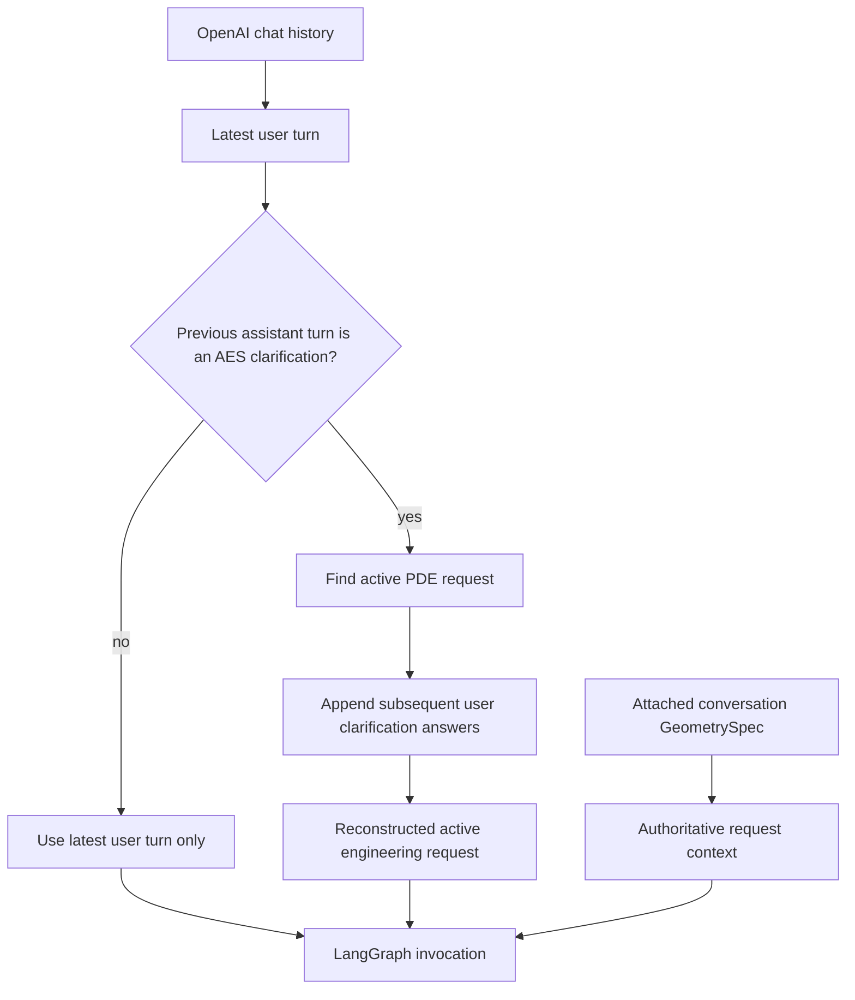
```mermaid
flowchart TD
    A["OpenAI chat history"] --> B["Latest user turn"]
    B --> C{"Previous assistant turn is an AES clarification?"}
    C -->|no| D["Use latest user turn only"]
    C -->|yes| E["Find active PDE request"]
    E --> F["Append subsequent user clarification answers"]
    F --> G["Reconstructed active engineering request"]
    H["Attached conversation GeometrySpec"] --> I["Authoritative request context"]
    D --> J["LangGraph invocation"]
    G --> J
    I --> J
```

This bounded reconstruction prevents a clarification such as `T_0=0,
T_end=1, dt=0.01` from becoming a new standalone problem. It deliberately does
not concatenate arbitrary older chat turns. Persistent checkpoint-backed graph
resume remains a later architecture step.

### Typed PDE And Geometry Compilation Path

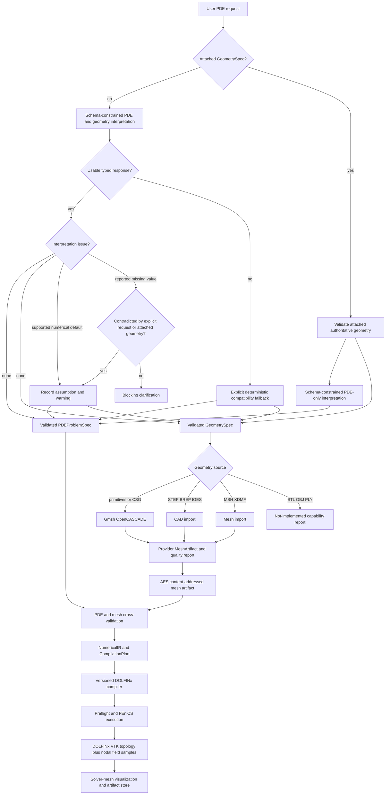
```mermaid
flowchart TD
    A["User PDE request"] --> AB{"Attached GeometrySpec?"}
    AB -->|no| B["Schema-constrained PDE and geometry interpretation"]
    AB -->|yes| AG["Validate attached authoritative geometry"]
    AG --> AP["Schema-constrained PDE-only interpretation"]
    AP --> C
    AG --> D
    B --> BI{"Usable typed response?"}
    BI -->|yes| BA{"Interpretation issue?"}
    BA -->|none| C["Validated PDEProblemSpec"]
    BA -->|none| D["Validated GeometrySpec"]
    BA -->|supported numerical default| BW["Record assumption and warning"]
    BA -->|reported missing value| BE{"Contradicted by explicit request or attached geometry?"}
    BE -->|yes| BW
    BE -->|no| BC["Blocking clarification"]
    BW --> C
    BW --> D
    BI -->|no| BF["Explicit deterministic compatibility fallback"]
    BF --> C
    BF --> D
    D --> E{"Geometry source"}
    E -->|primitives or CSG| F["Gmsh OpenCASCADE"]
    E -->|STEP BREP IGES| G["CAD import"]
    E -->|MSH XDMF| H["Mesh import"]
    E -->|STL OBJ PLY| I["Not-implemented capability report"]
    F --> J["Provider MeshArtifact and quality report"]
    G --> J
    H --> J
    J --> JA["AES content-addressed mesh artifact"]
    C --> K["PDE and mesh cross-validation"]
    JA --> K
    K --> L["NumericalIR and CompilationPlan"]
    L --> M["Versioned DOLFINx compiler"]
    M --> N["Preflight and FEniCS execution"]
    N --> NA["DOLFINx VTK topology plus nodal field samples"]
    NA --> O["Solver-mesh visualization and artifact store"]
```

### Deterministic MCP Smoke Path

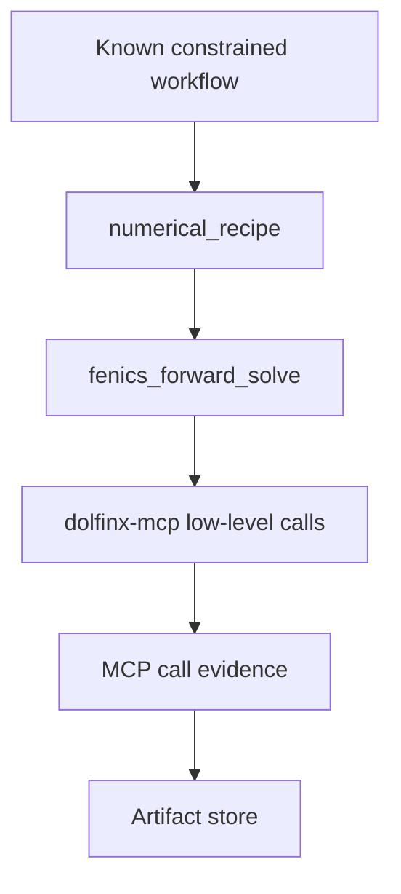
```mermaid
flowchart TD
    A["Known constrained workflow"] --> B["numerical_recipe"]
    B --> C["fenics_forward_solve"]
    C --> D["dolfinx-mcp low-level calls"]
    D --> E["MCP call evidence"]
    E --> F["Artifact store"]
```

The typed compiler is the preferred production path. Free-form LLM code
generation is disabled by default and becomes available for unsupported
compiler capabilities only when `AES_EXPERIMENTAL_LLM_CODE_ENABLED=true`; the
deterministic MCP path remains for controlled provider smoke workflows.
Natural-language interpretation is LLM-first by default. The interpreter sends
the combined typed JSON Schema to the selected Ollama or vLLM provider and logs
the provider, model, request timing, and selected interpretation source. If the
model endpoint fails or returns an invalid contract, AES records the reason and
uses the deterministic compatibility extractor only as an explicit fallback.
Interpretation issues are not all blocking. Documented defaults for numerical
scheme, finite-element space, mesh size, solver, and output format are recorded
as assumptions and warnings. Missing physical or mathematical problem data,
including geometry, coefficients, boundary data, transient initial data, final
time, or `dt`, routes to clarification only after the claim is checked against
deterministically parsed request values and a validated attached GeometrySpec.
Explicit `T_0`, `T_end` or `T`, and `dt` values remain authoritative when model
output conflicts with them.

## Deployment Topology

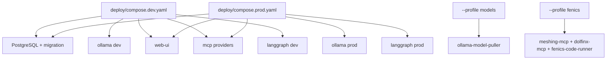
```mermaid
flowchart TD
    A["deploy/compose.dev.yaml"] --> DB["PostgreSQL + migration"]
    A --> B["ollama dev"]
    A --> C["web-ui"]
    A --> D["mcp providers"]
    A --> E["langgraph dev"]

    F["deploy/compose.prod.yaml"] --> DB
    F --> G["ollama prod"]
    F --> C
    F --> D
    F --> H["langgraph prod"]

    I["--profile models"] --> J["ollama-model-puller"]
    K["--profile fenics"] --> L["meshing-mcp + dolfinx-mcp + fenics-code-runner"]
```

See [`deploy/architecture.md`](../deploy/architecture.md) and
[`docs/deployment.md`](deployment.md) for commands.

## Planned Extensions

- Materialize provider-owned raw solution files into AES-owned `/artifacts`.
- Optionally materialize standalone `.vtu` time-series files for external
  post-processing; the Workbench already consumes DOLFINx VTK topology and
  nodal field samples from the governed viewer manifest.
- Add retrieval provider implementation for project/domain RAG.
- Migrate Workbench chats, run progress, artifact ownership, and LangGraph
  checkpoints from process/browser memory to server-side PostgreSQL
  persistence; identity and login sessions are already implemented.
- Add lifecycle controller for on-demand provider startup when Compose profiles
  are no longer enough.
