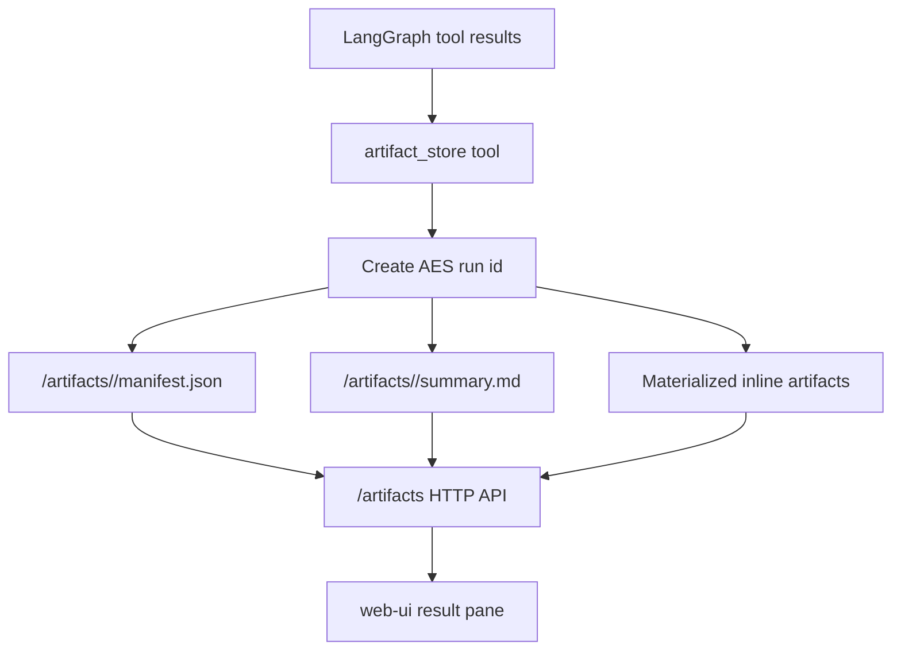
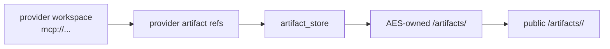
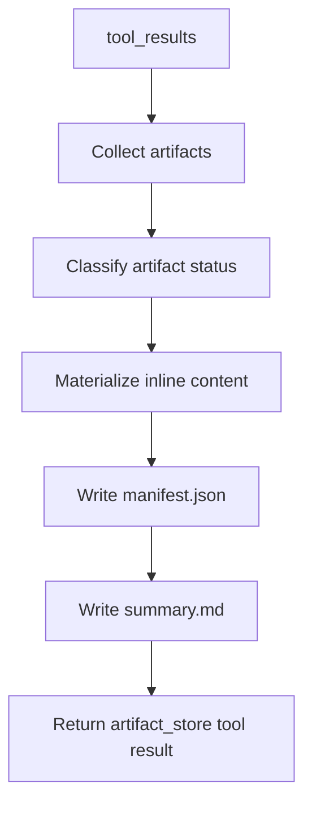

# Artifact Store Architecture

The artifact store is the AES-owned output boundary. Provider workspaces are
scratch spaces; final user-visible records are stored by AES under
`AES_ARTIFACT_ROOT`.



## Ownership

The artifact store owns:

- AES run ids,
- final manifest shape,
- summary files,
- materialized inline artifacts,
- final artifact status,
- browser-facing artifact URLs.

It does not own:

- provider scratch directories,
- raw provider execution,
- solver-specific file formats,
- visualization rendering.

## Provider Versus AES Storage



Provider references can appear in the manifest even before the referenced file
is materialized into AES-owned storage. Browser-fetchable output requires an
AES-owned file or a provider resource-read/copy mechanism.

## Stored Run Contents

An AES run may store:

- clarification questions,
- formulation summaries,
- generated `solve.py`,
- static safety reports,
- stdout/stderr logs,
- `diagnostics.json`,
- sampled solution field data such as stationary \(u(x,y)\) or transient
  \(u(x,y,t)\) inside `diagnostics.json` under `field_samples`,
- solver outputs,
- visualization metadata,
- `preview.svg`,
- `viewer.html`,
- `viewer_manifest.json`,
- unsafe-code rejection reports.

Artifact storage means traceability, not solver success.

## Manifest Flow



## Public URLs

`AES_PUBLIC_BASE_URL` controls absolute public links in AES responses. In the
default container deployment it points to the Workbench:

```text
http://127.0.0.1:3000
```

The Workbench proxies:

```text
/artifacts/* -> http://langgraph:8001/artifacts/*
```

Inside `web-ui`, `aes://artifacts/...` URIs are converted to same-origin
`/artifacts/...` URLs first. This keeps links usable through SSH tunnels where
the local browser port may differ from `AES_PUBLIC_BASE_URL`.

## Current Limitation

Provider-owned solver files such as `mcp://fenics-code-runner/.../solution.xdmf`
may be referenced but not yet copied into AES-owned storage. The next artifact
step is to fetch/copy or convert provider-owned outputs into browser-fetchable
files under `/artifacts/<run_id>/`.
