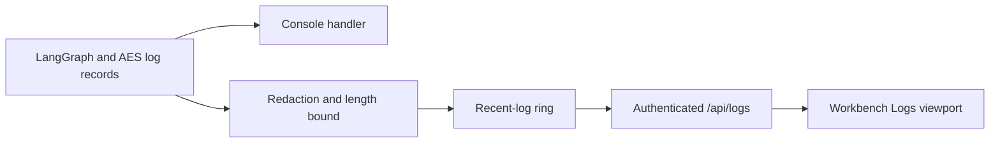

# AES Logging

AES uses component-prefixed logs for services controlled by this repository.
The target shape is:

```text
component-name | date-time | level | logger | message
```

## Controlled Components

The following components use AES-owned structured text logs:

- `langgraph`: FastAPI requests, OpenAI-compatible chat requests, graph
  invocation boundaries, LangGraph node starts/finishes, routing decisions,
  Ollama/vLLM model-provider requests, MCP client calls, tool execution, FEniCS code generation,
  repair/fallback decisions, visualization, and artifact persistence.
- `fenics-code-runner`: MCP requests, tool calls, script writing/execution,
  stdout/stderr/diagnostics previews, artifact discovery, and timeouts.
- `web-ui`: nginx access/error logs using the AES log prefix format.

## Content Logging

Content previews are intentionally bounded and sanitized. They are useful for
debugging live AES runs without dumping unlimited prompts, generated code,
credentials, or solver files into Docker logs.

LangGraph controls:

```text
AES_LOG_LEVEL=INFO
AES_LOG_CONTENT=true
AES_LOG_MAX_CHARS=2000
```

FEniCS code-runner controls:

```text
FENICS_RUNNER_LOG_LEVEL=INFO
FENICS_RUNNER_LOG_CONTENT=true
FENICS_RUNNER_LOG_MAX_CHARS=2000
```

Set `AES_LOG_CONTENT=false` and `FENICS_RUNNER_LOG_CONTENT=false` when logs
should contain workflow metadata only.

## Workbench Log Stream

LangGraph installs a second handler beside stdout. It keeps only a bounded
in-memory window (`AES_RECENT_LOG_CAPACITY`, default 3000) and sanitizes every
message before storage. Authenticated users can inspect that window via
`GET /api/logs`; the Workbench polls it at a fixed two-second interval while
its left pane is in Logs mode. Browser state is additionally capped at 1000
rows.



This stream intentionally does not read `/var/run/docker.sock` and does not
claim to aggregate Nginx, Ollama, PostgreSQL, or provider-container stdout.
Those remain available through the operator commands below. A true unified
cross-container UI should use a dedicated collector and store such as Grafana
Loki rather than granting the application container Docker control.

## External Components

Some services are not fully controlled by AES:

- `ollama-server` is the upstream Ollama runtime and emits its own GIN/runtime
  logs.
- `dolfinx-mcp` is an external MCP image and emits its own uvicorn/provider
  logs.

AES still logs calls to these services from the LangGraph side. To normalize
their internal log format completely, introduce wrapper images or a central log
collector that rewrites records at ingestion time.

## Live Log Commands

```bash
docker compose -f deploy/compose.prod.yaml --profile models --profile fenics logs -f --timestamps
```

Focused logs:

```bash
docker compose -f deploy/compose.prod.yaml --profile models --profile fenics logs -f langgraph
docker compose -f deploy/compose.prod.yaml --profile models --profile fenics logs -f web-ui
docker compose -f deploy/compose.prod.yaml --profile models --profile fenics logs -f fenics-code-runner
docker compose -f deploy/compose.prod.yaml --profile models --profile fenics logs -f ollama-server dolfinx-mcp
```
