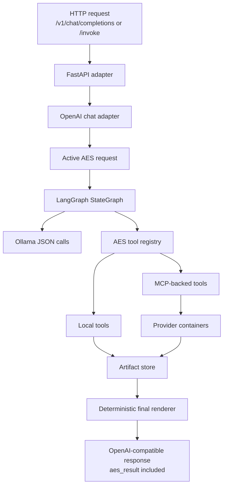
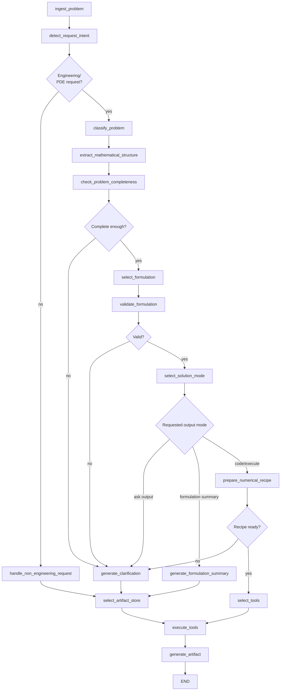
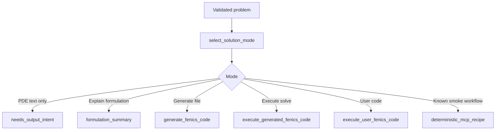
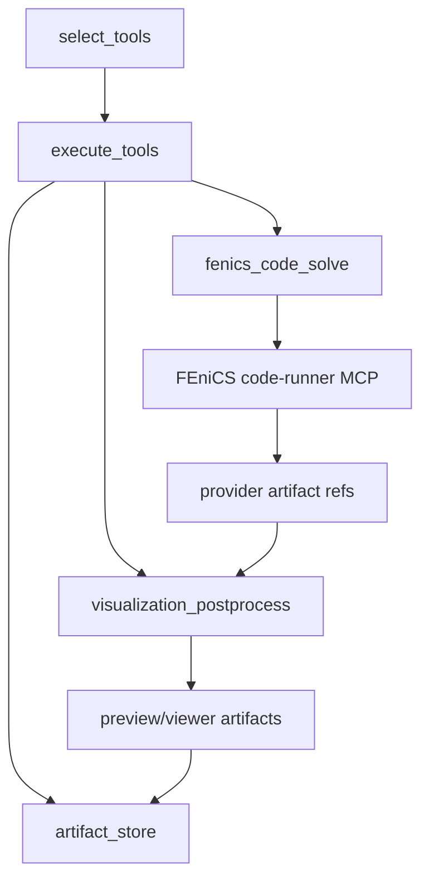
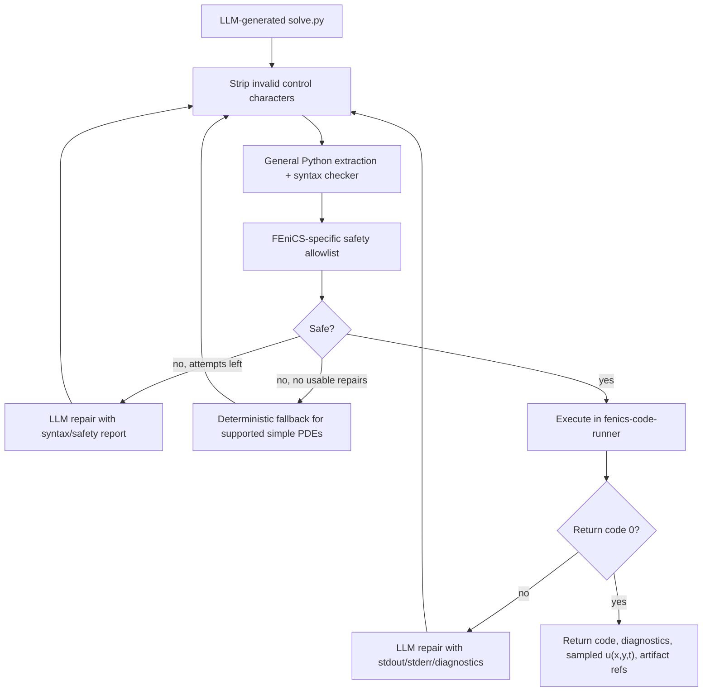

# LangGraph Architecture

The `langgraph/` component is the AES orchestration service. It exposes the
OpenAI-compatible `aes-agent` API, owns the LangGraph workflow, calls Ollama for
structured reasoning, selects high-level tools, and writes final user-facing
answers from graph state.



## Ownership

`langgraph/` owns:

- the AES FastAPI service,
- the OpenAI-compatible API surface,
- `AgentState`,
- LangGraph nodes and routing,
- Ollama prompt builders and response parsing,
- high-level tool registry,
- MCP client boundary,
- generated-code safety checks and repair loop,
- final AES answer rendering,
- artifact-store invocation.

It does not own:

- Ollama model storage,
- FEniCS/DOLFINx installation,
- browser UI state,
- provider workspaces,
- production deployment topology.

## Graph Flow

The current graph is a guarded workflow, not a free-form agent loop.



## State Contract

`AgentState` is the current-run state. It should stay focused on the active
request and should not become a general memory database.

Important state groups:

- request and intent: `raw_user_input`, `request_intent`, `intent_reason`,
- problem extraction: `problem_class`, `domain_info`, `pde_info`,
  `coefficient_info`, `source_info`, `bc_info`, `initial_condition_info`,
  `time_info`,
- clarification and validation: `missing_information`,
  `clarification_questions`, `selected_formulation`, `validation_status`,
  `validation_errors`,
- execution planning: `solution_mode`, `numerical_recipe_status`,
  `numerical_recipe`, `numerical_recipe_errors`,
- tool phase: `selected_tools`, `tool_execution_status`, `tool_results`,
  `tool_errors`,
- final response: `generated_artifact`, `agent_status`, `next_action`.

Long-term memory, chat history, retrieval indexes, and project knowledge should
live outside `AgentState` and be injected through explicit nodes/tools.

## Solution Modes

AES classifies the requested output before selecting tools.



AES should not silently execute numerical tools for a PDE-only prompt. It asks
whether the user wants a formulation summary, generated code, or execution.

## Tool Layer

LangGraph exposes high-level AES tools, not raw provider tools. The current
important tools are:

- `fenics_code_solve`: generate/check/execute DOLFINx Python in a provider
  sandbox,
- `fenics_forward_solve`: older deterministic MCP recipe path for constrained
  smoke workflows,
- `visualization_postprocess`: create preview and viewer metadata from solver
  outputs,
- `artifact_store`: materialize final AES artifacts and manifests.



## Generated-Code Repair Loop

For LLM-generated FEniCS code, AES attempts bounded repair. User-provided code
is not auto-rewritten.



Repair attempts are bounded by `DOLFINX_CODE_REPAIR_ATTEMPTS`.
The generic checker lives in `aes_agent/python_checker.py` and is intentionally
not FEniCS-specific: it extracts Python from common LLM response shapes, strips
invalid control characters, and catches syntax errors before the stricter
FEniCS import/call allowlist runs. If bounded static repairs return no usable
Python for a supported simple heat/Poisson-style problem, AES falls back only at
that point instead of repeatedly validating the same broken script.

For generated-code runs, scripts should write sampled field data for the
numerical solution into `diagnostics.json` under `field_samples`: stationary
problems provide \(u(x,y)\), while transient problems provide \(u(x,y,t)\).
The visualization layer can then render the actual sampled solution field in
the Workbench even before a full VTK `.vtu` or `.vtkjs` conversion exists.

## API Boundary

The public API exposes `aes-agent`; this is an AES wrapper model, not a raw LLM.
The raw backend model is selected through environment:

```text
AES_OLLAMA_MODEL -> OLLAMA_MODEL -> Ollama /api/generate payload model
```

The OpenAI-compatible adapter normally uses the latest user turn as the active
request. The controlled exception is AES-requested output clarification: when
AES asks what output the user wants, a short follow-up such as `execution with
stored result artifacts` is merged with the previous PDE problem.

## Tests

Focused tests live under `langgraph/tests/` and cover graph routing, parsing,
MCP client behavior, FEniCS tools, artifact storage, visualization, and API
behavior.
