# LangGraph Architecture

The `langgraph/` component is the AES orchestration service. It exposes the
OpenAI-compatible `aes-agent` API, owns the LangGraph workflow, calls the
configured model provider for structured reasoning, selects high-level tools,
and writes final user-facing answers from graph state.

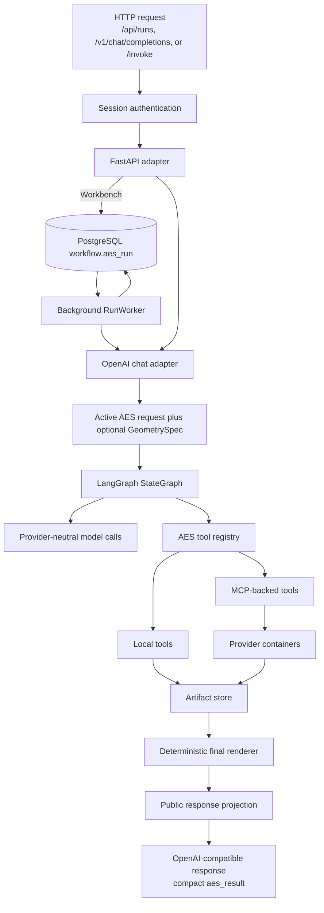
```mermaid
flowchart TD
    A["HTTP request<br/>/api/runs, /v1/chat/completions, or /invoke"] --> AUTH["Session authentication"]
    AUTH --> B["FastAPI adapter"]
    B -->|Workbench| JOBS[("PostgreSQL workflow.aes_run")]
    JOBS --> WORKER["Background RunWorker"]
    WORKER --> C
    WORKER --> JOBS
    B --> C["OpenAI chat adapter"]
    C --> D["Active AES request plus optional GeometrySpec"]
    D --> E["LangGraph StateGraph"]
    E --> F["Provider-neutral model calls"]
    E --> G["AES tool registry"]
    G --> H["MCP-backed tools"]
    G --> I["Local tools"]
    H --> J["Provider containers"]
    I --> K["Artifact store"]
    J --> K
    K --> L["Deterministic final renderer"]
    L --> P["Public response projection"]
    P --> M["OpenAI-compatible response<br/>compact aes_result"]
```

## Ownership

`langgraph/` owns:

- the AES FastAPI service,
- the OpenAI-compatible API surface,
- PostgreSQL-backed user/session authentication at the API boundary,
- durable, owner-scoped Workbench execution records and background execution,
- `AgentState`,
- LangGraph nodes and routing,
- model-provider prompt transport and response parsing,
- high-level tool registry,
- MCP client boundary,
- generated-code safety checks and repair loop,
- final AES answer rendering,
- artifact-store invocation.

It does not own:

- Ollama or vLLM model storage,
- FEniCS/DOLFINx installation,
- browser UI state,
- provider workspaces,
- production deployment topology.

## Authentication Boundary

### Recoverable Workbench Runs

Workbench uses `POST /api/runs` to accept a durable job and `GET /api/runs/{id}`
to retrieve its status, node progress, and final OpenAI-shaped response. Both
endpoints enforce session authentication and run ownership. The request UUID is
generated and saved in the browser before submission; the run table primary key
and a canonical payload fingerprint make submission idempotent. Model selection
is validated once and frozen alongside the chat history and GeometrySpec.

The FastAPI lifespan starts one polling RunWorker per process. Workers claim
queued jobs with PostgreSQL `FOR UPDATE SKIP LOCKED`, release the transaction,
and execute outside the HTTP request lifetime. Graph node wrappers publish
progress through a ContextVar. Heartbeats run every five seconds independently
of slow LLM/tool calls. Completion persists the projected response and artifact
links; transient result-write failures retry the write without invoking the graph again.

Auth requests, queue polling, progress writes, and heartbeats borrow short-lived
transactions from the shared process-local pool in `aes_agent/db_pool.py`.
The default is two warm connections, at most eight connections, a ten-second
checkout timeout, and a ten-second statement timeout. Connections are checked
before checkout; broken connections are replaced by Psycopg's background pool
workers. Pools close during FastAPI shutdown and CLI process exit. No database
connection or transaction is held for the duration of an LLM or FEM calculation.

Heartbeat outages use bounded retry delays and report the failure count, age of
the last successful heartbeat, and recovery. A transient progress-write failure
buffers the latest state per graph node in memory; subsequent node reports,
heartbeats, or result persistence flush it with an idempotent node update.
Progress writes also renew the lease. Final writes require database
acknowledgement and may repeat the same terminal result for the same worker if
a commit acknowledgement was lost. An interrupted run or a lost worker lease
cannot be reported as successfully saved. The 120-second abandonment rule still
applies during prolonged outages; no automatic solver replay is introduced.

Lifecycle and queue primitives follow the official [FastAPI lifespan](https://fastapi.tiangolo.com/advanced/events/)
and [PostgreSQL locking-clause](https://www.postgresql.org/docs/16/sql-select.html#SQL-FOR-UPDATE-SHARE)
documentation.

The synchronous `/v1/chat/completions` and `/invoke` APIs remain available for
existing clients. Durable Workbench runs require the configured PostgreSQL and
authentication service. The new route never falls back to process-only run storage.

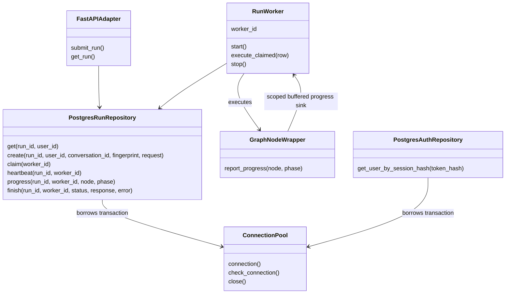
```mermaid
classDiagram
    class PostgresRunRepository {
        get(run_id, user_id)
        create(run_id, user_id, conversation_id, fingerprint, request)
        claim(worker_id)
        heartbeat(run_id, worker_id)
        progress(run_id, worker_id, node, phase)
        finish(run_id, worker_id, status, response, error)
    }
    class RunWorker {
        worker_id
        start()
        execute_claimed(row)
        stop()
    }
    class FastAPIAdapter {
        submit_run()
        get_run()
    }
    class GraphNodeWrapper {
        report_progress(node, phase)
    }
    class ConnectionPool {
        connection()
        check_connection()
        close()
    }
    class PostgresAuthRepository {
        get_user_by_session_hash(token_hash)
    }
    FastAPIAdapter --> PostgresRunRepository
    RunWorker --> PostgresRunRepository
    RunWorker --> GraphNodeWrapper : executes
    GraphNodeWrapper --> RunWorker : scoped buffered progress sink
    PostgresRunRepository --> ConnectionPool : borrows transaction
    PostgresAuthRepository --> ConnectionPool : borrows transaction
```

Queued jobs survive backend restarts. Running jobs with no heartbeat for 120
seconds become `interrupted`; they are never automatically replayed because
provider side effects may already have occurred. Completed responses survive
restarts in PostgreSQL. This slice does not persist LangGraph checkpoints or
resume a solver from its last time step.

The FastAPI service owns authentication so the browser never connects to
PostgreSQL. `POST /api/auth/login` verifies an Argon2id password hash and sets
an opaque `HttpOnly` cookie. Only a SHA-256 hash of the random session token is
stored in `identity.auth_session`. `GET /api/auth/me` restores the Workbench
session, and `POST /api/auth/logout` revokes it.

Administrative password recovery uses the interactive
`python -m aes_agent.reset_user_password --username <name>` command inside the
LangGraph container. The command validates the existing password policy,
stores a new Argon2id hash, and revokes every active session for the account in
one database transaction.
Passwords are read from a hidden terminal prompt and never accepted as command
arguments.

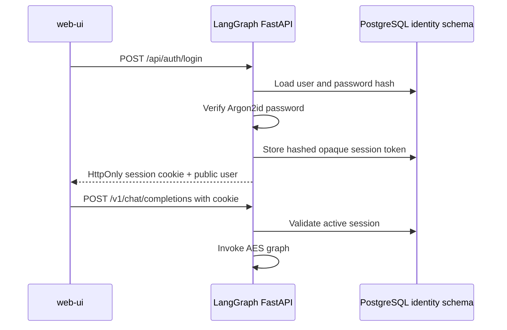
```mermaid
sequenceDiagram
    participant UI as web-ui
    participant API as LangGraph FastAPI
    participant DB as PostgreSQL identity schema

    UI->>API: POST /api/auth/login
    API->>DB: Load user and password hash
    API->>API: Verify Argon2id password
    API->>DB: Store hashed opaque session token
    API-->>UI: HttpOnly session cookie + public user
    UI->>API: POST /v1/chat/completions with cookie
    API->>DB: Validate active session
    API->>API: Invoke AES graph
```

`/v1/chat/completions`, `/invoke`, and `/artifacts/...` require an active
session. `/health`, `/v1/models`, and the login endpoint remain reachable for
health checks and session creation. Initial users are created interactively
inside the LangGraph container with `python -m aes_agent.create_user`; passwords
are never accepted as command-line arguments. Existing users are recovered with
`python -m aes_agent.reset_user_password`.

## Graph Flow

The current graph is a guarded workflow, not a free-form agent loop.

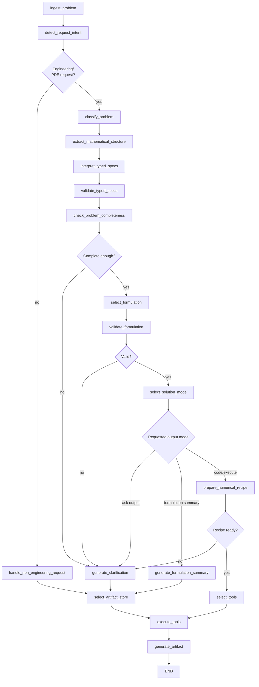
```mermaid
flowchart TD
    A["ingest_problem"] --> B["detect_request_intent"]
    B --> C{"Engineering/ \n PDE request?"}
    C -->|no| D["handle_non_engineering_request"]
    C -->|yes| E["classify_problem"]
    E --> F["extract_mathematical_structure"]
    F --> FS["interpret_typed_specs"]
    FS --> VS["validate_typed_specs"]
    VS --> G["check_problem_completeness"]
    G --> H{"Complete enough?"}
    H -->|no| I["generate_clarification"]
    H -->|yes| J["select_formulation"]
    J --> K["validate_formulation"]
    K --> L{"Valid?"}
    L -->|no| I
    L -->|yes| M["select_solution_mode"]
    M --> N{"Requested output mode"}
    N -->|ask output| I
    N -->|formulation summary| O["generate_formulation_summary"]
    N -->|code/execute| P["prepare_numerical_recipe"]
    P --> Q{"Recipe ready?"}
    Q -->|no| I
    Q -->|yes| R["select_tools"]
    R --> S["execute_tools"]
    D --> T["select_artifact_store"]
    I --> T
    O --> T
    T --> S
    S --> U["generate_artifact"]
    U --> V["END"]
```

## State Contract

`AgentState` is the current-run state. It should stay focused on the active
request and should not become a general memory database.

Important state groups:

- request and intent: `raw_user_input`, `request_intent`, `intent_reason`,
- problem extraction: `problem_class`, `domain_info`, `pde_info`,
  `coefficient_info`, `source_info`, `bc_info`, `initial_condition_info`,
  `time_info`,
- typed contracts: `requested_geometry_spec`, `pde_spec`, `geometry_spec`,
  `typed_spec_source`, `geometry_spec_source`,
  `typed_spec_ambiguities`, `typed_interpretation_warnings`,
  `typed_validation_status`, `typed_validation_errors`,
  `typed_validation_warnings`, `mesh_artifact`, and `compilation_plan`,
- clarification and validation: `missing_information`,
  `clarification_questions`, `selected_formulation`, `validation_status`,
  `validation_errors`,
- execution planning: `solution_mode`, `numerical_recipe_status`,
  `numerical_recipe`, `numerical_recipe_errors`,
- tool phase: `selected_tools`, `tool_execution_status`, `tool_results`,
  `tool_errors`,
- final response: `generated_artifact`, `agent_status`, `next_action`.

Long-term memory, chat history, retrieval indexes, and project knowledge should
live outside `AgentState` and be injected through explicit nodes/tools.

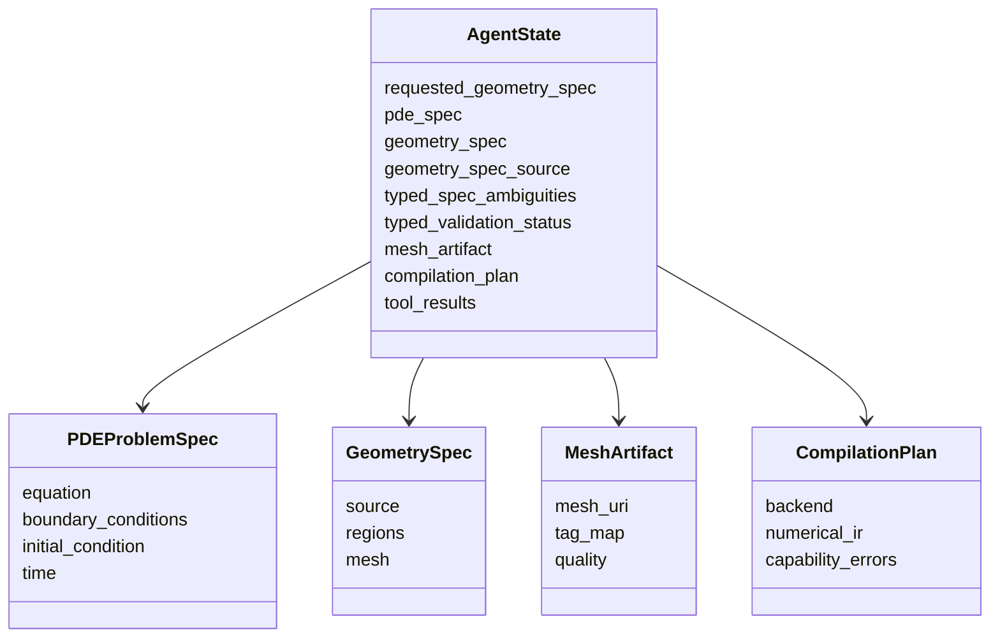
```mermaid
classDiagram
    class AgentState {
        requested_geometry_spec
        pde_spec
        geometry_spec
        geometry_spec_source
        typed_spec_ambiguities
        typed_validation_status
        mesh_artifact
        compilation_plan
        tool_results
    }
    class PDEProblemSpec {
        equation
        boundary_conditions
        initial_condition
        time
    }
    class GeometrySpec {
        source
        regions
        mesh
    }
    class MeshArtifact {
        mesh_uri
        tag_map
        quality
    }
    class CompilationPlan {
        backend
        numerical_ir
        capability_errors
    }
    AgentState --> PDEProblemSpec
    AgentState --> GeometrySpec
    AgentState --> MeshArtifact
    AgentState --> CompilationPlan
```

## Solution Modes

AES classifies the requested output before selecting tools.

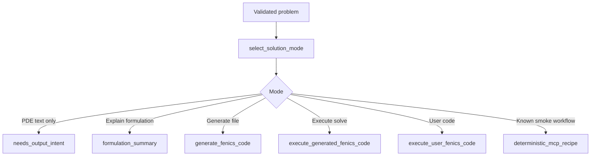
```mermaid
flowchart TD
    A["Validated problem"] --> B["select_solution_mode"]
    B --> C{"Mode"}
    C -->|"PDE text only"| D["needs_output_intent"]
    C -->|"Explain formulation"| E["formulation_summary"]
    C -->|"Generate file"| F["generate_fenics_code"]
    C -->|"Execute solve"| G["execute_generated_fenics_code"]
    C -->|"User code"| H["execute_user_fenics_code"]
    C -->|"Known smoke workflow"| I["deterministic_mcp_recipe"]
```

AES should not silently execute numerical tools for a PDE-only prompt. It asks
whether the user wants a formulation summary, generated code, or execution.

## Tool Layer

LangGraph exposes high-level AES tools, not raw provider tools. The current
important tools are:

- `fenics_code_solve`: generate/check/execute DOLFINx Python in a provider
  sandbox,
- `mesh_geometry`: compile CSG or CAD and import/validate existing meshes
  through the meshing MCP provider,
- `mesh_artifact_store`: materialize a validated provider mesh bundle into the
  AES-owned, content-addressed intermediate mesh store,
- `fenics_forward_solve`: older deterministic MCP recipe path for constrained
  smoke workflows,
- `visualization_postprocess`: create preview and viewer metadata from solver
  outputs,
- `artifact_store`: materialize final AES artifacts and manifests.

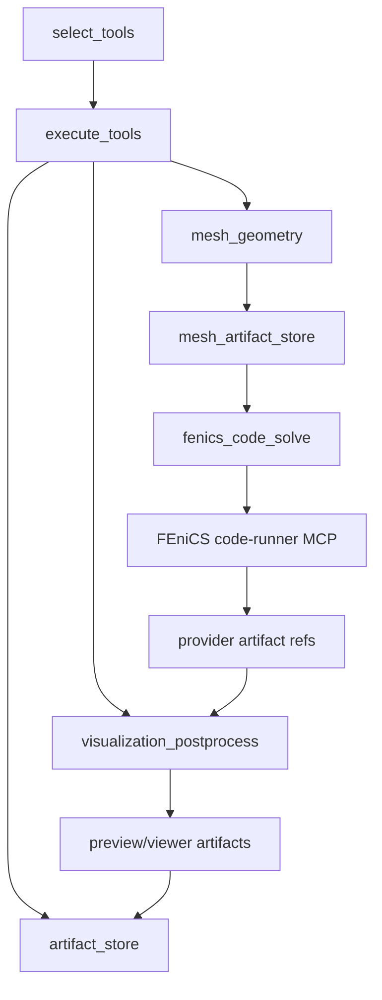
```mermaid
flowchart TD
    A["select_tools"] --> B["execute_tools"]
    B --> M["mesh_geometry"]
    M --> MS["mesh_artifact_store"]
    MS --> C["fenics_code_solve"]
    B --> D["visualization_postprocess"]
    B --> E["artifact_store"]
    C --> F["FEniCS code-runner MCP"]
    F --> G["provider artifact refs"]
    G --> D
    D --> H["preview/viewer artifacts"]
    H --> E
```

## Typed Compilation Lifecycle

Supported problems use typed specifications and the versioned deterministic
DOLFINx compiler. The LLM interprets engineering semantics but does not author
the production solver implementation. User-provided code remains a separately
governed mode. Unsupported compiler capabilities return a capability report by
default and can enter free-form LLM generation only when explicitly enabled.

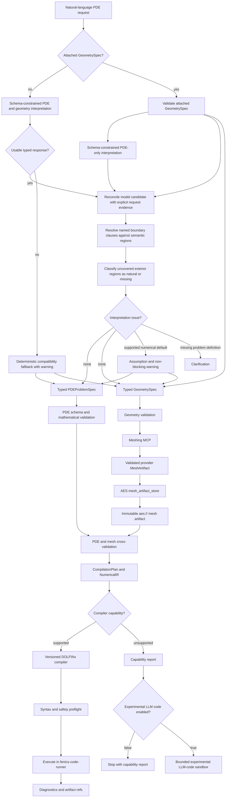
```mermaid
flowchart TD
    A["Natural-language PDE request"] --> AG{"Attached GeometrySpec?"}
    AG -->|no| AI["Schema-constrained PDE and geometry interpretation"]
    AG -->|yes| GV["Validate attached GeometrySpec"]
    GV --> PI["Schema-constrained PDE-only interpretation"]
    PI --> RC["Reconcile model candidate with explicit request evidence"]
    GV --> RC
    GV --> C
    AI --> AV{"Usable typed response?"}
    AV -->|yes| RC
    RC --> BC["Resolve named boundary clauses against semantic regions"]
    BC --> NB["Classify uncovered exterior regions as natural or missing"]
    NB --> AS{"Interpretation issue?"}
    AS -->|none| B["Typed PDEProblemSpec"]
    AS -->|none| C["Typed GeometrySpec"]
    AS -->|supported numerical default| AW["Assumption and non-blocking warning"]
    AW --> B
    AW --> C
    AS -->|missing problem definition| AX["Clarification"]
    AV -->|no| AF["Deterministic compatibility fallback with warning"]
    AF --> B
    AF --> C
    B --> D["PDE schema and mathematical validation"]
    C --> E["Geometry validation"]
    E --> F["Meshing MCP"]
    F --> G["Validated provider MeshArtifact"]
    G --> GS["AES mesh_artifact_store"]
    GS --> GA["Immutable aes:// mesh artifact"]
    D --> H["PDE and mesh cross-validation"]
    GA --> H
    H --> I["CompilationPlan and NumericalIR"]
    I --> J{"Compiler capability?"}
    J -->|supported| K["Versioned DOLFINx compiler"]
    K --> L["Syntax and safety preflight"]
    L --> M["Execute in fenics-code-runner"]
    M --> N["Diagnostics and artifact refs"]
    J -->|unsupported| O["Capability report"]
    O --> P{"Experimental LLM code enabled?"}
    P -->|false| Q["Stop with capability report"]
    P -->|true| R["Bounded experimental LLM-code sandbox"]
```

`AES_TYPED_INTERPRETATION_MODE=llm_first` is the default. Without an attached
geometry, the model receives the combined Pydantic JSON Schema and interprets
the natural-language PDE and geometry. With an attached geometry, AES validates
that GeometrySpec first and asks the model only for a PDEProblemSpec constrained
to its dimension and semantic region names. AES adds an aggregate `boundary`
region when the supplied contract does not define one, so phrases such as
"u=0 on the boundary" map deterministically. Model claims that an uploaded path
is missing are ignored only after the supplied GeometrySpec validates; missing
physics remains blocking. The compatibility parser runs only when the model
call is unavailable or its response does not validate. Setting
`AES_TYPED_INTERPRETATION_MODE=deterministic_only` is an explicit offline/test
configuration and is visible as
`typed_spec_source=deterministic_configuration`.

The interpreter treats model output as a candidate contract and reconciles it
before typed validation. A validated attached GeometrySpec is authoritative for
spatial dimension. Explicit request values are authoritative for diffusion,
source, whole-boundary and named-region conditions, initial data, and time
values, so a model cannot erase or rewrite them. Named clauses such as
`u=100 on base_bottom` and mixed clauses such as `u=1 on x_min and u=0 on
y_min, notch_vertical, and notch_horizontal` are resolved against the
GeometrySpec's semantic regions before validation. For example, on a 3D plate,
`u0(x,y,z)=sin(pi*x)*sin(pi*y)` is a valid field that is constant through the
thickness and does not require artificial `z` dependence.

Boundary coverage follows the variational contract. Explicit essential
Dirichlet data is compiled strongly on its named regions. Exterior regions not
covered by an explicit condition use homogeneous Neumann data only when that is
the documented natural boundary condition for the selected scalar diffusion
form; this is recorded as a non-blocking assumption, not invented as an
overlapping aggregate boundary condition. Explicit nonzero or symbolic Neumann
data remains a compiler capability question. All Dirichlet, Neumann, and initial
expressions pass the same symbol/schema validation as coefficients and sources.

The interpreter then normalizes model-reported issues before typed validation.
Documented defaults for time integration, finite-element space, mesh size,
linear solver, preconditioner, and output format are non-blocking assumptions.
Claims that time values or geometry are missing are cross-checked against the
deterministic request parser and the validated attached GeometrySpec. False
claims about missing initial data or required coordinate dependence are also
discarded when an explicit initial field was parsed. Unresolved physics and
geometry inputs remain blocking ambiguities and route to clarification.

The initial compiler release supports stationary and transient scalar
diffusion with constant coefficients, constant sources, constant Dirichlet
data, rectangle primitives, and validated external meshes. Unsupported
operators produce capability errors and may be routed explicitly to the
experimental path.

`examples/use-cases/catalog.yaml` is the checked capability catalog for 24
representative PDE families. Its `immediate` entries include complete typed
specifications and tests require schema validity, PDE/geometry compatibility,
and a ready compilation plan. `compiler_extension` and `advanced_backend`
entries list missing numerical capabilities explicitly and are not routed as
supported production solves.

Experimental raw-code generation remains bounded by
`DOLFINX_CODE_GENERATION_ATTEMPTS`; static/runtime repair is independently
bounded by `DOLFINX_CODE_REPAIR_ATTEMPTS`. It is disabled by default through
`AES_EXPERIMENTAL_LLM_CODE_ENABLED=false`. Deterministic compiler failures do
not enter LLM repair unless this flag is explicitly enabled.
The generic checker lives in `aes_agent/python_checker.py` and is intentionally
not FEniCS-specific: it extracts raw Python, strips invalid control characters,
and catches syntax errors before the stricter FEniCS import/call allowlist
runs. Generation failures are classified as transport, empty response,
unexpected JSON envelope, invalid response, or non-code response. If bounded
generation/static/runtime attempts fail for a supported simple
heat/Poisson-style problem, AES uses the deterministic DOLFINx template.

The model never serializes the candidate envelope. AES constructs it after
checking the source and records code origin, SHA-256, generation attempts,
repair attempts, static validation, and expected artifacts. The contract is
documented in `mcp/contracts/fenics_code_candidate.schema.json`.

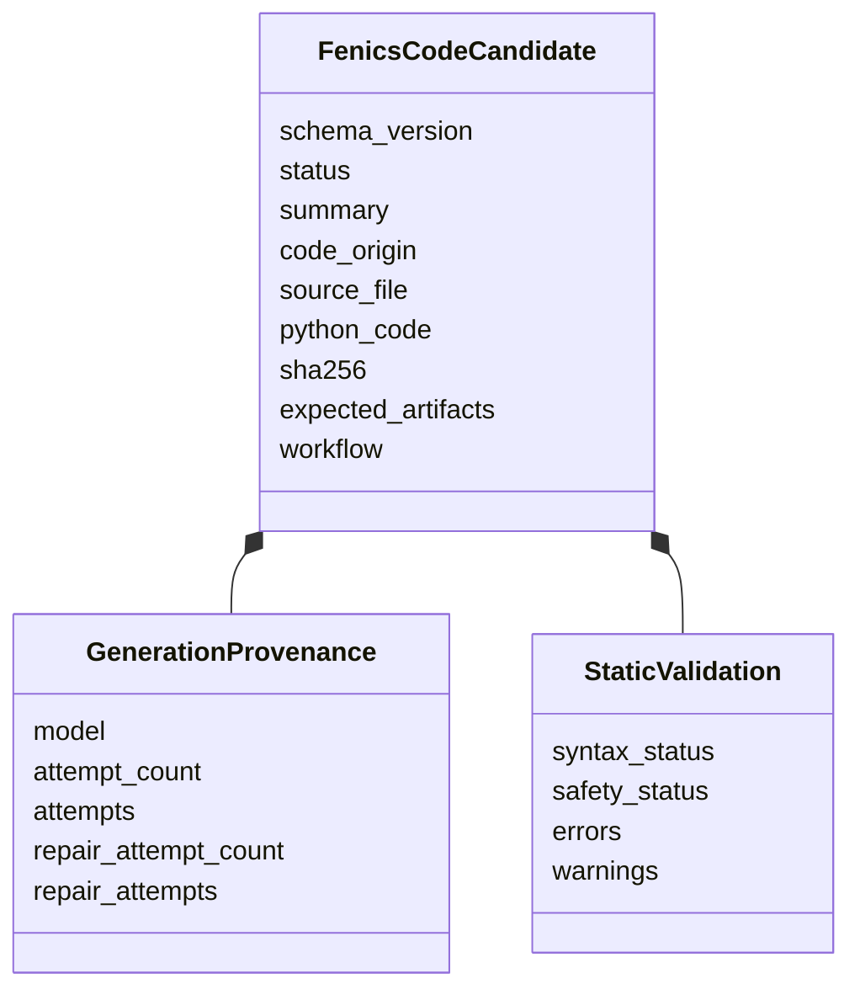
```mermaid
classDiagram
    class FenicsCodeCandidate {
        schema_version
        status
        summary
        code_origin
        source_file
        python_code
        sha256
        expected_artifacts
        workflow
    }
    class GenerationProvenance {
        model
        attempt_count
        attempts
        repair_attempt_count
        repair_attempts
    }
    class StaticValidation {
        syntax_status
        safety_status
        errors
        warnings
    }
    FenicsCodeCandidate *-- GenerationProvenance
    FenicsCodeCandidate *-- StaticValidation
```

Transient scalar initial-condition callbacks return a contiguous array of shape
`(number_of_interpolation_points,)` with `PETSc.ScalarType`. Both constant values
such as `20` and coordinate-dependent expressions are expanded through
`np.full(x.shape[1], expression, dtype=PETSc.ScalarType)` before DOLFINx
interpolation. This contract is tested by evaluating the generated callback,
including empty point batches; parsing `solve.py` alone cannot detect a callback
that returns a scalar. Compiler version `0.1.1` records this correction, and the
legacy heat fallback uses the same array contract.

Compiled solver runs write a topology-preserving visualization contract under
`diagnostics.json.field_samples`. `dolfinx.plot.vtk_mesh(V)` supplies the VTK
cell array, cell types, and function-space coordinates once; stationary and
transient samples supply nodal values on exactly those points. Transient runs
export the initial field and every solved time step, while keeping the shared
topology only once. The Workbench therefore renders \(u\) on the actual
triangular, tetrahedral, or hexahedral solver mesh rather than displaying
disconnected DOF markers. For 3D cells it derives a translucent exterior shell
and interpolated interior cut plane; topology remains fixed and only the nodal
scalar array changes with the time control.

An aggregate boundary region with selector `all_boundary` is compiled using
`mesh.locate_entities_boundary` over the actual solver mesh. It does not rely
on one overlapping Gmsh physical tag, which ensures conditions such as
\(u=0\) apply to the complete exterior even when named faces and `hole_wall`
tags coexist.

## API Boundary

The public OpenAI-compatible API exposes `aes-agent`; this remains the stable
AES wrapper model rather than a raw provider contract. Authenticated Workbench
clients may request `/api/models` and pass an optional `backend_model` hint.
The server validates the id against the live provider catalog and scopes the
override with a `ContextVar`, so concurrent requests cannot mutate one global
model setting. Requests without the hint retain the deployment default.

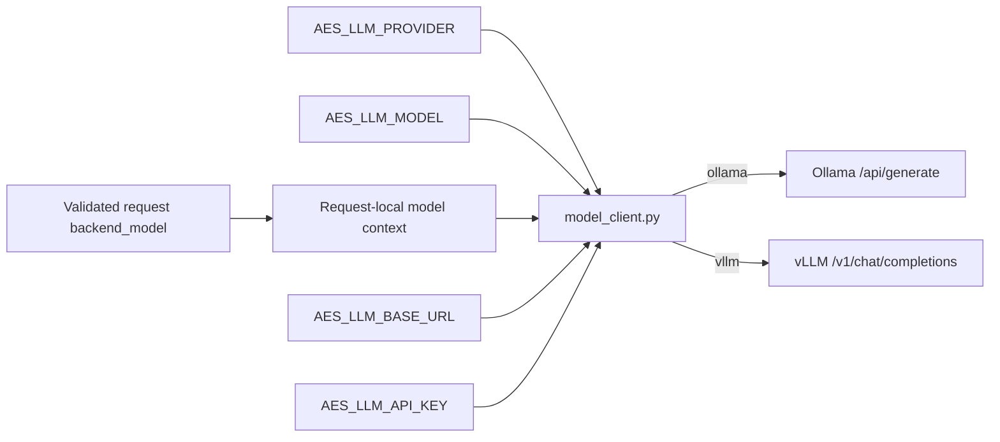
```mermaid
flowchart LR
    provider["AES_LLM_PROVIDER"] --> client["model_client.py"]
    client -->|"ollama"| ollamaApi["Ollama /api/generate"]
    client -->|"vllm"| vllmApi["vLLM /v1/chat/completions"]
    model["AES_LLM_MODEL"] --> client
    selected["Validated request backend_model"] --> scoped["Request-local model context"]
    scoped --> client
    endpoint["AES_LLM_BASE_URL"] --> client
    key["AES_LLM_API_KEY"] --> client
```

When `AES_LLM_MODEL` is empty, the Ollama path preserves the existing
`OLLAMA_MODEL` setting. The vLLM path uses `response_format=json_schema` when a
graph node supplies a contract, otherwise `response_format=json_object`;
generated Python source uses plain Chat Completions. Ollama receives the same
schema through its `format` field. The model-client logs include
`schema_constrained=true` for typed PDE and geometry interpretation. Provider
API keys are used only in the server-side LangGraph client.

The provider catalog is cached briefly to avoid querying Ollama or vLLM for
every browser render. `AES_LLM_ALLOWED_MODELS` may restrict the discovered list;
an empty value permits every model reported by the configured provider. The
result cache key includes the selected backend model for clients that request
an override, preventing a recent result from another model being reused.

The authenticated `/api/logs` endpoint projects the process-local logging
ring. Every stored message is bounded and sanitized for bearer tokens,
passwords, API keys, and other recognized secrets. This endpoint covers AES
orchestration records emitted in the LangGraph process; it does not grant access
to the Docker daemon or collect unrelated host logs.

Content previews bound strings, container items, nesting, and total visited
values before redaction and JSON serialization. This prevents a short log
message from traversing complete meshes and generated viewer files. Disabled
log levels do not construct previews. Full numerical arrays and file contents
remain in artifacts, independently of preview limits.

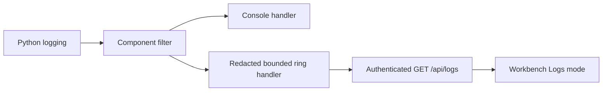
```mermaid
flowchart LR
    A["Python logging"] --> B["Component filter"]
    B --> C["Console handler"]
    B --> D["Redacted bounded ring handler"]
    D --> E["Authenticated GET /api/logs"]
    E --> F["Workbench Logs mode"]
```

The OpenAI-compatible adapter normally uses the latest user turn as the active
request. When the immediately preceding assistant response is an explicit AES
clarification, the adapter finds the active PDE user turn and appends every
subsequent user clarification answer. This handles requested-output selection,
time corrections, boundary data, coefficients, and similar follow-ups without
mixing arbitrary older chat history into a new request.

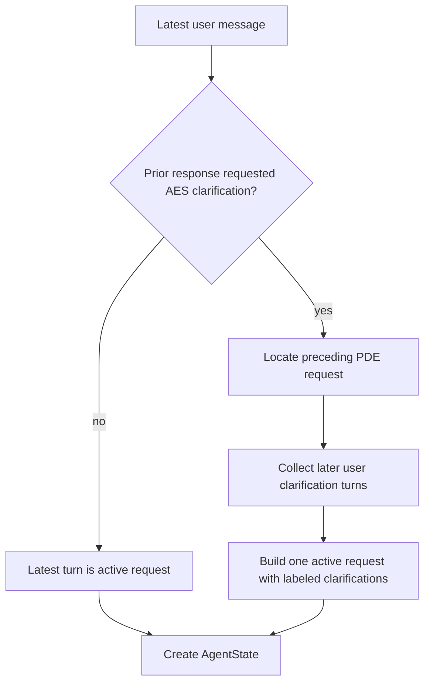
```mermaid
flowchart TD
    A["Latest user message"] --> B{"Prior response requested AES clarification?"}
    B -->|no| C["Latest turn is active request"]
    B -->|yes| D["Locate preceding PDE request"]
    D --> E["Collect later user clarification turns"]
    E --> F["Build one active request with labeled clarifications"]
    C --> G["Create AgentState"]
    F --> G
```

This is bounded API-level reconstruction. It does not yet replace the planned
PostgreSQL-backed LangGraph checkpoint resume by conversation `thread_id`.

The graph's internal `AgentState` is not returned directly to browsers. Before
the non-streaming response is serialized, `response_projection.py` creates a
bounded public result containing status, interpreted problem fields, concise
tool summaries, and artifact manifest references. Inline generated files,
sampled field arrays, raw MCP responses, and execution diagnostics remain in
the AES artifact store and are fetched through authenticated `/artifacts/...`
URLs.

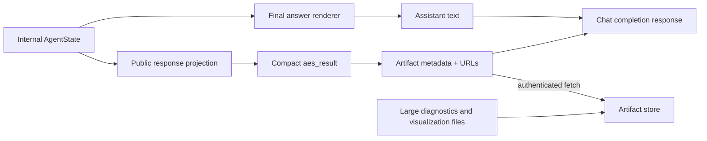
```mermaid
flowchart LR
    A["Internal AgentState"] --> B["Final answer renderer"]
    A --> C["Public response projection"]
    B --> D["Assistant text"]
    C --> E["Compact aes_result"]
    E --> F["Artifact metadata + URLs"]
    D --> G["Chat completion response"]
    F --> G
    H["Large diagnostics and visualization files"] --> I["Artifact store"]
    F -->|"authenticated fetch"| I
```

## Tests

Focused tests live under `langgraph/tests/` and cover graph routing, parsing,
MCP client behavior, FEniCS tools, artifact storage, visualization, and API
behavior.
