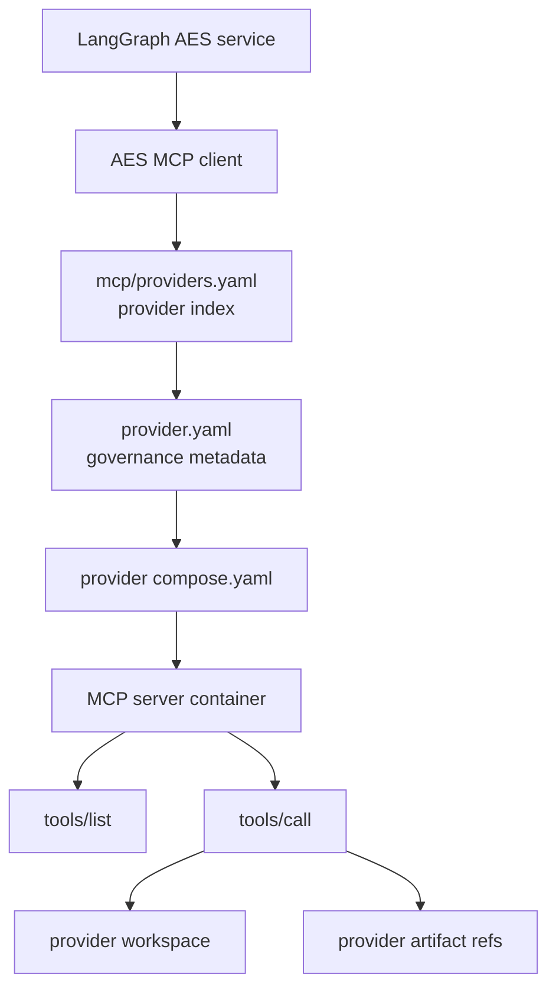
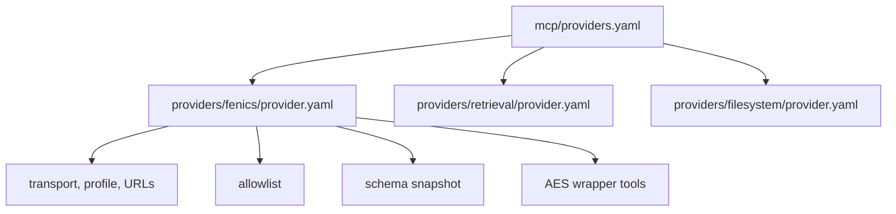
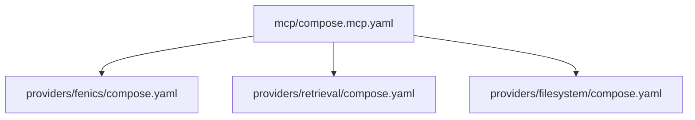
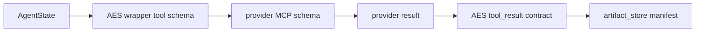
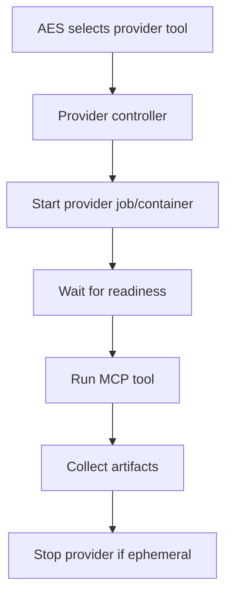

# MCP Layer Architecture

The `mcp/` component is the provider-management layer for external tools. AES
remains the LangGraph orchestration host and MCP client; provider containers
live under `mcp/` and expose governed capabilities through MCP.

## Ownership

`mcp/` owns:

- provider index and governance layout,
- provider-owned Compose includes,
- allowlists and schema snapshots,
- provider workspaces and smoke tests,
- MCP contracts shared by AES and providers.

`mcp/` does not own:

- LangGraph routing,
- final AES artifact policy,
- browser UI rendering,
- Ollama model selection.

## Provider Index

The central `providers.yaml` is intentionally only an index. Each provider owns
its local governance manifest.

This prevents the central file from becoming a second monolith.

## Compose Entry Point

`mcp/compose.mcp.yaml` is a thin include layer.

Providers are currently optional long-running services selected by Docker
Compose profiles. On-demand startup/shutdown can be added later with a lifecycle
controller, but it is not part of the first reliable Compose design.

## Governance Pattern

Each provider should contain:

- `provider.yaml`: AES/governance metadata,
- `compose.yaml`: provider service definitions,
- `allowlist.yaml`: approved provider tools,
- `tool_schemas.snapshot.json` or `schemas/`: expected tool contracts,
- `workspace/`: provider scratch/output area,
- `smoke_tests/`: live provider checks,
- `README.md`: operations,
- `architecture.md`: design and ownership.

## Runtime Profiles

Current profiles:

- `fenics`: starts FEniCS/DOLFINx providers,
- `retrieval`: reserved for retrieval provider,
- `filesystem`: reserved for filesystem provider.

Live execution requires the corresponding provider profile to be active. Planning
mode can run without providers.

## Contracts

Shared JSON contracts live in `mcp/contracts/` and describe the shape of data
that should cross provider boundaries. These contracts should stay provider
agnostic where possible:

- `fenics_forward_solve.schema.json`,
- `fenics_code_candidate.schema.json`,
- `numerical_recipe.schema.json`,
- `tool_result.schema.json`.

The pattern is:

## Provider Lifecycle Target

The future provider lifecycle can become:

For now, Compose profiles are simpler and easier to debug.
