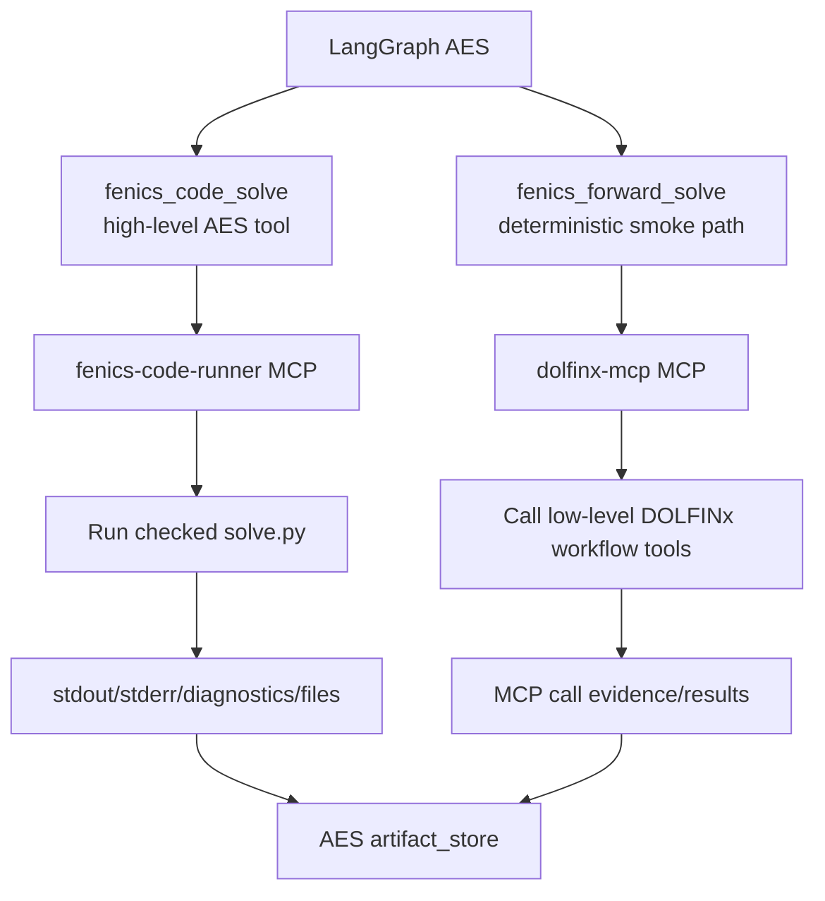
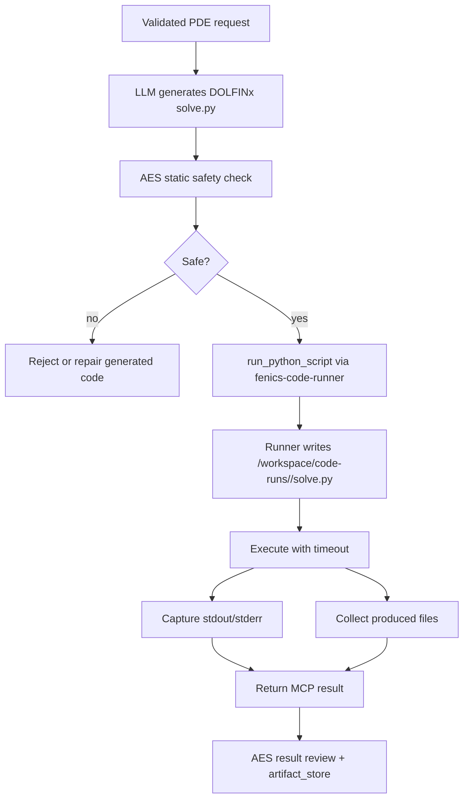
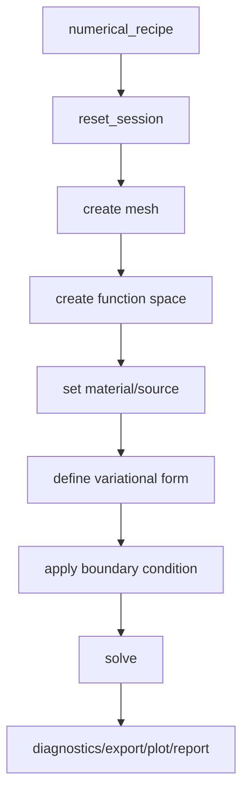
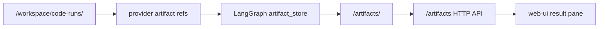

# FEniCS Provider Architecture

The FEniCS provider is the numerical execution boundary for DOLFINx/FEniCS
workflows. AES does not install or run FEniCS inside the LangGraph container.
All FEniCS execution happens in provider containers.



## Services

This provider owns two services:

- `dolfinx-mcp`: external workflow-oriented MCP server used by the older
  deterministic `fenics_forward_solve` path,
- `fenics-code-runner`: AES-owned MCP script runner used by the flexible
  generated-code path.

The generated-code path is the preferred flexible architecture. The deterministic
path remains useful for low-level smoke tests and constrained workflows.

## Generated-Code Path



The code runner exposes:

```text
run_python_script(filename, code, timeout_seconds)
```

It returns:

- provider run id,
- return code,
- runtime seconds,
- timeout,
- stdout/stderr,
- diagnostics if `diagnostics.json` is produced,
- provider artifact references for generated files.

## Deterministic MCP Path

The deterministic path maps a constrained numerical recipe to low-level MCP tool
calls.



This path is intentionally narrow because every new PDE family can require new
tool argument logic. It should not be the primary path for general PDE work.

## Safety Boundary

Security policy:

- raw user code is never executed in the LangGraph container,
- LLM-generated code must pass static checks before execution,
- user-provided code is checked and either accepted or rejected; AES does not
  auto-rewrite user code,
- `run_custom_code` remains blocked on the external `dolfinx-mcp` service,
- arbitrary execution is isolated in `fenics-code-runner`.

## Artifact Ownership

Provider workspaces are scratch spaces. AES-owned artifacts are materialized by
the LangGraph artifact store.



Current limitation: raw `mcp://...` solution references must be copied or
converted into AES-owned `/artifacts` before the browser can directly fetch
them.

## Operational Inputs

LangGraph uses:

```text
DOLFINX_MCP_URL=http://dolfinx-mcp:8000/mcp
DOLFINX_MCP_EXECUTE=true|false
DOLFINX_CODE_MCP_URL=http://fenics-code-runner:8000/mcp
DOLFINX_CODE_EXECUTE=true|false
DOLFINX_CODE_GENERATION_ATTEMPTS=2
DOLFINX_CODE_REPAIR_ATTEMPTS=2
```

Production enables generated-code execution by default. Development may keep it
disabled until the provider is available.
