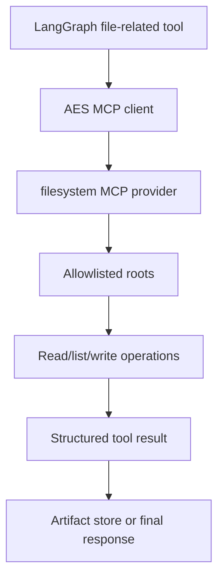

# Filesystem Provider Architecture

The filesystem provider is a planned governed file-access boundary for AES. It
is not yet an active production dependency.

## Target Ownership

The provider should own:

- allowed filesystem roots,
- read/write permissions,
- path normalization,
- file-size limits,
- audit metadata,
- tool schemas for file operations.

LangGraph should own the high-level decision to read or write a file. The LLM
should not receive unrestricted filesystem tools.

## Safety Rules

The provider should:

- reject paths outside allowlisted roots,
- avoid destructive operations unless explicitly allowed,
- return structured metadata and bounded content,
- prefer artifact-store writes for final AES outputs.

## Status

This provider is a skeleton. It is documented now so future file access does not
creep into LangGraph or arbitrary provider containers.
