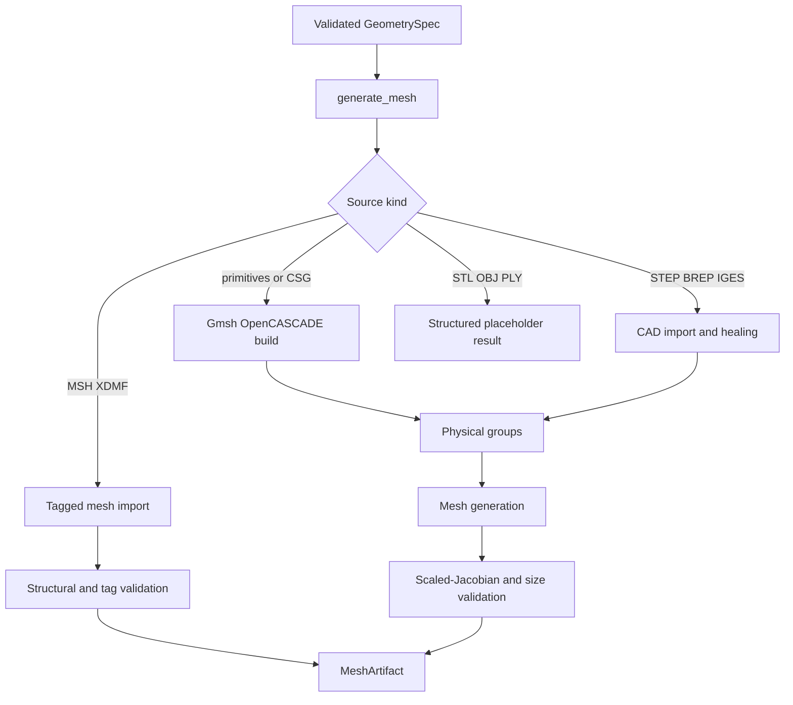

# AES Meshing MCP Provider

This provider compiles typed `GeometrySpec` documents into governed mesh
artifacts. It supports Gmsh/OpenCASCADE primitives and CSG, STEP/BREP/IGES CAD
imports, and existing MSH/XDMF meshes.

STL, OBJ, and PLY surface reconstruction is intentionally a placeholder. Such
inputs return `unsupported_not_implemented` until watertightness repair and
volume reconstruction have an explicit validated contract.

Input files must be placed below `workspace/uploads/`. Generated runs are
written below `workspace/runs/`.

## Geometry Sources

The provider implements three live source families and one explicit
placeholder:

| `source.kind` | Input | Behavior |
| --- | --- | --- |
| `primitives` / `csg` | Typed rectangle, disk, box, sphere, cylinder, and boolean operations | Builds and meshes an OpenCASCADE model with Gmsh |
| `cad` | STEP, STP, BREP, IGES, or IGS below `/workspace` | Imports, heals, removes duplicates, resolves semantic regions, and meshes |
| `mesh_file` | MSH or XDMF below `/workspace` | Imports, preserves physical tags, validates, and converts to governed MSH/XDMF outputs |
| `surface_scan` | STL, OBJ, or PLY | Returns `unsupported_not_implemented`; no guessed volume is generated |

For imported XDMF, `source.physical_data_name` selects the cell-data array
that contains integer region tags and `source.tag_map` maps semantic names to
those values. MSH files normally carry the same mapping in Gmsh
`field_data`. AES rejects imported meshes that cannot prove the boundary tags
referenced by the PDE.

## Runtime Flow



```bash
docker compose -f deploy/compose.dev.yaml --profile fenics up -d --build meshing-mcp
curl http://127.0.0.1:8007/health
```

The Compose `fenics` profile starts `meshing-mcp`, `dolfinx-mcp`, and
`fenics-code-runner`. `meshing-mcp` is also selectable through the dedicated
`meshing` profile.

The image installs the OpenGL/GLU, GNU OpenMP, and headless X11 runtime libraries
required by the Python Gmsh wheel (`libGL`, `libGLU`, `libgomp`, Xrender,
Xcursor, Xft, and Xinerama). Its Docker build imports and initializes Gmsh once,
then fails immediately if those libraries are unavailable. Runtime geometry
failures are returned as structured MCP tool results with a run id and concrete
error instead of an opaque HTTP 500 response.

MCP requests are handled concurrently, but Gmsh sessions are serialized because
the Gmsh API owns process-global model state. Worker-thread sessions initialize
Gmsh with `interruptible=False`, which prevents Python signal-handler
registration outside the main interpreter thread.
