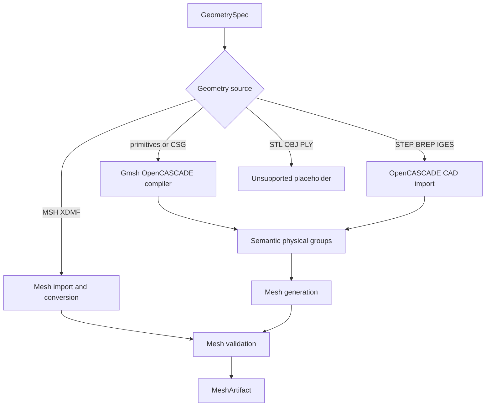
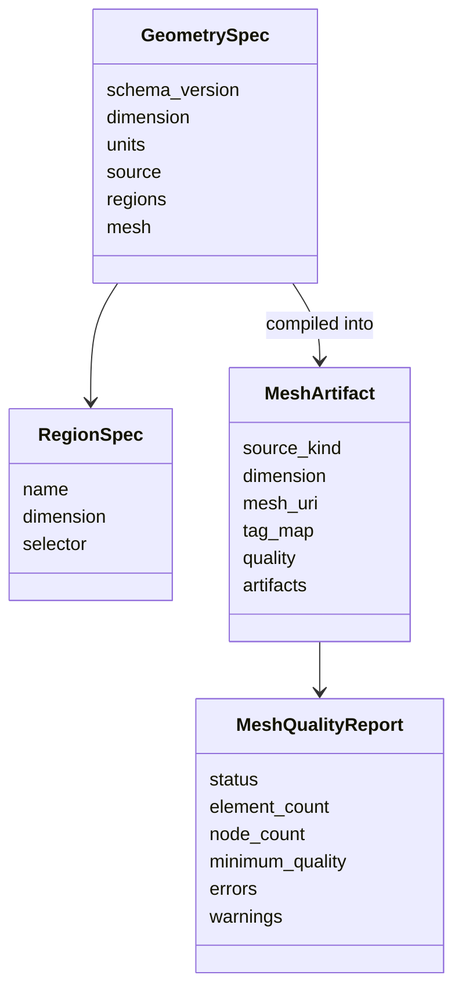
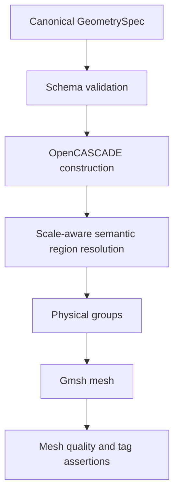

# Meshing Provider Architecture

The provider owns geometry construction, CAD and mesh import, semantic
physical groups, mesh conversion, and mesh-quality reporting. It does not own
PDE interpretation, boundary-condition semantics, solver compilation, or
final AES artifact publication.

## Contracts

## Implemented Sources

| Source | Status | Backend |
| --- | --- | --- |
| Primitives and CSG | Implemented | Gmsh OpenCASCADE boolean construction |
| STEP, BREP, IGES | Implemented | OpenCASCADE import and optional healing |
| MSH, XDMF | Implemented | meshio import, validation, and conversion |
| STL, OBJ, PLY | Placeholder | Returns `unsupported_not_implemented` |

The initial primitive set is rectangle, disk, box, sphere, and cylinder. CSG
supports union, difference, intersection, and fragment. Semantic regions are
materialized as Gmsh physical groups and returned as a stable name-to-tag map.
CAD healing uses the typed tolerance and repair switches from `CADRepairSpec`.
Imported XDMF can map a named cell-data array to Gmsh physical tags; both MSH
and XDMF imports must prove that all required semantic region tags exist on
cells of the expected dimension.

## Standard Geometry Fixtures

`examples/geometries/` is the cross-component reference catalog. It contains
equivalent YAML and JSON `GeometrySpec` files for a unit square, perforated unit
square, plate solid, and perforated plate solid. These are not hard-coded
solver templates: they exercise the same public geometry contract accepted by
the model interpreter, meshing provider, and Workbench.

Bounding-box region selectors are padded at model scale to account for
OpenCASCADE entity tolerances. Boundaries derived from disk and cylinder tools
are matched after CSG regeneration, so `hole_wall` remains a stable semantic
name even though Gmsh entity identifiers change.

## MCP Tools

- `inspect_geometry`: inspect CAD/CSG entities or an existing mesh,
- `generate_mesh`: create the governed `MeshArtifact`,
- `validate_mesh`: inspect an existing MSH/XDMF artifact,
- `convert_mesh`: convert between MSH and XDMF.

Input paths must resolve below `/workspace`; custom geometry scripts and raw
code execution are blocked. Generated data is written below
`/workspace/runs/<run_id>`. These provider files are transient. LangGraph's
`mesh_artifact_store` copies a validated bundle into
`/artifacts/meshes/<sha256>` and replaces provider-local references with
`aes://artifacts/meshes/...` URIs. The FEniCS runner receives only this
AES-owned bundle through a read-only artifact mount and copies `mesh.msh` into
its isolated run directory.

## Validation Boundary

Generated Gmsh meshes are checked for top-dimensional elements, node and
element counts, configured resource limits, and minimum scaled Jacobian.
Imported MSH/XDMF meshes receive structural, requested-cell-type, and semantic
tag validation; this first provider version reports that Jacobian-quality
evaluation for imported meshes is not yet available. Required physical region
names must already exist or be mapped explicitly before an imported mesh is
accepted.

The provider owns geometry construction and provider-workspace files. It does
not interpret PDEs, choose boundary conditions, compile UFL, or execute a
solver. File paths are resolved below the provider workspace and arbitrary
geometry scripts are not accepted.

## Concurrency Boundary

The HTTP layer can accept concurrent MCP requests. Gmsh itself uses
process-global model state, so all Gmsh initialize/build/finalize sessions pass
through one provider lock. Gmsh is initialized with `interruptible=False` in
HTTP worker threads to prevent Python signal-handler registration outside the
main interpreter thread. Mesh-file-only operations that use `meshio` do not
enter this Gmsh critical section.
