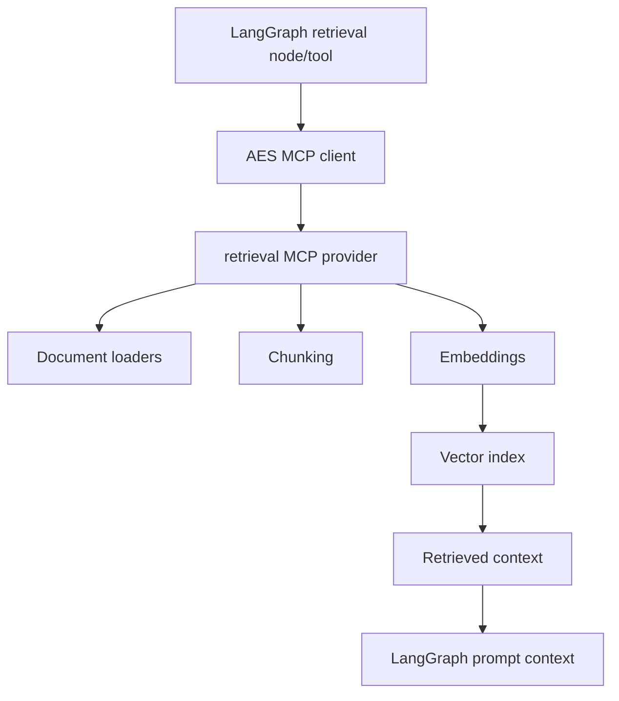

# Retrieval Provider Architecture

The retrieval provider is a planned MCP provider for AES knowledge lookup. It is
not yet an active production dependency.

## Target Ownership

The provider should own:

- ingestion connectors for AES project documents and domain references,
- chunking and metadata policy,
- embedding model calls,
- vector index persistence,
- retrieval query tools,
- schema and allowlist contracts.

LangGraph should own when retrieval is needed and how retrieved context is used
inside graph nodes.

## Planned Tool Shape

Candidate high-level AES tools:

- `retrieve_project_context(query, filters)`,
- `retrieve_fem_reference(query, filters)`,
- `retrieve_previous_artifacts(query, filters)`.

The LLM should not directly query raw storage engines. AES should expose
retrieval through typed wrapper tools with bounded result sizes.

## Status

This provider is a skeleton. It exists in the architecture so future retrieval,
RAG, embeddings, and vector database work has a clear component boundary.
