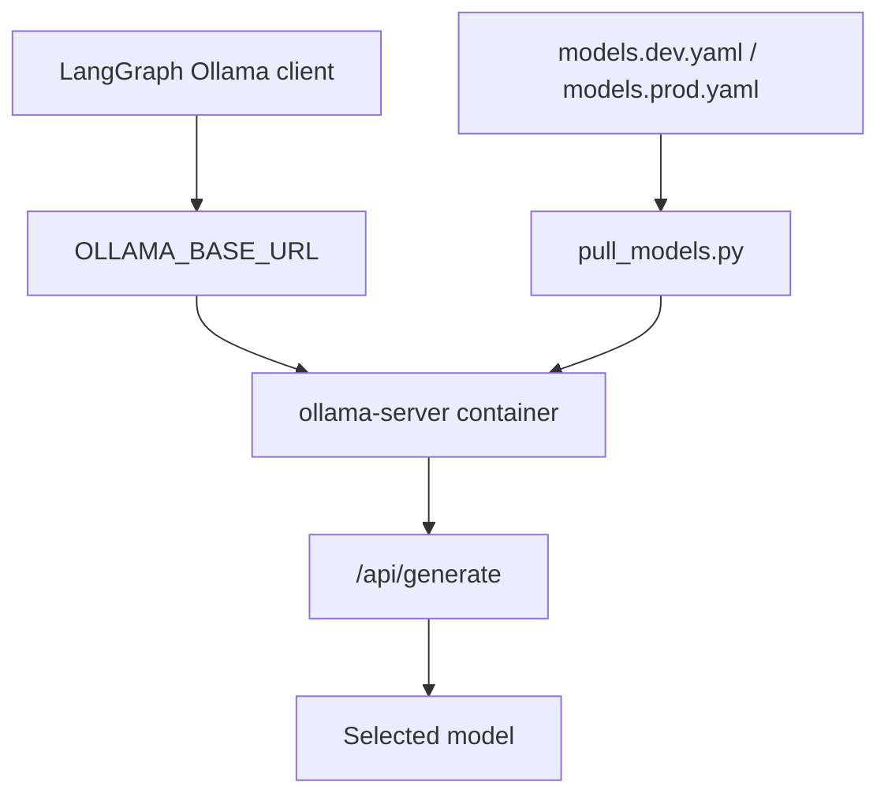
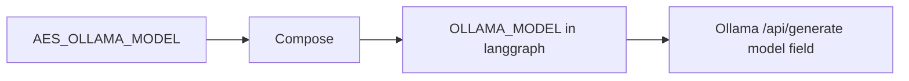
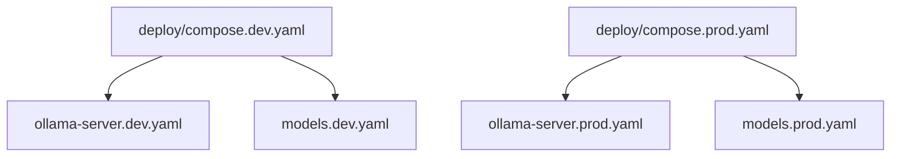
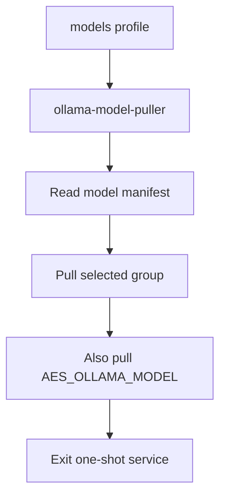

# Ollama Architecture

The `ollama/` component is the local model runtime for AES. LangGraph exposes
`aes-agent` to clients, but the actual LLM is selected and served by Ollama.



## Ownership

`ollama/` owns:

- dev/prod Ollama Compose files,
- model recommendation manifests,
- model pull automation,
- Ollama runtime environment defaults.

It does not own:

- AES graph prompts,
- OpenAI-compatible `aes-agent` API,
- generated code execution,
- artifact storage.

## Runtime Binding

The runtime model flow is:



`aes-agent` is the public AES wrapper model. It is not the raw Ollama model.

## Dev And Prod Profiles



Development targets laptop/WSL iteration and defaults to `qwen3:4b`.

Production targets the GPU server and defaults to `gemma4:26b`, with the
production model set narrowed to:

- `qwen3:8b`,
- `gemma4:26b`,
- `gemma4:31b`.

## Pull Automation

Ollama does not read `models.dev.yaml` or `models.prod.yaml` directly. AES uses
`pull_models.py` and the optional Compose `models` profile.



Important environment variables:

```text
AES_OLLAMA_MODEL
AES_OLLAMA_PULL_GROUP
OLLAMA_CONTEXT_LENGTH
OLLAMA_KEEP_ALIVE
OLLAMA_NUM_PARALLEL
OLLAMA_MAX_LOADED_MODELS
```

## Runtime Tuning

Current conservative production defaults:

- keep one loaded model by default: `OLLAMA_MAX_LOADED_MODELS=1`,
- avoid request parallelism for single-user numerical workflows:
  `OLLAMA_NUM_PARALLEL=1`,
- keep the active model warm for a bounded period:
  `OLLAMA_KEEP_ALIVE=60m`,
- keep the default context at `8192` until latency and memory are measured.

`OLLAMA_KEEP_ALIVE=-1` can pin models indefinitely, but that is not the default
because AES may test multiple large models and accidentally consume all VRAM.

## GPU Notes

The production Compose file reserves the configured NVIDIA device. The Ollama
logs should be checked with:

```bash
docker exec ollama-server ollama ps
docker logs ollama-server 2>&1 | grep -iE "offload|layer|model weights|kv cache|memory"
```

Seeing a small amount of CPU memory in Ollama logs does not necessarily mean
layers are CPU-offloaded. Use the `offloaded N/N layers` and `ollama ps`
processor fields to confirm.
