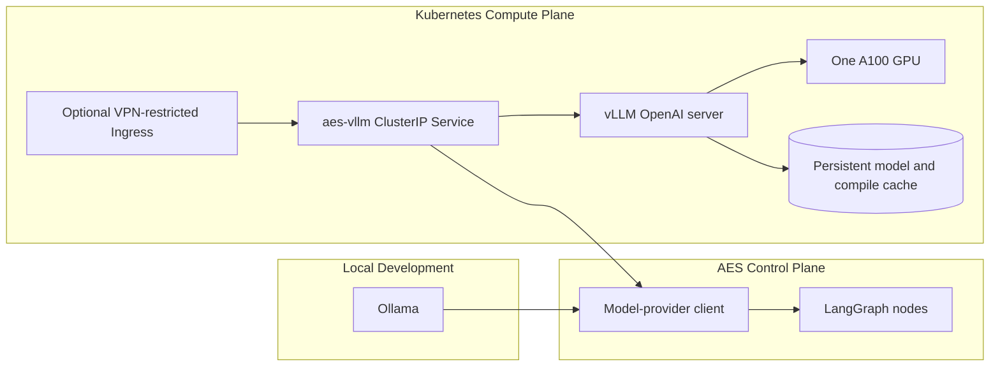
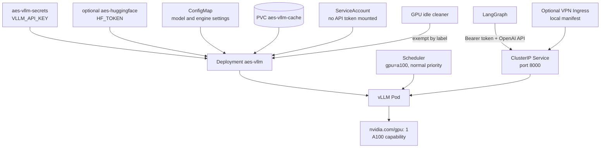
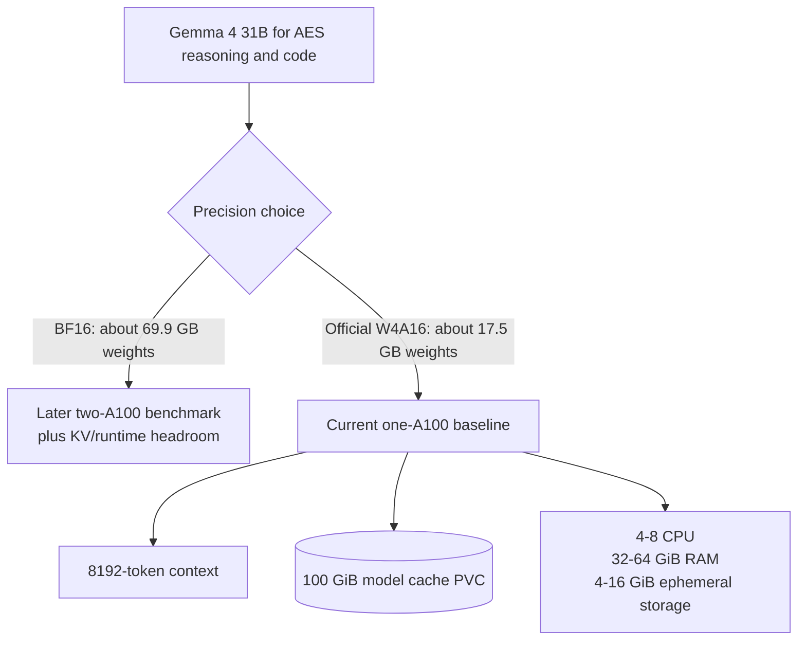
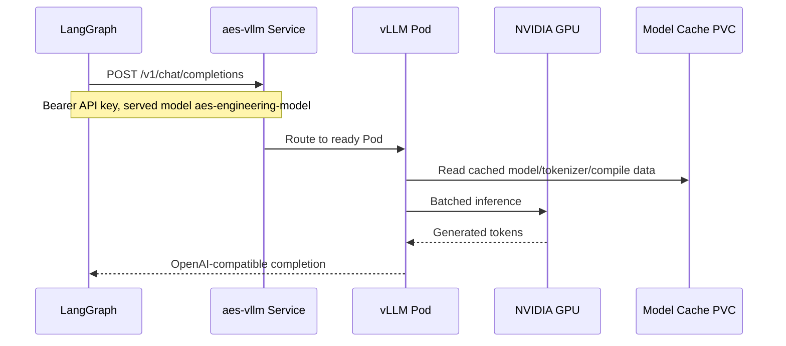
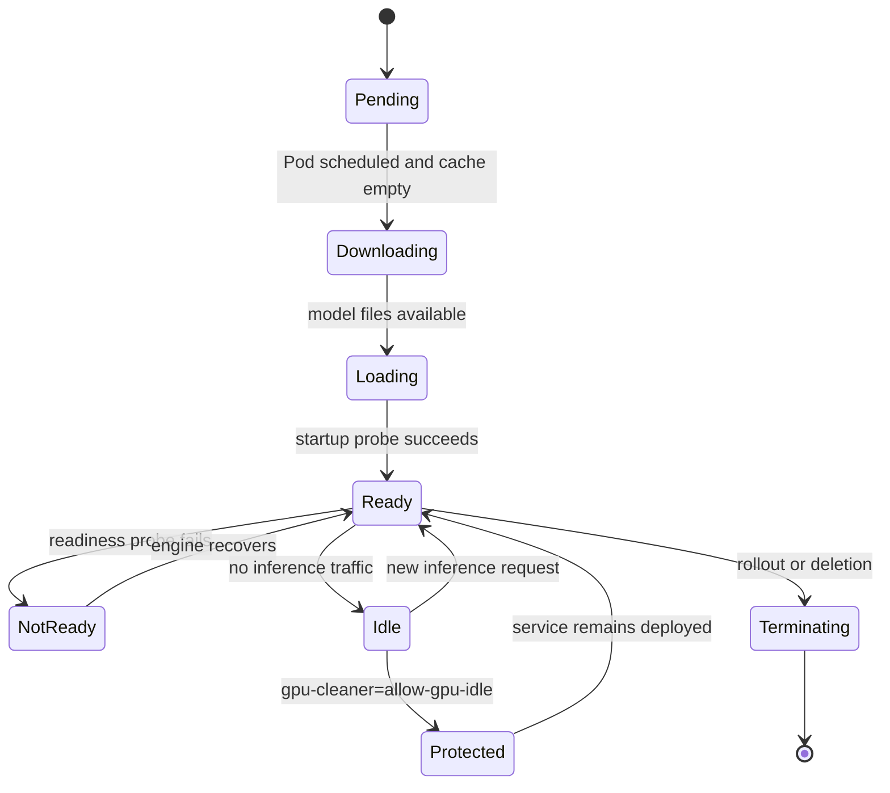
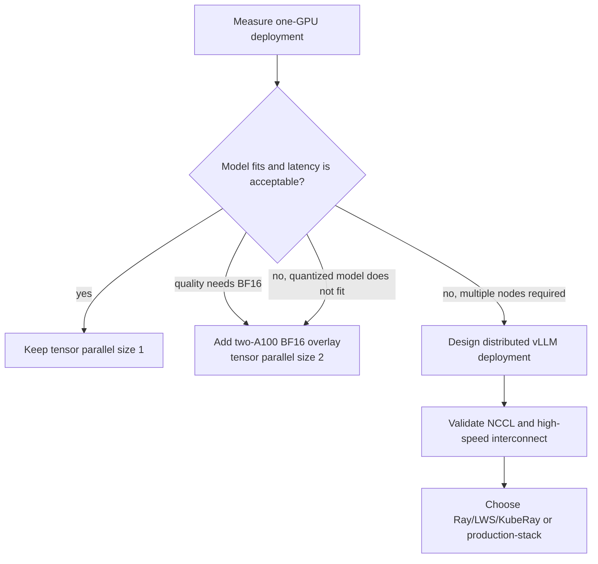

# vLLM Architecture

The `vllm/` component is the AES production model-serving boundary for a
Kubernetes cluster. It is separate from LangGraph orchestration and from local
Ollama development.

## Component Position

Only one backend is selected for a LangGraph process. Ollama remains the
default for the Docker Compose development stack. vLLM is selected for cluster
production through environment configuration.

## Kubernetes Topology

The Ingress path is optional and deliberately excluded from the Kustomize
base. Its hostname and cluster annotations belong in ignored
`vllm/k8s/ingress.local.yaml`. Same-cluster LangGraph uses Service DNS instead.

## Model And Resource Contract

The base serves `google/gemma-4-31B-it-qat-w4a16-ct` under the stable alias
`aes-engineering-model`. The official W4A16 checkpoint is preferred over BF16
for the first shared-cluster deployment because it fits one 40 GiB A100 with
room for KV cache and runtime overhead. The model context remains intentionally
below its architectural maximum until VRAM and latency are measured.

Node-level hardware capacity does not imply namespace quota. Deployment is
still conditional on one allocatable `nvidia.com/gpu`, CPU/memory quota, and a
bound PVC. The scheduler selects `gpu: a100`, never a physical worker name.

## Request Sequence

## Deployment Lifecycle

The startup probe allows a long first model download/load interval. Readiness
keeps traffic away until the engine responds. A `Recreate` deployment strategy
prevents two large model Pods from competing for a single GPU and a
ReadWriteOnce cache during rollout. The idle exemption is required because an
always-on inference server can legitimately hold its GPU while waiting for AES
requests; if the cluster cleaner removes both Pod and Deployment, Kubernetes
has no remaining controller that can recreate the service. Model data survives
in the PVC, but availability does not.

## Configuration Ownership

| Concern | Owner |
| --- | --- |
| model repository and served alias | `vllm/k8s/base/configmap.yaml` |
| vLLM image and process arguments | `vllm/k8s/base/deployment.yaml` |
| GPU/CPU/memory requests | Deployment resources |
| GPU capability and toleration | Deployment Pod scheduling policy |
| workload priority | cluster `normal` PriorityClass |
| idle-GPU lifecycle exemption | `gpu-cleaner: allow-gpu-idle` labels |
| model and compile cache | `aes-vllm-cache` PVC |
| inference API key | ignored/local Kubernetes Secret |
| optional gated-model token | `aes-huggingface` Secret |
| VPN hostname and Ingress annotations | ignored `ingress.local.yaml` |
| model request/response parsing | LangGraph model-provider client |
| public user API | LangGraph `aes-agent`, never raw vLLM |

## Security Boundary

- The base Service is `ClusterIP`; no public Ingress is created.
- The optional Ingress is private/VPN-restricted and remains outside the base.
- vLLM requires a Bearer API key.
- The Pod does not receive a Kubernetes service-account token.
- The container runs as a non-root UID with privilege escalation disabled.
- Secrets are not stored in tracked manifests.
- Users and browsers call LangGraph, not vLLM.
- A cluster-specific NetworkPolicy remains pending until the Ingress controller
  namespace labels and LangGraph placement are known.

## Scaling Direction

The known A100 capability makes a later same-node two-GPU experiment plausible,
but namespace quota and observed W4A16 quality must justify it first.
InfiniBand is unnecessary for the current single-GPU Pod. Multi-node manifests
remain deferred until quota, topology, NCCL/RDMA resources, and the supported
distributed controller are verified.
