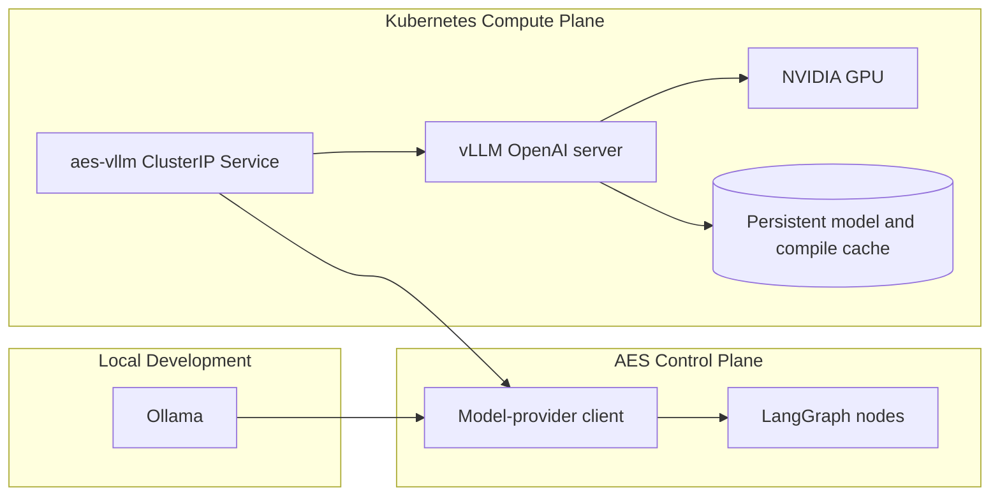
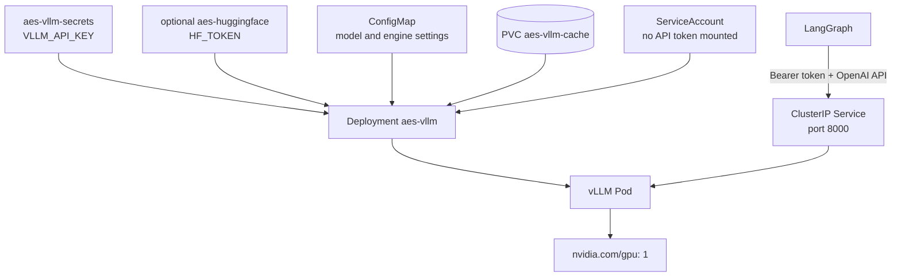
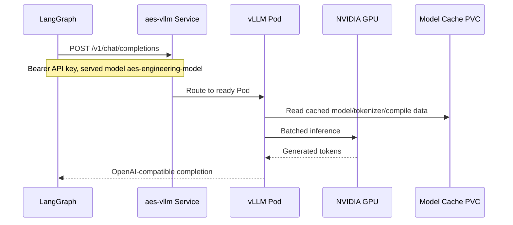
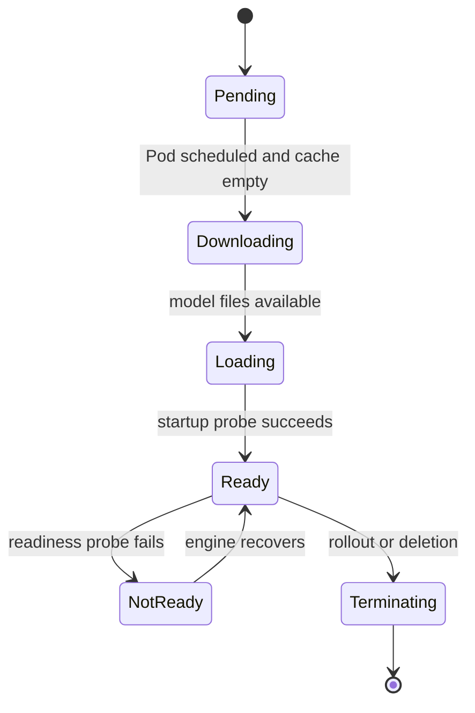
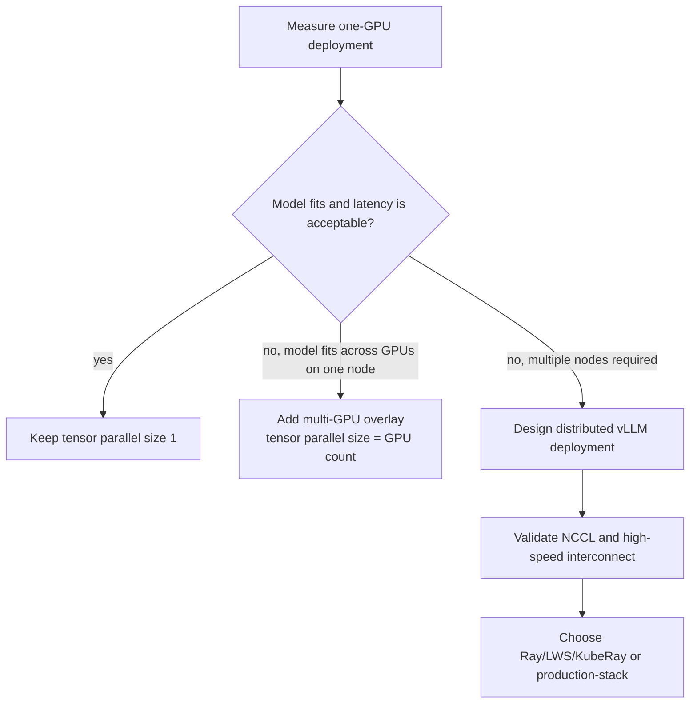

# vLLM Architecture

The `vllm/` component is the AES production model-serving boundary for a
Kubernetes cluster. It is separate from LangGraph orchestration and from local
Ollama development.

## Component Position

Only one backend is selected for a LangGraph process. Ollama remains the
default for the Docker Compose development stack. vLLM is selected for cluster
production through environment configuration.

## Kubernetes Topology

## Request Sequence

## Deployment Lifecycle

The startup probe allows a long first model download/load interval. Readiness
keeps traffic away until the engine responds. A `Recreate` deployment strategy
prevents two large model Pods from competing for a single GPU and a
ReadWriteOnce cache during rollout.

## Configuration Ownership

| Concern | Owner |
| --- | --- |
| model repository and served alias | `vllm/k8s/base/configmap.yaml` |
| vLLM image and process arguments | `vllm/k8s/base/deployment.yaml` |
| GPU/CPU/memory requests | Deployment resources |
| model and compile cache | `aes-vllm-cache` PVC |
| inference API key | ignored/local Kubernetes Secret |
| optional gated-model token | `aes-huggingface` Secret |
| model request/response parsing | LangGraph model-provider client |
| public user API | LangGraph `aes-agent`, never raw vLLM |

## Security Boundary

- The Service is `ClusterIP`; no public Ingress is created.
- vLLM requires a Bearer API key.
- The Pod does not receive a Kubernetes service-account token.
- The container runs as a non-root UID with privilege escalation disabled.
- Secrets are not stored in tracked manifests.
- Users and browsers call LangGraph, not vLLM.
- A later permanent route must add administrator-approved TLS, authentication,
  and NetworkPolicy controls.

## Scaling Direction

Multi-GPU and multi-node manifests are intentionally deferred until the cluster
GPU topology, node labels, quotas, interconnect, and supported controller are
known. Guessing those values would create manifests that schedule incorrectly
or perform poorly.
