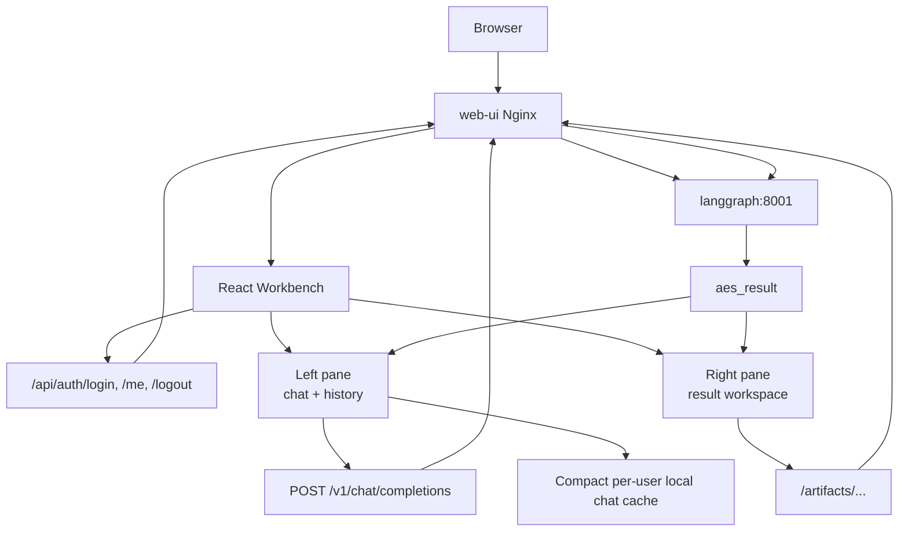
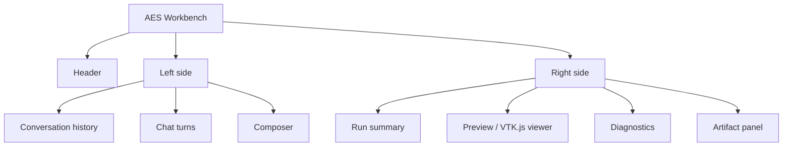
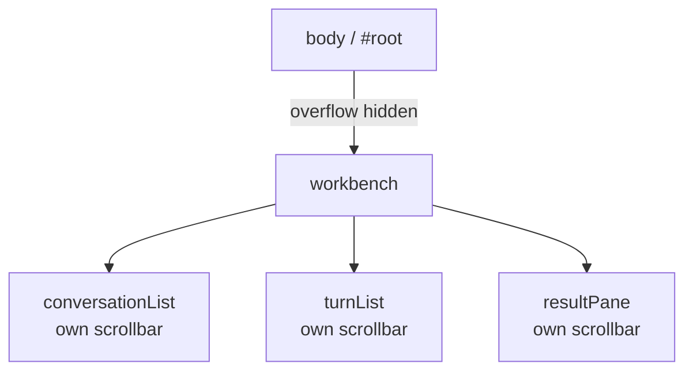
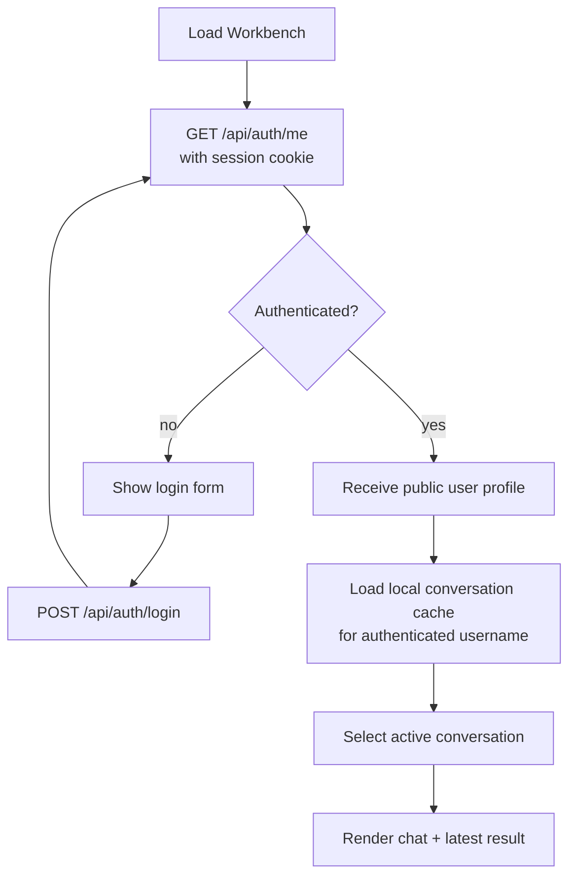
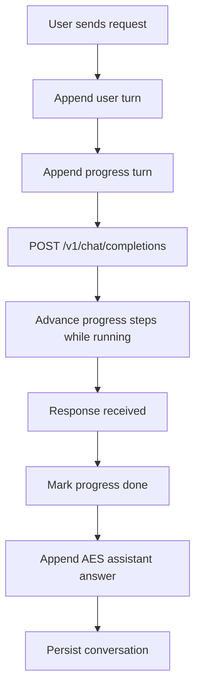
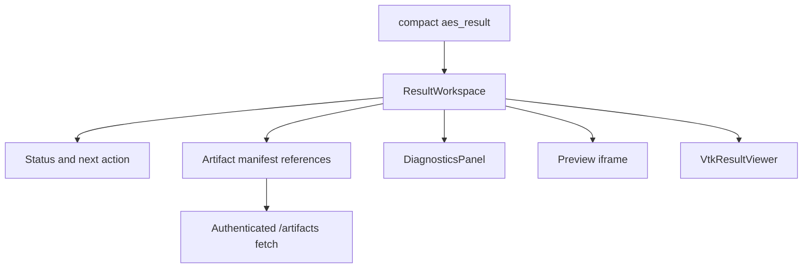

# AES Workbench Architecture

The `web-ui/` component is the browser-facing AES Workbench. It replaces the
previous generic browser UI with an AES-native application: chat on the left,
results and visualization on the right.



## Ownership

`web-ui/` owns:

- authenticated login/session UI,
- server-authenticated session bootstrap and logout,
- browser-local conversation storage scoped by authenticated username,
- chat panel against `aes-agent`,
- persisted AES progress turns,
- result workspace,
- artifact links and diagnostics rendering,
- VTK.js viewer shell,
- Nginx proxy for `/api/`, `/v1/`, and `/artifacts/`.

It does not own:

- LangGraph execution,
- Ollama model selection,
- artifact generation,
- FEniCS execution.

## Layout



The visual target is a bright ChatGPT-like theme. The saved-chat sidebar is
slightly darker than the main chat surface.

## Scroll Model

The page body should not be the normal scroll container. Each pane owns its own
scroll behavior.



This keeps the composer and layout stable while long chats or large result
panels are inspected.

## Session Model

Identity is server-authenticated. The browser receives an opaque `HttpOnly`
session cookie and never stores the password or raw token in JavaScript-accessible
storage. On every page load the Workbench asks the AES API for the current user.



PostgreSQL is authoritative for users and sessions. Conversation content is
still stored in browser `localStorage` as a transitional implementation. The
next database slice moves conversations and messages to authenticated APIs;
local storage then becomes only an optimistic cache and UI preference store.

Saved conversations contain:

- chat turns,
- persisted progress turns,
- compact latest `aes_result`,
- artifact/result links.

The Workbench never persists raw graph/tool payloads, inline generated files,
or sampled numerical arrays in `localStorage`. The API response projection and
the browser storage projection both retain only status, answer text, and the
artifact-store manifest references needed by the result pane. Large viewer
manifests, diagnostics, previews, and solution data are fetched on demand from
authenticated `/artifacts/...` URLs. This keeps a single solve from exceeding
the browser storage quota.

When a page reload interrupts an in-flight request, the restored progress turn
is marked as interrupted instead of remaining permanently active at `Waiting
for final response`.

## Persistent Progress Turns

AES progress is represented as a real chat turn, not transient component state.



This means refresh does not remove the progress record. Each question keeps its
own progress block between the user request and AES answer.

## Result Workspace

The right pane reads `aes_result` from the OpenAI-compatible response.



The viewer has two rendering paths:

- sampled-field rendering from `viewer_manifest.datasets.sampled_field`, used
  for stationary fields such as \(u(x,y)\) and transient fields such as
  \(u(x,y,t)\) before full VTK conversion exists;
- VTK.js rendering when AES serves browser-fetchable `.vtu`, `.vtp`, `.vtk`, or
  `.vtkjs` datasets.

Until at least sampled-field data or a VTK dataset exists, the UI shows
diagnostics, SVG previews, and raw artifact references.

## Proxy Boundary

Container deployment uses same-origin proxying:

```text
/v1/*         -> http://langgraph:8001/v1/*
/api/*        -> http://langgraph:8001/api/*
/artifacts/* -> http://langgraph:8001/artifacts/*
```

The `/v1/` proxy has long timeouts because first model loads and FEniCS runs can
take several minutes. Browser requests include credentials so the same-origin
session cookie protects chat and artifact access.
